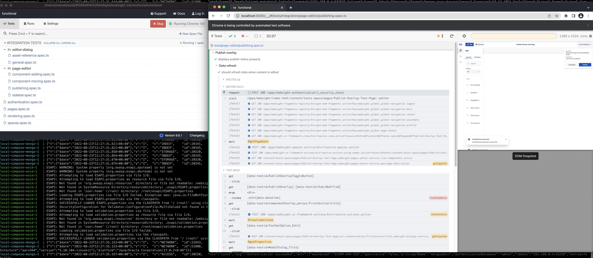

*Published at: 23.08.2022 by [Radek Lawgmin](https://github.com/radeklawgmin)*

>Making sure that a product conforms to its specification is always a challenge. Defining quality, agreeing on KPIs and planning subsequent steps is a thing. So is having an efficient QA process that helps to achieve it (not block the team from reaching their goals nor demotivate them). It is even more demanding to make the whole development team really care about the quality and make each member feel responsible for it when we move from quality assurance to quality assistance and want to share some of typical QA duties between each team member. So is it possible to have the whole team (not a single quality hero) that ensures the manufactured product meets requirements and keeps guard over quality standards? How and when we do it in our project?

    

## How we care about the quality

We want to create a new and cutting-edge product. That’s something we strongly believe in but apart from the final effect that, we hope, will positively struck our clients, it is also a kind of innovative approach to our every day work. How we do this? Once we agreed on the main purpose of the product (what it should do and how) we also started our discussion about what the quality means to us and how we are going to make sure that we build a high quality product. Next step was to start creating a QA plan and QA process that would evolve and adapt in time but would also help us to take care about quality from the very beginning. Putting there main ideas like the definition of the quality, and what we should do and how we should work to be able to say that our product meets quality requirements was our main objective here but apart from it we also needed to think how to engage everyone from the team in the process to let this really happen. Working on definition at the same time having quality in the back of our mind was the first step to do at this stage but we wanted to do more. Apart from delivering units and integration, code-reviews and cross-testing (which we actually try to facilitate by experimenting with extreme programming techniques like pair-programming and making the whole process continuous), we decided to create a suite of automated functional checks with Cypress.io that we could make use of to regression test our product at various stages. So we have started with applying it to check each PR. Thanks to the [architecture approach](https://www.websight.io/blog/2022/shipping-and-developing-osgi-application-in-container/) that we have adopted, we work with small, separate limited liability modules, which allows for thorough tests in isolation - in other words, a single PR can be deployed to a dedicated  environment where it can be tested first. As a result we don't need to run full regression tests against everything we release each time, which in turn accelerates our software development lifecycle.

    

What is more, we can use automated functional checks when launching a new environment and/or as a nightly regression suite against the latest version of the application. Well, it is still worth mentioning that it is a part of our pipeline to automatically, efficiently and reliably build and deploy code. Here what we mean by saying ‘reliably’ is that whenever a given release causes any failures it is rejected until any discovered issue has been analyzed and resolved. So we not only think about the future and do our best to plan quality around it but we are also reactive and address issues we come across in our everyday work. This suite of automated checks is also a part of the code we are going to share with our clients and community allowing them to quickly check if their deployments were successful and/or the product still works once they expanded it by adding new features or components.

## When we start to care about quality

Let’s get back to our definition for a while. That is the moment we, apart from focusing on strictly business requirements, plan other activities, including automated checks. Referring to our still evolving  DoR (Definition of Ready) and DoD (Definition of Done) where we have added automated functional checks as a part of requirements we hold each team member working on a given feature responsible for creating automated checks that will allow us to regression test this feature later on, according to our processes. As a result we do not need a dedicated role of a quality assurance engineer nor automation engineer that would be responsible for creating and maintaining automated checks. We invest some effort at the beginning but it always pays back, as having automated checks automatically running as a part of the CI process allows us to ultimately save much time needed to re-check feature by feature later.

## Summary

Quality assurance should be a high priority when we think of building a successful product. Building an effective process around it helps much when it starts from the very beginning and lasts until its end. However, delivering quality is a healthy procedure only when there is the whole development team engaged in it, not a single role. And of course, it is always more effective when an implemented, tested and deployed feature can be checked automatically within a few seconds as a part of the CI process instead of struggling to find a person and time for reproducing repeatable regression test cases again and again.