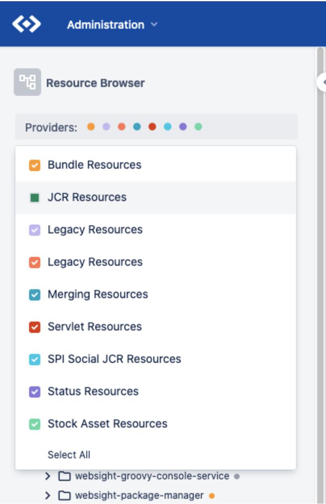

*Published at: 17.09.2022 by [Michał Cukierman](https://github.com/michalcukierman)*

#Are JCR Nodes and Sling Resources the same thing accessed by different APIs?

Some developers would say 'Yes' and their solutions would work... sometimes. I've decided to write a post about it because I often see people misunderstand Sling abstraction in relation to JCR.

<figure markdown>
  
  <figcaption>
    WebSight Resource Browser with non-JCR Resources on WebSight Community Edition
  </figcaption>
</figure>

When I started to learn AEM more than 10 years ago, my favorite tool was CRXDE. I used it together with a web browser to observe how changes made in a repository affect the resource tree and the site. Once you are familiar with CRXDE, you can start using Maven and a content-package plugin to produce FileVault packages which can be installed on AEM. Such packages may contain code, configurations, users, permissions, and content. Once a package is installed, you can view it in the resource tree. Changes can be previewed in a web browser by entering a resource path with an extension (a default Sling GET servlet offers JSON, text, and XML renderers mapped to .json, .txt, and .xml extensions respectively).

So what seems to be the problem here? From my experience, the main issue is the lack of visibility of resources other than JCR in the standard AEM tooling. You've probably heard the golden rule of the Sling community - "Everything is a Resource" a million times. The visible resources are sites, pages, assets, users, components, configurations, and bundles... and all are in JCR. Hence it is natural to conclude that a Sling Resource is a JCR Node, well it is a wrong conclusion.

At Dynamic Solutions, we work on a generic Sling Resource Browser as a part of WebSight Community Edition (formerly part of WebSight.Admin tools suite).
Apart from the support for reading/writing the JCR Resources, it allows users to browse ALL registered resources. Sling comes with 3, WebSight with 4 and AEM with 9 Out Of the Box Resource Providers.

<figure markdown>
  { align=left width="300"}
  <figcaption>
    For the purpose of this blog post, I've installed WebSight Resource Browser on AEM 6.5 to demonstrate available providers.
    Note that we don't maintain AEM compatible distribution of WebSight.Admin tools anymore.
  </figcaption>
</figure>

 Sites, pages, DAM, data, users, components, configurations, and bundles come from JCR, but there are others like servlets, scripts, Bundle Resources, File Resources, and Cloud Resources we should know about.

JCR is considered to be the most important resource provider. However, in theory, it's possible to run and work on Sling without JCR at all, simply by using other available resource providers. Resources come in a variety of 'shapes and forms', some resource types are read-only, some allow writing data and some allow creating nodes. Our WebSight Resource Browser supports all resource types with a special extension to enable provider-specific features (therefore with full JCR support).

##OK, so how do I work with resources?

First of all, start using them. Whenever you need to integrate Sling with an external system or need to access a custom resource, implementing your own resource provider may be a proper approach. Furthermore, there already exist implementations of some custom resource providers:

* NoSQL Resource Providers
* Filesystem Resource Provider

Using extended/custom resource providers is definitely the most elegant way of working with resources in a "Sling way" (once again - Everything is a Resource).

Secondly, it's important to follow certain rules during our day-to-day work:

1. Use Sling Resource API instead of the JCR API, always when possible. The entire hierarchy would be: CMS API > Sling API > JCR API > OAK API, however, it is a subject for a separate post.
2. Encapsulate usage of the JCR API by creating OSGi services and keep them separated from the generic Sling-based code.
3. Use the JCR API only if you need to access JCR-specific features, Sling does not abstract, for example, User Management, Version Management, Permission Management, complex Nodes definitions, FileVault, and indices are only available when using JCR or Oak API.
4. Think of the entire pool of resources, not only ones based on JCR. Remember that resource.adaptTo(Node.class) may simply not work.

##Summary

This blog post is about Sling, but the topics raised here are very important while developing and working with other Sling-based platforms like WebSight, AEM, or Peregrine. This is a preface for further evaluation of an “Everything is a Resource” statement. Is it still valid in 2022? Containerized, serverless world requires us to re-think our architectures and the way we distribute code, configurations, and content. Stay tuned if you wanna hear more.