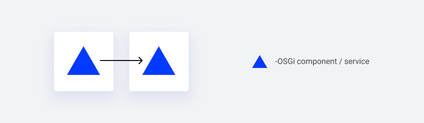
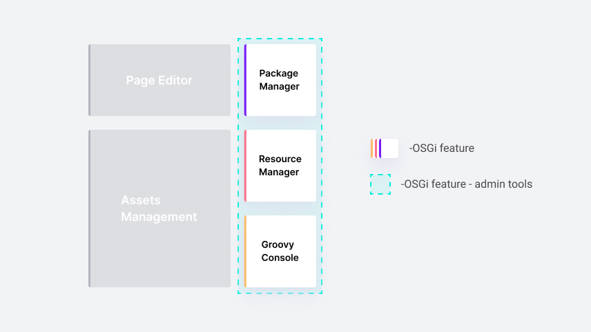

*Published at: 15.07.2022 by [Tomasz Michalak](https://github.com/tomaszmichalak)*

> Living in a city, we care about the streets and parks inside it. However, the city is not something permanent. It is constantly changing within its borders. City planners should replan internal city roads easily, adapting them to new requirements. However, for provincial and municipal roads, all changes should be approved by the provincial executive planners. 
> The same rules are valid in IT. As long as we change our private functions, the impact on the overall system is low. However, by changing module interfaces, we can break other modules. We expect a mechanism to define and constantly validate our national, provincial, city and private application roads.
> In this article, you will learn how we can benefit from OSGi modularity and Sling Feature Model.

## OSGi Bundles

Components are the main building blocks for OSGi applications. With single annotation, we can make a POJO an OSGi component and let the OSGi manage its lifecycle. However, if we want to reference it within our application, we need to declare it as a **_service_**.

The OSGI implements a service **_component model_** - a declarative model for publishing, finding and binding services. This model assumes that all services can expose their functionalities to others. A service implements some API and registers itself in the OSGi service registry. This way, other services can reference other services via APIs, allowing a more dynamic binding. It is how logically we compose the application from small building blocks. On the other hand, we need to group our services into more granular modules, called bundles. A bundle is an identifiable module containing such details as requirements and capabilities - so we initially declare what we need and offer from/to the other registered OSGi bundles. Instead of saying that services communicate with other services, we can say that bundles communicate and collaborate using services. It means that the client of a service is always a bundle. A bundle may register/use zero or more services.

While services are the main building blocks for OSGi applications, bundles are the main deployment blocks.

With services, we can define loosely coupled objects. With bundles, we organize them into modules with an independent development lifecycle. There are obvious benefits of decomposing an application into modules. A good modularization optimizes the impact of expected changes to only a low percentage of the modules. Cohesive modules containing limited **_sizes_** are easy to understand and clearly minimize communication between development teams, thus reducing errors. So It is natural for experienced developers to split their code into smaller pieces with well-defined contracts.

## 7±2 things

However, keeping things small comes with a price - with high granularity, we lose the capability of understanding high-level functionalities. This problem is described in _[Miller's law](https://en.wikipedia.org/wiki/Miller%27s_law#In_psychology)_, known as [7±2 ‘things’](http://en.wikipedia.org/wiki/The_Magical_Number_Seven,_Plus_or_Minus_Two). It simply says that we humans have limited cognition and our brains can recall only a few ‘things’ immediately. That is, up to about 3 or 4 ‘things’ do not require counting.

Over the 7±2 limit, we need to _chunk_. Miller's law says:

_Chunking is used by the brain's short-term memory as a method for keeping groups of information accessible for easy recall._

Our brain is chunking things based on some common characteristics such as a shape or color.

In development, chunking appears at the very low level. Objects and packages are higher-level concepts that group underlying code. Packages are organized into modules (bundles). And having in mind such principles as single-responsibility, we try to keep the number of objects per package small, the same with packages per module. With such a definition, we can easily notice that both modularity and chunking should always be applied together, at every abstraction level. Focusing only on modularity can increase the system complexity drastically.

Having that in mind there is an open question: how can we apply chunking at the bundles level. Would it be possible to group bundles into higher level ‘things’, and then once again group these higher level `things` into more generic ones, and so on? This is exactly what **Sling OSGi Feature Model** provides.

## Sling feature model

The [feature](https://github.com/apache/sling-org-apache-sling-feature/blob/master/docs/features.md#features) model is an identifiable JSON-based definition containing bundles, OSGi framework properties and configurations. With these, we can easily define more granular functionalities.

What is more, features can be declared from scratch or they can use another pre-existing feature as a [prototype](https://github.com/apache/sling-org-apache-sling-feature/blob/master/docs/features.md#prototype). It is especially useful to make minor adjustments to an existing feature and use the new feature instead of the original one.

For example, we can replace a single bundle

or add a bundle with, for example,  testing data

However, the Sling OSGI Feature Model is more than the declaration. It also supplies a maven plugin with features validation and aggregation capabilities.

The tool that checks all features for completeness and correctness is named the [Feature Model Analyser](https://github.com/apache/sling-org-apache-sling-feature-analyser). We can ensure that our declared feature model contains all required bundles during the compilation stage.

Once we deliver a feature, we can trust that there are no missing imports (requirements) and that all feature bundles are active. However, there is also a tradeoff - a feature model is declared in advance, so a list of bundles must be complete and **final**.

## Example

It is time for a short example. Our WebSight CMS is composed of features such as a page editor, package and resource managers, groovy console, assets management etc.

In some cases, we want to be able to aggregate some features into the bigger one. The

admin tools feature is a good example:

It aggregates package manager, resource manager and groovy console. This newly defined feature can be easily used by other teams building more custom applications for our clients. While our development team can deliver a new functionality in the page editor feature without worrying about other admin tools, our CI can check either more high level features for correctness and completeness. Higher-level features work like contracts for more granular features. It is the real benefit of chunking.

With the above approach, aggregating higher and higher features, we finally declare the top-level feature as an _application-level feature_. We keep two base WebSight features: one with local filesystem storage and the second with MongoDB. They differ only in the kind of storage.

Finally, we see the feature model as a perfect solution for customization. We keep a separate team delivering a demo website with custom components, styling and templates, called Howlite. This team is reusing the application-level WebSight feature and adding only a single Howlite feature. It is the way we want our clients to work with WebSight.

## Summary

In this article, we presented the idea of features - higher-level blocks of functionalities that build modern OSGi applications. WebSight is composed of multiple features, such as a page editor, assets management, and admin tools.
In addition, we are using features aggregation as a starting point for building a client-specific application on top of WebSight.
And the last thing to add is that developers can still focus only on small single-purpose building blocks - bundles. Features are nothing but groups of bundles and configs with a higher-level purpose and name.
