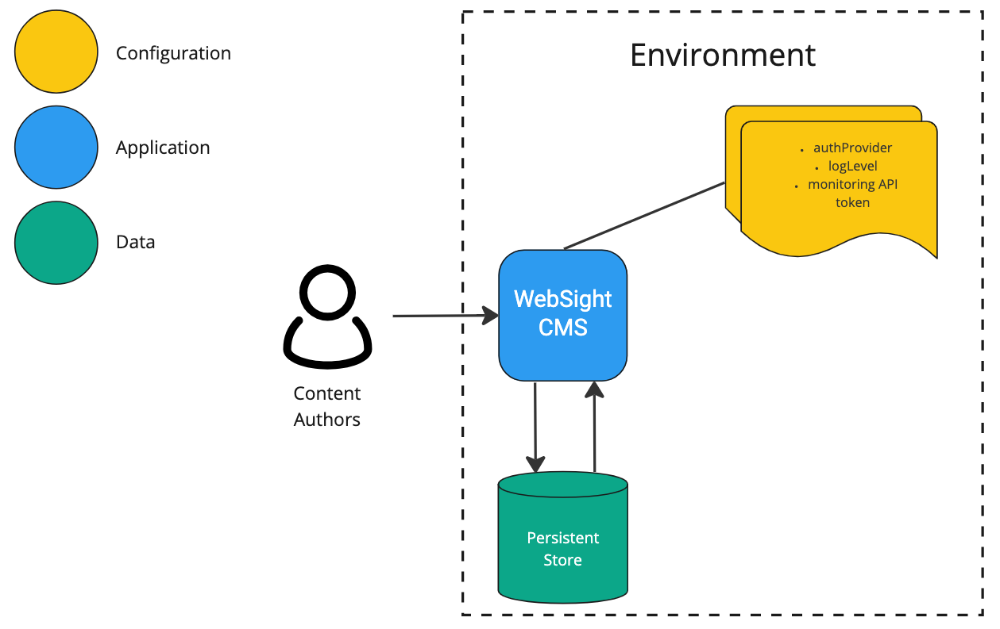

*Published at: 21.12.2022 by [Maciej Laskowski](https://github.com/malaskowski)*

> In this blog, I will explain how the WebSight CMS team approaches the twelve-factor app principles of separating codebase, data, and configuration with containerization.

## CMS

CMS stands for Content Management System. The content (titles/paragraphs/labels, but sometimes also assets like images, PDFs, etc.) is the first citizen in CMS. In short words, the application enables content authors to manage (add, update, delete, and finally publish) the content that is later served to the end users by the channel of their choice (e.g., website, mobile app, smart TV).

In the previous blog on containerizing [the OSGi application](/blog/2022/shipping-and-developing-osgi-application-in-container/), I focused mainly on the system architecture qualities. Today, we will look at the WebSight CMS in the aspect of the working environment (e.g., development, test, acceptance, production) that consists of three separate layers.

WebSight CMS is built on top of Apache Sling. As we already noted in the [post on understanding Sling Resources](/blog/2022/are-jcr-nodes-and-sling-resources-the-same-thing/), in the Sling world - everything is a [resource](https://sling.apache.org/documentation/the-sling-engine/resources.html#what-is-a-resource), including apps, configs, and data. Deploying and scaling the Apache Sling app in the cloud is possible using the [Oak Composite NodeStore](https://jackrabbit.apache.org/oak/docs/nodestore/compositens.html). However, we decided to take a different approach and implement a custom [Bundle Resource Provider](https://github.com/websight-io/websight-bundle-resource-provider). But that’s a topic for a dedicated blog. Now, let’s consider the configuration, application, and data in WebSight CMS.

## Configuration

There are two types of configuration:

* _Application_ _configuration_ defines the foundation and does not vary between environments (e.g., which modules application starts).
* _Environment configuration_ is everything likely to vary between environments (including confidential data like passwords or API tokens).

In this article, we will focus on the latter. There are multiple practices to provide environment-specific configuration to the application, naming a few:

* environment variables (language- and OS-agnostic standard),
* secrets (used in Docker or Kubernetes),
* files (e.g., attached via [Kubernetes ConfigMaps](https://kubernetes.io/docs/concepts/configuration/configmap/)).

Some advantages of using environment configurations independent of the application:

* The team can change settings without the need to release (or sometimes even without restarting) the application (e.g., thanks to OSGi configuration watching). When we were containerizing the WebSight CMS (which runs on the Apache Sling), we found Felix-dev [Interpolation Plugin](https://github.com/apache/felix-dev/blob/master/configadmin-plugins/interpolation/README.md) very handy.
* Vulnerable configs access is limited to administrators, who set it as secrets in CI or Secrets Manager (e.g., AWS Secret Manager or HashiCorp Vault) and securely mount it to the environment.

## Application

The application (created from the codebase) represents the logic with all necessary add-ons (like models, connectivity with database, or network requests) that delivers business value. In the case of WebSight CMS, we decided to build a stateless application. We keep the data outside the application (e.g., in DB or other persistent forms). That approach enabled the team to gain the following benefits:

* The application can be destroyed and recreated on demand (in seconds).
* Horizontal scaling up and down is easy to achieve, thanks to containers.

## Data

The data in CMS (and probably on any other system) is the most precious resource. It is usually not possible to recreate it easily. That is why we treat it in different ways than application or configuration. And the separation enables us to do so.

Data could be regularly backed up (depending on desired [Recovery Point Objective](https://en.wikipedia.org/wiki/Disaster_recovery#Recovery_Point_Objective) - RPO) and restored in case of trouble. The time to provide the operational environment ([Recovery Time Objective](https://en.wikipedia.org/wiki/Disaster_recovery#Recovery_Time_Objective) - RTO) depends on the volume of data because the application and configuration are ready almost instantly after the infrastructure is ready (which is also very fast in the case of cloud providers).

Another benefit of data separation is the ability to use different data sets during development and testing. That means we could easily create the application (build an image), test it against corner cases, and later attach it to the production data. The same is true for the opposite direction. The team can easily import the production data into the developer environment to investigate and fix encountered problems.

## Summary

In this blog, we focused on WebSight CMS in the aspect of three separate ingredients that, together with underlying infrastructure, compose a fully working environment. Separation of the configuration, application, and data enables development teams to:

* Create reusable releases and independent deployment cycles - build an application once, and deploy anywhere, anytime.
* Gain high confidence in the released application (image tested once, deployed everywhere will be the same).
* Achieve a high level of security (vulnerable data stored as secrets).
* Benefit from continuous integration - dedicated content (data) to test edge cases on the same image that travels to the higher environments (acceptance, production).
* Scale up and down the application (business logic) in an easy and automated way.
* Improve disaster recovery by optimizing RPO and RTO metrics.

## References
* [The twelve-factor app](https://12factor.net/) - a set of principles for building software-as-a-service apps. Most of those methods are considered the best practice for any modern web application, including separation of the codebase, configuration, and data.
* [Kubernetes ConfigMap](https://kubernetes.io/docs/concepts/configuration/configmap/) - a common technique for separating the application (image) from the configuration. ConfigMaps should not contain sensitive information.
* [Kubernetes Secrets](https://kubernetes.io/docs/concepts/configuration/secret/) - when the configuration contains sensitive information like passwords or tokens, secrets isolate the application (image) from the configs in a secure way.
