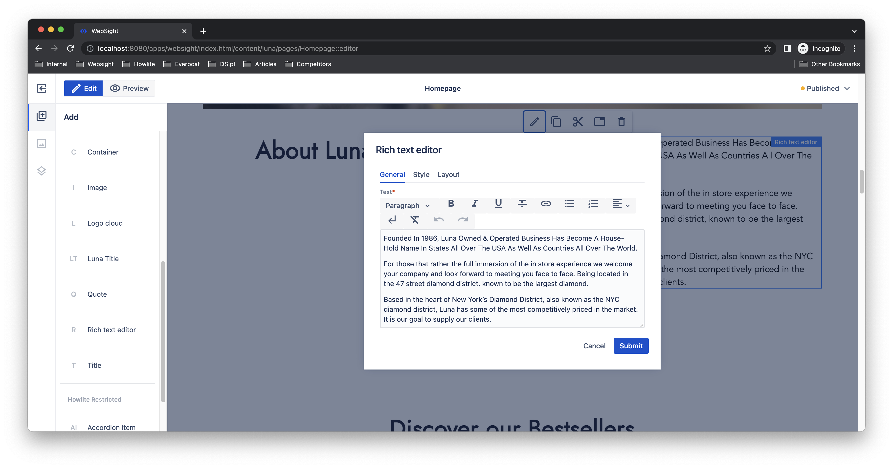
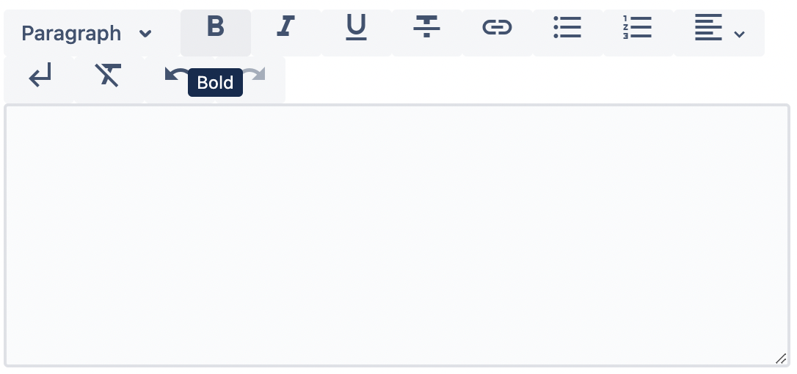
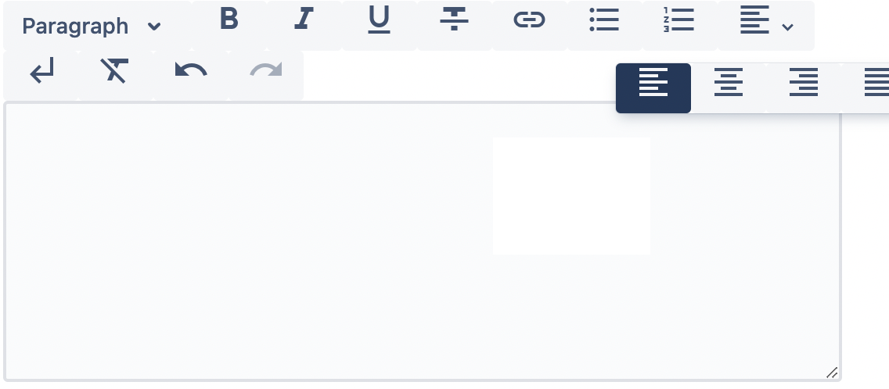
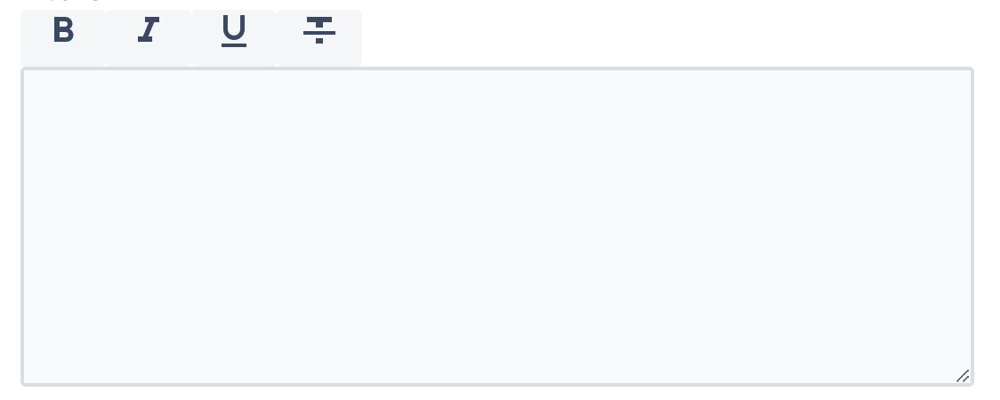

*Published at: 20.10.2022 by [Pawel Jozwicki](https://github.com/paweljozwicki), [Kamil Kwarciak](https://github.com/kamil-kwarciak)*

>

# Customising Rich Text Editor in WebSight CMS


> Ensuring site consistency is very important to provide an excellent experience for visitors. You can achieve the goal with page templates and components. They implement a structure that authors have to follow. However, a total lack of flexibility would require a lot of development effort to cover every case presented in designs. 

> Rich Text Editor (RTE) can be a sweet spot. It is an input field that provides a rich editing experience and offers extra formatting options like bold, italic, or bullet points. Moreover, RTE can deliver additional functionalities for edited content, for example, link definition, undo/redo. Finally, you can customize and extend RTE to provide the desired level of flexibility. 

> This article presents how to use and configure RTE in WebSight CMS. 


## WebSight RTE formatting functionalities

WebSight Rich Text Editor provides multiple content editing functionalities with possibilities to adjust and extend them. Each functionality requires a definition of two elements:

- UI component added to the menu bar;
- a plugin component that implements various styling or content processing feature.

The above separation enables adjustment of the RTE toolbar according to the desired level of freedom. You can configure the editing options as separate buttons, group them in a dropdown or prepare a dropdown list. Moreover, you can extend the set of existing functionalities and create additional UI components or implement different plugins. Then, you can mix them all and include them in the toolbar to provide new options. 

WebSight CMS delivers the following UI components for the RTE toolbar:

- Button with a caption or displayed as an icon (if provided);
- Button Dropdown that groups several buttons in a dropdown;
- Dropdown that contains a list of options;
- Link that opens a dialog for a link setup.

The list of available plugin components is as follows:

- Bold
- Italic
- Underline
- Strikethrough
- Bullet list
- Ordered list
- Paragraph
- Heading
- Link
- Unset link
- Clear formatting
- Hard Break
- Text Align
- Undo
- Redo

## Using RTE as a dialog field

RTE is not a stand-alone content editor in WebSight CMS. You need to add it in a dialog definition for a component. Use `wcm/dialogs/components/richtext` as the resource type. Once completed, you can drag and drop the component on a page, open its dialog and enter the content.

```json title="/libs/howlite/components/richtext/dialog/.content.json"
...

"text": {
  "sling:resourceType": "wcm/dialogs/components/richtext",
  "name": "text",
  "label": "Text"
}

...
```
RTE defined above uses a default configuration. See the regular options available in the toolbar on the image below. It presents an application in the [Rich text editor](../../../docs/authors/component-libs/howlite/rte/) component that is a part of the [Howlite](../../../docs/authors/component-libs/howlite/) library.



!!! hint "Components development"
    See our [component development guide](../../../docs/developers/components/) and documentation for [dialogs](../../../docs/developers/dialogs/) to learn more on how to use input fields and define dialogs for components.

## RTE customization

### Configuration of components

You can modify RTE by defining a custom configuration. Thus, let's review its structure first.

RTE configuration should include entries for all functionalities available in the editor. Each entry consists of UI component details, and the plugin runs when a user clicks the UI component.

See a sample configuration for `Bold` functionality below:

```json
{
  "sling:resourceType": "wcm/dialogs/components/richtext/ui/button",
  "title": "Bold",
  "icon": "format_bold",
  "plugin": {
    "sling:resourceType": "wcm/dialogs/components/richtext/plugin/bold"
  }
}
```

The configuration contains a path to [UI Component](/docs/developers/dialogs/richtext-editor/ui-components), its title and icon, and a path to [plugin component](/docs/developers/dialogs/richtext-editor/plugin-components)

See the result on the screen presented below.


You may need to group buttons in a dropdown, for example, text alignment options. Let's assume the expected result is as follows.


You can use the following configuration to implement it.
```json
{
  "sling:resourceType": "wcm/dialogs/components/richtext/ui/buttondropdown",
  "title": "Text Alignment",
  "left": {
    "sling:resourceType": "wcm/dialogs/components/richtext/ui/button",
    "title": "Left Align",
    "icon": "format_align_left",
    "plugin": {
      "sling:resourceType": "wcm/dialogs/components/richtext/plugin/textalign",
      "alignment": "left"
    }
  },
  "center": {
    "sling:resourceType": "wcm/dialogs/components/richtext/ui/button",
    "title": "Center Align",
    "icon": "format_align_center",
    "plugin": {
      "sling:resourceType": "wcm/dialogs/components/richtext/plugin/textalign",
      "alignment": "center"
    }
  },
  "right": {
    "sling:resourceType": "wcm/dialogs/components/richtext/ui/button",
    "title": "Right Align",
    "icon": "format_align_right",
    "plugin": {
      "sling:resourceType": "wcm/dialogs/components/richtext/plugin/textalign",
      "alignment": "right"
    }
  },
  "justify": {
    "sling:resourceType": "wcm/dialogs/components/richtext/ui/button",
    "title": "Justify Align",
    "icon": "format_align_justify",
    "plugin": {
      "sling:resourceType": "wcm/dialogs/components/richtext/plugin/textalign",
      "alignment": "justify"
    }
  }
}
```

The above scenario requires embedding `button` components in `buttondropdown`. Moreover, `textalign` plugin requires alignment type as a parameter. 


### Sample configuration file

It is required to define a proper resource type for the RTE configuration. It should be `wcm/dialogs/components/richtext/configuration`. Additionally, the configuration should contain definitions for all components as described above.

```json title="/apps/myapp/components/rte/configuration"
{
  "sling:resourceType": "wcm/dialogs/components/richtext/configuration",
  "bold": {
    "sling:resourceType": "wcm/dialogs/components/richtext/ui/button",
    "title": "Bold",
    "icon": "format_bold",
    "plugin": {
      "sling:resourceType": "wcm/dialogs/components/richtext/plugin/bold"
    }
  },
  "italic": {
    "sling:resourceType": "wcm/dialogs/components/richtext/ui/button",
    "title": "Italic",
    "icon": "format_italic",
    "plugin": {
      "sling:resourceType": "wcm/dialogs/components/richtext/plugin/italic"
    }
  },
  "underline": {
    "sling:resourceType": "wcm/dialogs/components/richtext/ui/button",
    "title": "Underline",
    "icon": "format_underlined",
    "plugin": {
      "sling:resourceType": "wcm/dialogs/components/richtext/plugin/underline"
    }
  },
  "strikethrough": {
    "sling:resourceType": "wcm/dialogs/components/richtext/ui/button",
    "title": "Strikethrough",
    "icon": "format_strikethrough",
    "plugin": {
      "sling:resourceType": "wcm/dialogs/components/richtext/plugin/strikethrough"
    }
  }
}
```

The above configuration includes just four simple font styles. Its application results in the following RTE.



### Using custom configuration

You can change the RTE configuration in two ways. 

Firstly, by adding a property with a path to a custom configuration.
```json
"content": {
  "sling:resourceType": "wcm/dialogs/components/richtext",
  "name": "content",
  "label": "Content",
  "configuration": "/apps/myapp/components/rte/configuration"
}
```

Another option is to define the configuration explicitly under the field definition.
```json
"content": {
  "sling:resourceType": "wcm/dialogs/components/richtext",
  "name": "content",
  "label": "Content",
  "configuration":  {
    ...
  }
}
```

# Summary

Page templates may determine the overall layout of components. However, one of them can be RTE. It gives users some flexibility in the content authoring for a given area on the page. 

We presented how to adjust the flexibility level granted to authors. You can use a collection of plugins to customize the functionalities of RTE. Moreover, you can implement your UI or plugin components as well. We will cover this advanced topic in one of my next blog posts. 

You can find more details on RTE customization in our [documentation](../../../docs/developers/dialogs/richtext-editor/).