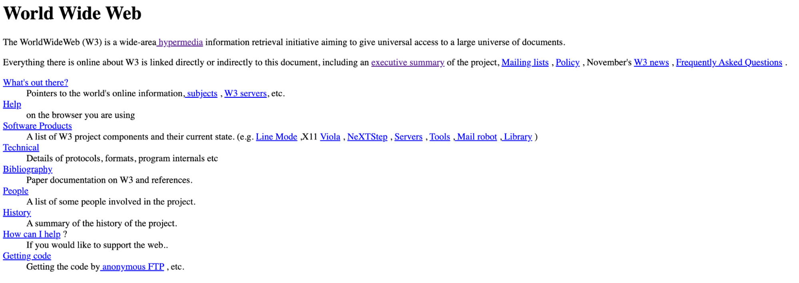
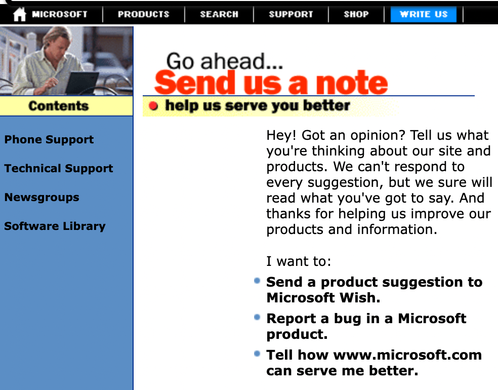
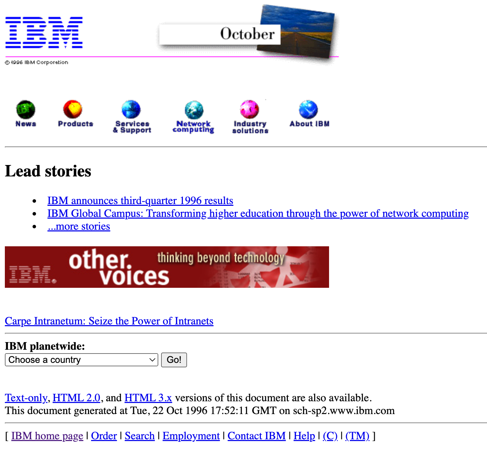

*Published at: 06.10.2022 by [Michal Papciak](https://github.com/michup-ds)*
<!-- https://pixabay.com/photos/human-evolution-reenactment-sunset-3801547/ -->

> There are multiple articles on the internet that touch the definitions of CMS and DXP and attempt to draw a line between them. And of course the line can vary from one definition to another. 

> In this blogpost, I would like to look into how the web has changed from web 1.0 to what it is right now and how these changes and business needs have impacted the evolution of content management systems. 

## The evolution of WWW and its impact on content management systems

The first website in history was published on August the 6th, 1991 by Tim Berners Lee. While working at CERN, Berners Lee was frustrated with the fact that there is so much knowledge spread with the thousands of researchers employed at CERN and yet… it is near impossible to access and use it. In his own words:

_“I found myself answering the same questions asked frequently of me by different people. It would be so much easier if everyone could just read my database.”_

It took some serious work and negotiations from the London-born physicist to convince his boss to allow him to work on the project then called “Information Management” (later changed to WorldWideWeb). The website below is the key milestone of that project: 

    
    The first webpage  (<a href="http://info.cern.ch/hypertext/WWW/TheProject.html">source</a>)

This simple compilation of links and text started everything. Fast forward about 5 - 6 years and the **WWW grew to over 200.000 websites**. Nothing compared to near 2 billion we have in 2022[1]. But what was noticed then, is that producing new content with HTML authoring tools will simply not scale up to the needs. Wise observation for the time, considering that the websites of tech giants like Microsoft or IBM still looked something like this:

    
    Microsoft “write us” page in late 1996  (<a href="https://web.archive.org/web/19980120112129/http://www.microsoft.com/regwiz/regwiz.asp">source</a>)

 

    
    IBM homepage in October 1996 (<a href="https://web.archive.org/web/19961022175210/http://www.ibm.com/">source</a>)

All this was still in the mid of web 1.0 era, [Internet Explorer had just learned to support CSS](https://www.w3.org/Style/CSS/msie/) and shortly after [Document Object Model](https://en.wikipedia.org/wiki/Document_Object_Model) was born. Pages like above shaped the early requirements of the CMS:

1. Having one, central repository where content authors would collaborate efficiently;
1. Easing the process of content creation by removing pure HTML creation. More consistency between pages needed;
1. Rudimentary set of permissions for content authors, so that it is clear who can work on which parts of the website;
1. Some basic security over our content and the information we want and potentially do not want to publish.

That was really it. And early content management systems allowed for exactly that. Server side scripting transformed simple templates filled in by authors to HTML. One database stored all the content and managed permissions. Only one distribution channel - the desktop, only static pages served, and finally, only one way communication: from the content authors to the web. Things were simple. 

Fast forward to the Web 2.0 era. This is when users started generating content. Pages were no longer static, e-commerce had arrived and [soon social media started becoming very relevant](https://www.statista.com/statistics/264810/number-of-monthly-active-facebook-users-worldwide/). The web users now communicate with the businesses in digital. And they expect to be heard. Around that time (2008 - 2010) your CMS should:

1. Support WYSIWYG content authoring;
1. Support complex, publishing workflows;
1. Allow for bi-directional communication with your users;
1. Store and serve various media types, including rich media.

Things became much trickier - your CMS then had to support some complex processes and integrate with a lot of different applications (think about all the Wordpress app-like plugins). And this is something it was not designed to do initially. 

One more jump in time and we are in 2015 - 2017. [2017 was the first year when mobile traffic overtook the desktop](https://gs.statcounter.com/platform-market-share/desktop-mobile/worldwide/#yearly-2011-2022). And it has remained so until now. The WWW users now expect a consistent experience between desktop and mobile. There are 1 billion websites in the world. Your CMS has become more of a platform that:

1. Supports all devices;
1. Gathers data and customer intelligence;
1. Is context aware and serves personalized content;
1. Supports multiple infrastructure and deployment models;
1. Integrates seamlessly with 3rd party software.

Even though monolithic CMS are still standing strong, it is becoming apparent that at some point, the amount of data, touchpoints and users will become a challenge. Scaling monoliths will be complicated or costly but most likely both. And this is actually how we enter the DXP.

## DXP - a revolution or “just” next step?

I do not like definitions, so I will not quote Gartner Glossary here. Allow me to list the challenges I think a DXP should address: 

1. The ability to deliver contextualized experiences to digital channels (web, mobile, apps, social media, email, IoT devices…) and **scale up quickly and at low cost**. 
1. Consistency between all channels and devices for a full, end to end customer journey. There is nothing more annoying than an empty basket on your mobile app when you've just completed it on a website.
1. One to one personalization. 75% of consumers are likely to buy from companies that are able to suggest a product based on their previous interest, buys and journeys[2]. 
1. The ability to extend your customer’s profile by easily connecting other systems - CRM, CDP and similar. 
1. Using any tools you like. Due to the architecture of a DXP, you should not be subject to vendor - locking. Instead you are able to build the best digital marketing suite out of the tools and systems you feel are best. 

You could argue that some of the same issues we were trying to solve as early as in 2016. And I would agree. **There is a major factor to consider here though, which is the volume**. 
There is a fantastic book by Vaclav Smil called [_Numbers don’t lie_](https://www.amazon.pl/Numbers-dont-lie-things-about/dp/0241989698) (I’d recommend you give the entire book a read) and one of the chapters touches on the volume of data we produce. Some facts:

1. In 2018 in the United States, the internet users have downloaded 97000 hours of movies and series from Netflix **every minute**. They watched 4.5 million Youtube movies and generally transferred a total of 3.1 petabytes of data (that is 3.1 x 1015 bytes). Again that is **every minute**.
1. In 2016, the pace in which we produced data was estimated to be 16 zettabytes a year, which is 16 * 1021 bytes. To put that into perspective: you would have to download a 4k Braveheart movie about 400.000.000.000 times to generate the same volume.  
1. It is estimated that by 2025 this number will be ten times higher - 160 zettabytes a year (which is 160 * 1021 bytes). 
1. Somewhere in all of this, is your digital estate and your CMS.
 
**So what is a DXP?** In essence, a DXP is a technological suite, at heart of which could be the CMS. The suite should be powered by an architecture with loosely - coupled elements that allows you to easily plug in tools (personalization engines, marketing automation, CRM etc.) that improve your user and customer experience. Most importantly however, that architecture should be able to serve all your visitors, channels and data volume now, tomorrow and three years from now, when it  becomes even more challenging (as indicated by Professor Smil in his book). 

**Is DXP a revolution then?** In my opinion no, it is the next step, just like Web 2.0 CMS was the next step from Web 1.0 CMS. **Does it require a shift in technical design from what it initially was?** Yes, definitely.

## DXP - should you care?

Yes, you should. Here is why:

1. Digital Experience Platform market size will be worth $15.80 Billion by 2025 [3], [4]
1. 65% of North American consumers say they trust a business less when they experience a problem using a website or mobile app [5]
1. 55% of customers prefer digital channels over traditional channels [5]</a>
1. 32% consumers say they will walk away from a brand **they love** after just one bad experience [6]

If a company has a digital presence and wants to keep up with user’s growing expectations - a DXP should be on their radar. 

## Summary

The goal of this post is to give the reader an overview of how the needs of the businesses in WWW have shaped content management systems. We went from its early days to explaining the explosion of data and delivery channels and what challenges they have brought. 

In the next blogpost, I would like to introduce how our product - WebSight is designed to fit the demanding digital environment today. We will take a closer, more technical look into the features and architecture that is able to power the next generation of Customer Experience. 

[1]: https://www.internetlivestats.com/total-number-of-websites/
[2]: https://newsroom.accenture.com/news/consumers-welcome-personalized-offerings-but-businesses-are-struggling-to-deliver-finds-accenture-interactive-personalization-research.htm
[3]: https://www.prnewswire.com/news-releases/digital-experience-platform-market-size-worth-15-80-billion-by-2025-grand-view-research-inc-300957088.html
[4]: https://www.statista.com/statistics/1306566/digital-experience-platform-market-size/
[5]: https://www.fullstory.com/blog/digital-experience-consumer-survey/
[6]: https://www.pwc.com/us/en/advisory-services/publications/consumer-intelligence-series/pwc-consumer-intelligence-series-customer-experience.pdf
