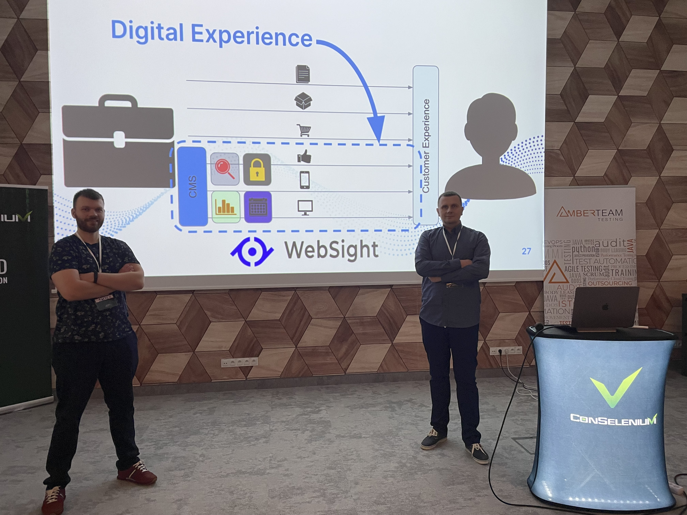
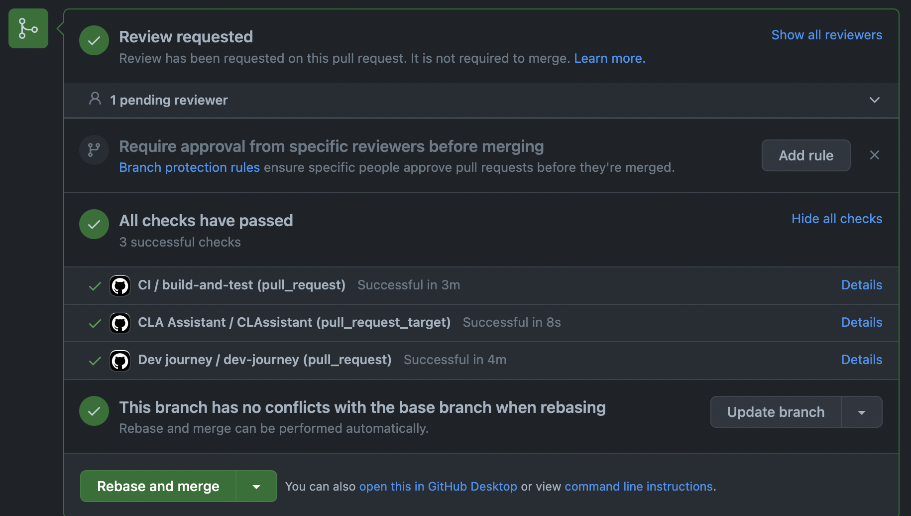

*Published at: 06.12.2022 by [Maciej Laskowski](https://github.com/malaskowski) and [Radek Lawgmin](https://github.com/radeklawgmin)*

Last Friday (02.12.2022) we had much pleasure speaking at the ConSelenium conference in Warsaw.

And what was the presentation like? We started by introducing some basic concepts including what the DXP is and how it has grown out of the constraints CMS started to place in regard to building modern customer experience. Next, we talked about milestones in the history of WebSight - from the general idea for a new system, through developing a platform prototype, forming a product team responsible for delivering features to releasing the Early Preview version and its Community Edition. We mentioned those stages in the context of the challenges we came across while developing it, including solutions and tools we had used to address them. Solving problems and adding new items one by one made us evolve so much that now we think about this evolution in terms of the revolution.

No doubt, automation turned out to be one of the key points here. Apart from making the whole team work more efficient it has also helped us to transform the QA role within it. More or less traditional quality assurance engineer started to be a quality assistant i.e. an advisor, educator and facilitator with some automation help replaced attended aspects of testing we struggled with before, especially during ineffective regression sessions. And now our quality assistant supports the dev team in their work in the field of testing and automation including strategy, designing, promoting best practices and addressing edge cases.

Another point we touched was Selenium or rather why we preferred Cypress. Having a great number of positive experiences from the past, this time we needed a framework that we could launch instantly and that is ready to use and stable. It was also a matter of reaching a compromise and enabling each team member to cover the functionalities and bugfixes she/he delivered with automated checks and as a result growing the culture of developing automated checks within the team.

We also gave a short demo of WebSight focused mainly on how and where we make use of automated checking tools when delivering a product. Being a team that builds platforms for delivering Digital Experience, we want the future project based on WebSight to take advantage of our developers' experience and make their start even easier. That’s why [starting a new project from our archetype](/docs/developers/setup/#generate-a-project) includes fully integrated units and end-to-end (functional + visual) tests. With our approach you can easily launch a product in a cloud environment within a minute and have it validated with automated checks run as a part of the GitHub Actions pipeline. 

But that’s not the end - we will be extending the template in the future to give the dev team even more ready-to-use quality patterns and techniques (e.g. such as CI configuration or automated performance checks as a part of CI).

The QA transformation we did, turned out to be revolutionary but we know it is still not over yet, and there is so much more for us to do…

If you want to read more about this topic, please visit Radek's post on [Achieving quality with no dedicated QA Engineers ](/blog/2022/achieving-quality-with-no-dedicated-qa-engineers/).

As for the conference itself, we must admit that the program board made an effort and chose really interesting and diverse subjects thanks to which the content was, as always, at a very high level and its organization was just excellent (the organizers really cared not only about the participants, but also made every effort to make the speakers feel at home).

Thanks again, and stay tuned!
