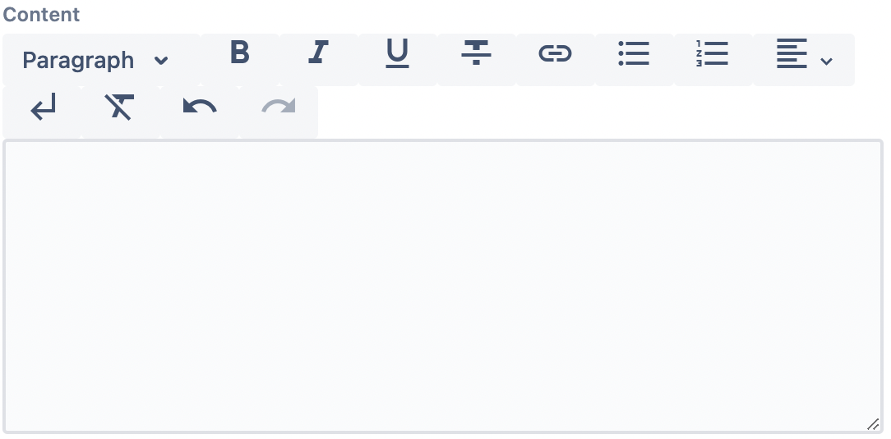
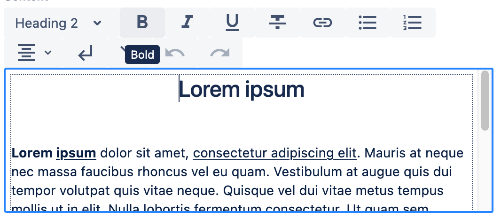
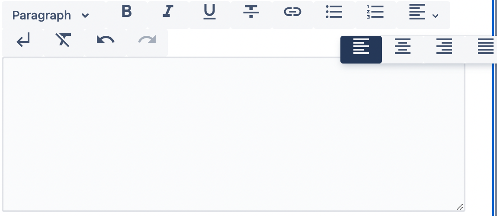

*Published at: dd.mm.yyyy by [Author Name](https://github.com/author-git-slug)*

>

# Rich text editors
Rich text editors (RTE) are dialog fields that give a better, richer editing experience and usually are in the form of WYSIWYG (What You See Is What You Get), where you see right away how your text changes when you format it without having to deal with the whole HTML formatting. They offer more text editing and formatting options, like bold, italics, bullet points, heading levels, etc, than text editors.

Apart from standard functionalities, WebSight RTE can be customized with UI components and formatting logic to fit your needs. In this article, we will discuss how to use and configure them.

## WebSight RTE formatting functionalities
WebSight Rich Text Editor provides multiple content editing functionalities with the possibility to extend their functions. Each formatting functionality requires a definition of two elements
- UI component, which defines UI elements added to the menu bar,
- formatting logic, which provides formatting functionality.

Thanks to the separation of UI and formatting logic the toolbar can be adjusted to the author's needs. Some actions can be added as a separate button or one of the buttons grouped in a dropdown, or as part of a dropdown list. Users can also create dedicated UI components and build the whole toolbar using just them, or create a new formatting logic and add it to the toolbar using the existing UI components.

### UI components:
- Button - action visible as a button in the menu, can be displayed as an icon or with a title.
- Button Dropdown - button group added to the toolbar
- Dropdown - opens a list of actions added to the menu bar.
- Link - opens a dialog in which the author can add a link and select the target type.

### Formatting logic
Formatting logic allows users to register features to edit text content

Available formatting logic:
- Bold
- Italic
- Underline
- Strikethrough
- Bullet list
- Ordered list
- Paragraph
- Heading
- Link
- Unset link
- Clear formatting
- Hard Break
- Text Align
- Undo
- Redo

## Using RTE dialog field
All you need to use RTE dialog field is to add its definition using RTE resource type:

```json
"content": {
  "sling:resourceType": "wcm/dialogs/components/richtext",
  "name": "content",
  "label": "Content"
}
```
RTE field created that way uses its default configuration.



### RTE dialog field customization

You can change RTE field configuration in two ways:
- by adding a property with a path to a custom configuration:
```json
"content": {
  "sling:resourceType": "wcm/dialogs/components/richtext",
  "name": "content",
  "label": "Content",
  "configuration": "/apps/myapp/components/rte/configuration"
}
```

- by defining its configuration explicit under the field definition:
```json
"content": {
  "sling:resourceType": "wcm/dialogs/components/richtext",
  "name": "content",
  "label": "Content",
  "configuration":  {
    ...
  }
}
```


### RTE configuration:
RTE field configuration is a set of formatting functionalities definitions. Each of them has UI Component definition with:
- `sling:resourceType` - path to UI Component
- properties used by UI Component, such as title or icon
- `plugin` - formatting login definition with:
  - `sling:resourceType` - path to formatting logic
  - properties used by formatting logic
- child UI components - other UI components defined instead of `plugin` definition

#### Sample definitions:
To add a button with bold functionality

you can use:
```json
{
  "sling:resourceType": "wcm/dialogs/components/richtext/ui/button",
  "title": "Bold",
  "icon": "format_bold",
  "plugin": {
    "sling:resourceType": "wcm/dialogs/components/richtext/plugin/bold"
  }
}
```

To add buttons allow choosing text-align

you can use:
```json
{
  "sling:resourceType": "wcm/dialogs/components/richtext/ui/buttondropdown",
  "title": "Text Alignment",
  "left": {
    "sling:resourceType": "wcm/dialogs/components/richtext/ui/button",
    "title": "Left Align",
    "icon": "format_align_left",
    "plugin": {
      "sling:resourceType": "wcm/dialogs/components/richtext/plugin/textalign",
      "alignment": "left"
    }
  },
  "center": {
    "sling:resourceType": "wcm/dialogs/components/richtext/ui/button",
    "title": "Center Align",
    "icon": "format_align_center",
    "plugin": {
      "sling:resourceType": "wcm/dialogs/components/richtext/plugin/textalign",
      "alignment": "center"
    }
  },
  "right": {
    "sling:resourceType": "wcm/dialogs/components/richtext/ui/button",
    "title": "Right Align",
    "icon": "format_align_right",
    "plugin": {
      "sling:resourceType": "wcm/dialogs/components/richtext/plugin/textalign",
      "alignment": "right"
    }
  },
  "justify": {
    "sling:resourceType": "wcm/dialogs/components/richtext/ui/button",
    "title": "Justify Align",
    "icon": "format_align_justify",
    "plugin": {
      "sling:resourceType": "wcm/dialogs/components/richtext/plugin/textalign",
      "alignment": "justify"
    }
  }
}
```

### Sample configurations

To prepare a configuration you have to set its resource type to `wcm/dialogs/components/richtext/configuration`
and add all the formatting functionalities you need.
```json
{
  "sling:resourceType": "wcm/dialogs/components/richtext/configuration",
  "bold": {
    "sling:resourceType": "wcm/dialogs/components/richtext/ui/button",
    "title": "Bold",
    "icon": "format_bold",
    "plugin": {
      "sling:resourceType": "wcm/dialogs/components/richtext/plugin/bold"
    }
  },
  "italic": {
    "sling:resourceType": "wcm/dialogs/components/richtext/ui/button",
    "title": "Italic",
    "icon": "format_italic",
    "plugin": {
      "sling:resourceType": "wcm/dialogs/components/richtext/plugin/italic"
    }
  },
  "underline": {
    "sling:resourceType": "wcm/dialogs/components/richtext/ui/button",
    "title": "Underline",
    "icon": "format_underlined",
    "plugin": {
      "sling:resourceType": "wcm/dialogs/components/richtext/plugin/underline"
    }
  },
  "strikethrough": {
    "sling:resourceType": "wcm/dialogs/components/richtext/ui/button",
    "title": "Strikethrough",
    "icon": "format_strikethrough",
    "plugin": {
      "sling:resourceType": "wcm/dialogs/components/richtext/plugin/strikethrough"
    }
  }
}
```


If you need to add simple changes to the existing configuration you don't have to write the whole configuration from scratch. You can use [sling resource merger](https://sling.apache.org/documentation/bundles/resource-merger.html) mechanism. To do so, you have to point existing configuration in the resource supertype property and define all the differences.
```json
{
  "sling:resourceSuperType": "wcm/dialogs/components/richtext/configuration",
  "sling:hideChildren": ["bold", "italic", "underline", "strikethrough"]
}
```


## Custom formatting logic
If you need some formatting logic that is not available in WebSight then you can provide it yourself.

The first thing you have to know is that we are using [TipTap](https://tiptap.dev/) under our text editor. So you can easily use any of the extensions provided by TipTap.
Now you have to prepare two things:

### Formatting logic configuration

It requires specifying `type` which is a path to formatting logic source code. Optionally you can define also a `configuration` object with all properties required by the designed formatting logic
```html
{
  "type": "/apps/myapp/web-resources/components/richtext/plugin/Plugin.js",
  "configuration": {}
}
```

example configuration for headings:
```html
{
  "type": "/apps/websight-dialogs-view/web-resources/components/richtext/plugin/Heading.js",
  "configuration": {
    "level": ${properties.level || 1}
  }
}
```

### Formatting logic source code

It's a js function that should follow the given interface:
```js
const Plugin = (configuration) => ({
  getTipTapExtensions: () => [],
  getAction: (context) => ({
    execute: (state) => {},
  }),
  getState: (context) => ({}),
});

export  default  Plugin;
```
- `getTipTapExtensions` should return all TipTap extensions required by formatting logic
- `getAction` is a function which `context` parameter provides `editor` property. This property points to TipTap editor, so it allows executing some TipTap action. `getAction` should return an object with execute method which has a `state` parameter. This parameter has the same structure as returned from `getState` function
- `getState` should return an object with properties required to build the proper state of the UI Component. Object with this same structure is expected in execute method.

example for heading:
```js
const Heading = ({ level }) => ({
  getTipTapExtensions: () => [TipTapHeading],
  getAction: ({ editor }) => ({
    execute: () => editor.chain().focus().setHeading({ level }).run(),
  }),
  getState: ({ editor }) => ({
    isActive: editor.isActive('heading', { level }),
  }),
});

export default Heading;
```

## Custom UI component
If your project requires some specific UI component to handle formatting logic then you can also provide it by yourself.

You have to specify two files

### UI Component configuration

- type - should point script with UI component definition
- configuration - contains properties required by the component to render properly
- children - contains a list of subcomponents. It is used by components grouping other ones in some structure.
- plugin - formatting logic configuration.

```html
{
  "type": "/apps/myapp/web-resources/components/richtext/ui/Component.js",
  "configuration": {}
  <sly data-sly-list="${resource.children}">
    <sly data-sly-test="itemList.first">,
      "plugin": <sly data-sly-resource="${item}"></sly>
    </sly>
  </sly>
}
```

or

```html
{
  "type": "/apps/myapp/web-resources/components/richtext/ui/Component.js",
  "configuration": {}
  "children": [
    <sly data-sly-list="${resource.children}">
      <sly data-sly-resource="${item}"></sly>
      <sly data-sly-test="${!itemList.last}">,</sly>
    </sly>
  ]
}
```

example for button:
```html
{
  "type": "/apps/websight-dialogs-view/web-resources/components/richtext/ui/Button.js",
  "configuration": {
    "title": "${properties.title}",
    "icon": "${properties.icon}"
  }
  <sly data-sly-list="${resource.children}">
    <sly data-sly-test="itemList.first">,
      "plugin": <sly data-sly-resource="${item}"></sly>
    </sly>
  </sly>
}
```

### UI Component source code:

Component source code is a function that takes:
- configuration - parameter in the same structure as defined in the Component configuration,
- state - current state. It get from the plugin `getState` method
- action - action run on event executed by component. It get from the plugin `getAction` method
- children - children components

```js
const Component = ({ configuration, state, action, children }) => {
  return (
    <></>
  )
}
```

```js
import PropTypes from 'prop-types';
import React from 'react';
import AtlaskitButton from '@atlaskit/button';
import Tooltip from '@atlaskit/tooltip';

import Icon from 'websight-ui-components/icon';

const Button = ({ configuration, state, action }) => {
    const { title, icon } = configuration;
    const { isActive, isDisabled } = state;
    const { execute } = action;

    return (
        <Tooltip content={title}>
            <AtlaskitButton
                type="button"
                isSelected={isActive}
                isDisabled={isDisabled}
                onClick={execute}
                testId={`RichText_Button_${title.replaceAll(' ', '')}`}
            >
                {icon ? <Icon label={title} name={icon} /> : title}
            </AtlaskitButton>
        </Tooltip>
    );
};

Button.propTypes = {
    configuration: PropTypes.shape({
        title: PropTypes.string.isRequired,
        icon: PropTypes.string,
    }).isRequired,
    state: PropTypes.shape({
        isActive: PropTypes.bool.isRequired,
        isDisabled: PropTypes.bool.isRequired,
    }).isRequired,
    action: PropTypes.shape({
        execute: PropTypes.func.isRequired,
    }).isRequired,
};

export default Button;

```

# Summary
WebSight Rich Text Editor is a versatile tool that gives a better editing experience to the authors. It provides multiple formatting functionalities and can be easily used with the default configuration. Additionally, thanks to the separation of UI and formatting logic it’s flexible and can be adjusted to the user’s needs. After reading this blog post you should know how to add RTE field to the component dialog, how to change the default configuration, and how to prepare a new one or change the existing configuration.