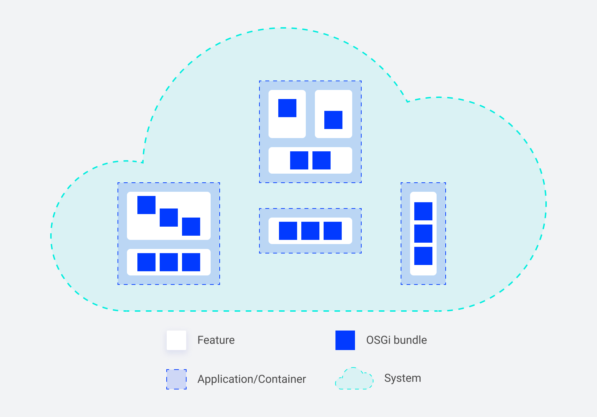

*Published at: 02.08.2022 by [Maciej Laskowski](https://github.com/malaskowski)*

> Modern distributed software systems consist of multiple cooperating software applications. However, to run the application, the software we develop is only one part. The second one is the environment (e.g., JVM and OS). In this article, I will focus on building an OSGi application and explain five benefits we gained thanks to containerizing it.

## Modularity

In the previous article “[Building OSGi applications with Sling Feature Model](https://www.websight.io/blog/2022/building-osgi-apps-with-sling-feature-model/)” we discussed modularity on the bundles and features (micro) level. In this article, we analyze another level - application/container. Thanks to containers, we can benefit from micro-level modularity at the application (macro) level. Containers allow us to set up a new, minimal but self-sufficient environment to run the OSGi platform. And because it is so simple, we can prepare many single-purpose, containerized applications.

Container images are immutable after creation. And here comes the first tradeoff - modification of applications is no longer an option when the container run. We are not able to use OSGi bundles pluggability in full. We install all necessary bundles in the build time, but no changes or additions are later allowed in the run time.

But there is good news. Instead of adding more bundles to the existing applications, we can add entirely new specialized containers and plug them into the system. This approach improves the system architecture by keeping it modular and enables the delivery of the extra piece of functionality independently.

Let’s take an example.

When running an OSGi environment on a VM was expensive, we were tempted to pack all features into a single application to minimize the setup and management costs. 

Thanks to containerization we create separate, specialized applications that can combine features and deliver limited functionality. That is a massive step towards a distributed system with applications that have their life cycle and can scale up and down independently.

## Deployability

We already know that the container is immutable. That means all applications inside the container are immutable too. Preparing a container image requires extra effort (e.g., gathering all dependencies the application needs to run). However, we might use the Sling OSGi Feature Model in the case of OSGi applications and let it handle stuff like downloading dependencies.

The gain here is confidence. Once the image is ready, it will behave the same way anywhere we deploy it.

Of course, there are tradeoffs here too. We will no longer be able to hot reload/install bundles and change configs manually on the production setups. (We can still do it for development purposes, to improve developer experience). The question here is: do we want to do manual changes on production anymore? Imagine having 100 containers to update. Does applying change on all the containers manually even make sense?

To be fair, one thing is best practices, and another is having the possibility to do it in emergencies. Let's think about how we can deal with this tradeoff. The answer can be automation. We can implement Continuous Integration and Delivery pipelines to perform changes quickly when necessary and roll back to the previous version in a matter of minutes (which is usually much faster than manual fixes in multiple places).

## Portability

JVM and OSGi give us some level of portability. We can run an OSGi application independently of the operating system (assuming the compatibility of the Java version etc.).

Containers give us another level of portability. Once built, we can run a container on our local machine, deploy it to Kubernetes (locally, on-premise, or in the cloud), or use managed container orchestration service, like AWS ECS, and stop worrying about the infrastructure underneath. Containers enable the portability of applications between cloud providers, acting as a runtime standard.

## Maintainability

Another advantage of containers is that they make you think of applications as stateless. Containers should be able to stop or start at any moment for no reason. Since they are self-sufficient, no manual actions are required to spawn a new instance, and no additional downloads happen (it should be done already during the build phase and embedded into the image).

That means, having a closed, immutable application, we can test it once and deploy it many times. Also, performing a rollback is an easy operation. From the system’s perspective, it is switching to the previous application version like using an undo shortcut.

All those factors make the containerized application easier to maintain.

## Security

Last but not least - the security. Containers give us additional control over the environment like the Operating System and version/type of the Java. Managing it via Dockerfile is considered a standard and low-effort operation nowadays.

Additionally, a lot of tooling on the market helps keep containers safe, like vulnerability scanners executed during Continuous Integration. Since we have all dependencies (JARs) inside the container, we can release applications regularly with security updates.

There are also other best practices. For example, distroless containers minimize the attack vector (the fewer tools installed in the container, the fewer opportunities to hack in). On the other hand, using managed cloud services to run containers in comparison to running virtual machines limits significantly the number of topics we need to worry about (like patching OS, managing firewall, etc.).

## Summary

In this article, I went through five main system qualities that we improved significantly after switching the development and delivery of our OSGi applications to containers.

Containers are no silver bullet, and there were tradeoffs we had to sort out. Yet, we were able to keep the most important benefits of developing OSGi applications like high modularisation and good developer experience. In our situation, the benefits outweighed the costs of containerizing applications.
