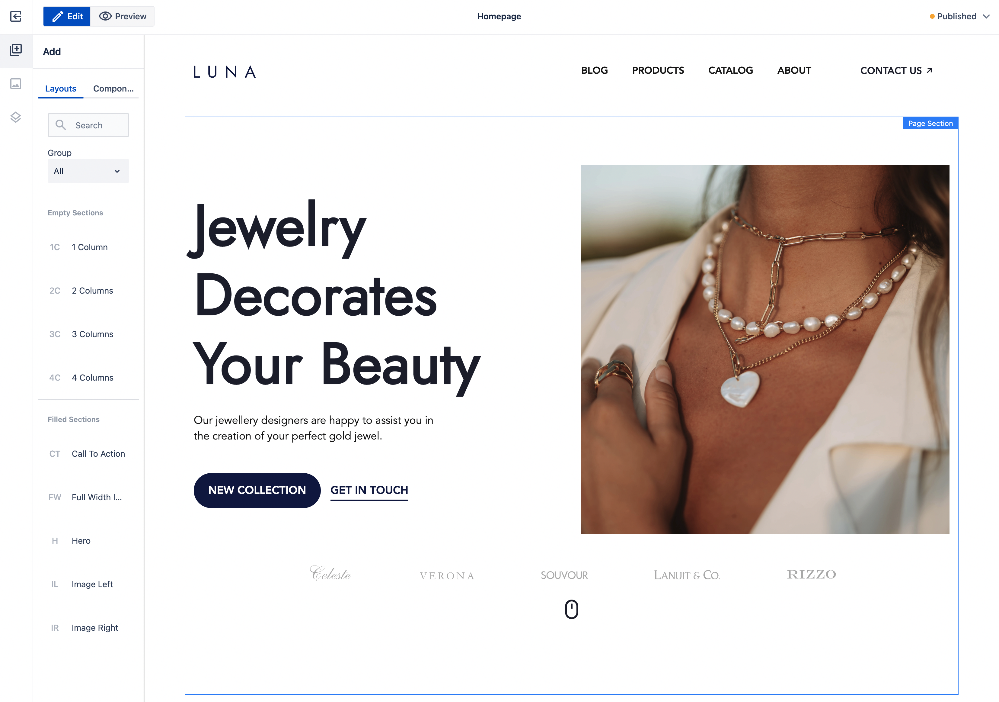

*Published at: 29.09.2022 by [WebSight Team](https://github.com/orgs/websight-io/people)*

> Today we announce the release of WebSight CMS Community Edition 1.0, the first part of the WebSight Digital Experience Platform (DXP). You can start your adventure with [WebSight CMS Quick Start Guide](/docs/quick-start/).

## What is WebSight CMS

WebSight CMS is an enterprise-grade content management system created using battle-tested technologies that allow us to take advantage of years of experience from other players. At the same time, WebSight leverages a modern technology mix of cloud and containers. If you want to know more about the project's history, please visit the [On the road to the perfect DXP](/blog/2022/on-the-road-to-the-perfect-dxp/) blog post.

## Getting started

All you need to start an adventure with WebSight CMS is Docker installed on your machine. Please visit the [Authoring Quick Start Guide](/docs/quick-start/) to experience our authoring, or dive into [Developers Quick Start Guide](/docs/developers/quick-start/) to play the role of WebSight developer.

## Community

WebSight CMS Community Edition is free to use for everyone ([terms of use](/terms-of-use/)). To support us, you may follow the project at:

* [github.com/websight-io/starter](https://github.com/websight-io/starter) (feel free to star the repository, open [issues](https://github.com/websight-io/starter/issues), and start [discussions](https://github.com/websight-io/starter/discussions))
* [linkedin.com/company/websight-io/](https://www.linkedin.com/company/websight-io/)
* [twitter.com/websight_io](https://twitter.com/websight_io)

## Thank you notes

In addition to the contributions from Dynamic Solutions employees, we want to send special thanks to all early reviewers of the WebSight Alpha distribution, as well as many architects, project managers, and engineers who shared their thoughts and ideas about the product during various demo sessions.

## What’s next

It is just the beginning. Work on the CMS Community Edition will continue (you may expect regular bi-weekly releases). Items we have on our list to work on for the upcoming versions include:

* dynamic content - we work on easy-to-use and implement a framework for integrations with external data sources using WebSight,
* support for cloud environments (on-demand/ephemeral and long-living),
* GitHub template project with built-in Continuous Integration.
