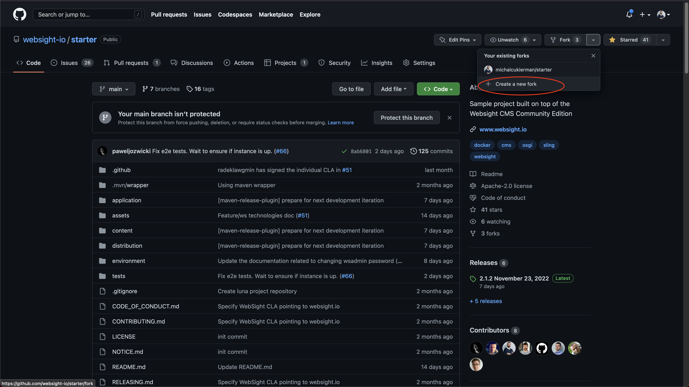
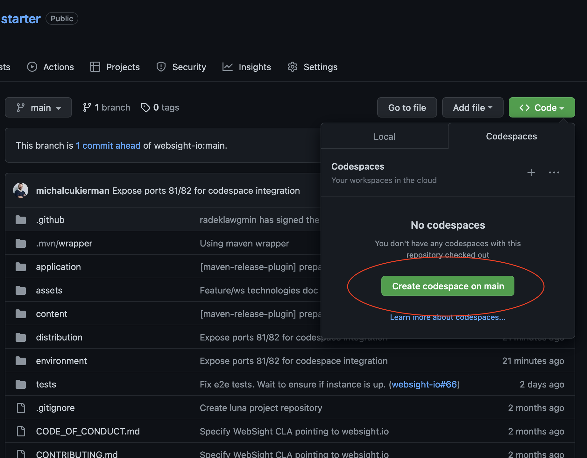
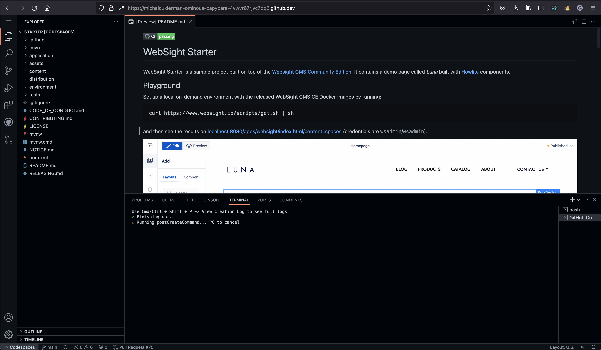
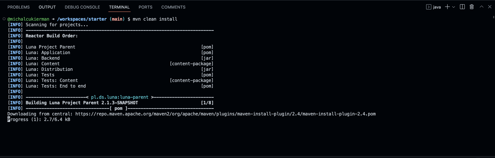
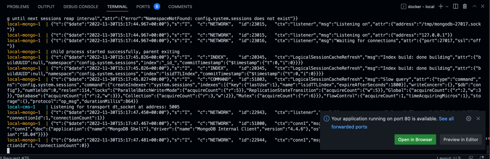
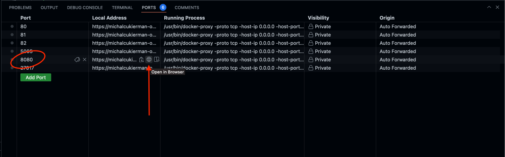
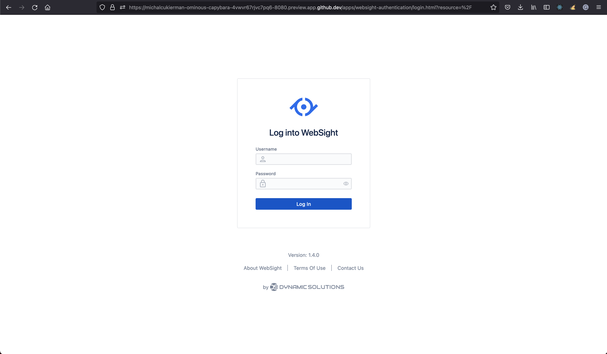

*Published at: 01.12.2022 by [Michał Cukierman](https://github.com/michalcukierman)*

## What is GitHub Codespaces
GitHub Codespaces is a dev environment in the cloud. It looks very similar to Visual Studio Code and can be used to spin up fully configured dev environments in the cloud that starts in seconds.
It comes together with preconfigured tooling, like Docker and Java, and it's all that we need to start working with WebSight instantly.

## Starting and running the project
The easiest way to set up the project and start Dockerized ephemeral environment is to follow the steps: 

1. Go to https://github.com/websight-io/starter and fork the project
 <p align="center" width="100%">
     
 </p>
 
1. Create Codespace on `main` branch
  <p align="center" width="100%">
      
  </p>
  
1. The new window with the project on online IDE should open
  <p align="center" width="100%">
       
  </p>
1. Go to the terminal and build the project with
```
mvn clean install
```
 <p align="center" width="100%">
      
 </p>

1. cd to `environment/local` and start WebSight with
```
docker compose up
```
 <p align="center" width="100%">
      
 </p>


Codespaces automatically forwards declared ports using the generated domain. In our case, the ports are:

| #    | Service               |
|------|------------------------------|
| 8080 | WebSight CMS port            |
| 81   | Nginx port for Luna project  |
| 82   | Nginx port for Bulma project |
| 80   | Default Nginx port           |
| 5005 | Java debug port              |
| 27017|MongoDB port                  |

 
 
## Usage
To open WebSight CMS and Nginx hosted sites, navigate to `Ports` tab and click on the link you want to visit.
Author link is the one next to `8080` port
 <p align="center" width="100%">
      
 </p>

New tab should open and you should be able to log in. Default credentials are `wsadmin`/`wsadmin`, but you can change it directly in Codespaces.
 <p align="center" width="100%">
      
 </p>

After logging in you can use WebSight, edit and publish pages directly on GitHub:
 <p align="center" width="100%">
      
 </p>


## Summary
Containerization brings us new possibilities, and setting up dev environments in seconds is just one of them.
I really like the way `Codespaces` works, and I believe it can gain more popularity in the future.
