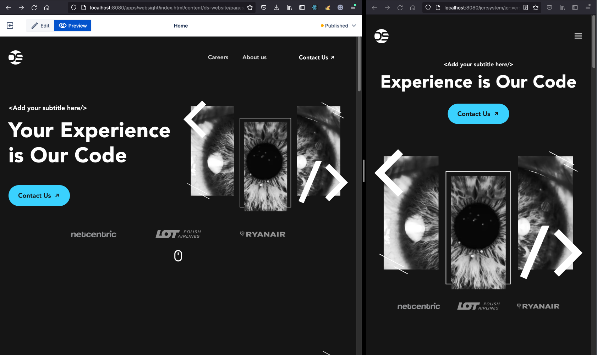
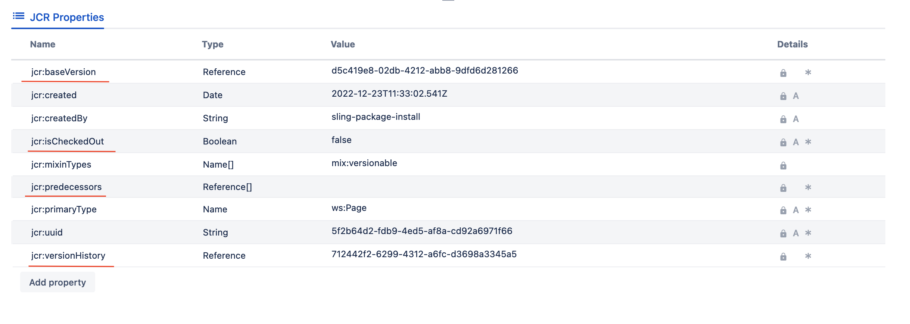
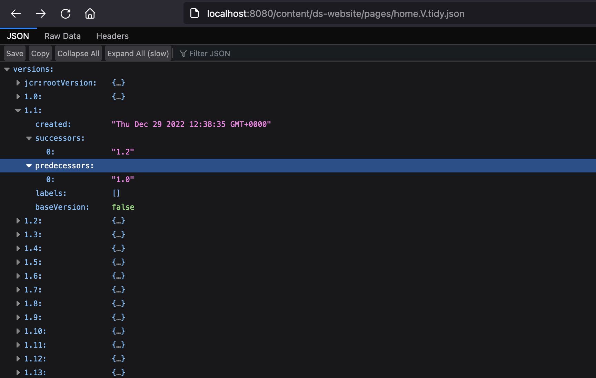

*Published at: 29.12.2022 by [Michal Cukierman](https://github.com/michalcukierman)*

## Overview
Content versioning is one of the essential features of a mature CMS. The ability to work with pages, compare and roll back when needed is a must in a collaborative environment.
Luckily it’s also well supported by Apache Sling. In this article, I will explain how to do basic operations using only JCR and Sling APIs.

<p align="center" width="100%">
    
    Comparing two versions of a single page on one system
</p>

## Enabling content versioning
Sling supports versioning of JCR Resources. JCR Resources are used to represent the `content`, and as a consequence, it’s possible to version pages, assets, and tags. Unlike other Content Management Systems, we do not store scripts, configurations, and bundles in the JCR,
for more information, see [this blog post](../configuration-application-data-in-websight-cms/).

!!! Info "Before you start"
        Make sure to replace `/content/ds-website/pages/home` in the examples below with your page path.
 

To make a JCR Resource versionable, we need to add JCR `Mixin` to it. The easiest way to do it is to execute a script in the [Groovy Console](http://localhost:8080/apps/groovy): 

```groovy
home = session.getNode("/content/ds-website/pages/home");
home.addMixin("mix:versionable")
// Save is required to get apply mixin
session.save();
```

You can verify the result with the [Resource Browser](http://localhost:8080/apps/browser#/content/ds-website/pages/home). The resource should now contain new properties.

<p align="center" width="100%">
    
    New properties assigned the versioned resource
</p>

## Creating multiple page versions
Again, let's use Groovy script to create a couple of versions of a homepage:
```groovy
home = session.getNode("/content/ds-website/pages/home");

for (int i = 0; i< 10; i++) {
  home.checkout();
  home.checkin();
}

println home.getVersionHistory();
```

The code above should create 10 versions of a page and print the complete history once done. Note that version creation is relatively expensive, so we should not overuse it.
Each version of a resource is stored as a `jcr:fronzenNode` under `/jcr:system/jcr:versionStorage/<generated hash>`.

In my case, the path is `/jcr:system/jcr:versionStorage/5f/2b/64/5f2b64d2-fdb9-4ed5-af8a-cd92a6971f66`.

## Accessing page versions:
There are multiple ways we can access the page versions.

- Directly by accessing frozen node with .html extension.

In my case, it's `http://localhost:8080/jcr:system/jcr:versionStorage/5f/2b/64/5f2b64d2-fdb9-4ed5-af8a-cd92a6971f66/1.10/jcr:frozenNode/jcr:content.html`, but it will be unique on every system.

- Programmatically by using JCR API [1]

- Using Sling API for getting available versions and fetching versioned content [2]

Before using Sling version info, the configuration: [org.apache.sling.servlets.get.impl.version.VersionInfoServlet](http://localhost:8080/system/console/configMgr/org.apache.sling.servlets.get.impl.version.VersionInfoServlet) has to be enabled with default values.
Once it's done, the versions can be read by visiting the following URL: `http://localhost:8080/content/ds-website/pages/home.V.tidy.json`.

<p align="center" width="100%">
    
    JSON with homepage versions information
</p>

It's relatively easy to compare two versions by comparing the output of requests to URLs:

`http://localhost:8080/content/ds-website/pages/home.tidy.5.json;v=1.10`
and 

`http://localhost:8080/content/ds-website/pages/home.tidy.5.json`

It's also possible to read individual components from versioned pages:

`http://localhost:8080/content/ds-website/pages/home/jcr:content/rootcontainer/header.tidy.5.json;v=1.10`

## Summary
At the time of writing, content versioning is still on our [Roadmap](https://github.com/orgs/websight-io/projects/2/views/2). Nevertheless, we get most of the work done by the JCR and Sling projects, and as a result, the feature should be shipped relatively quickly.
We can once again benefit from choosing a battle-tested platform to run our CMS.

## References

[1] https://developer.adobe.com/experience-manager/reference-materials/spec/jcr/2.0/15_Versioning.html

[2] https://sling.apache.org/documentation/bundles/rendering-content-default-get-servlets.html#jcr-versions-support-1