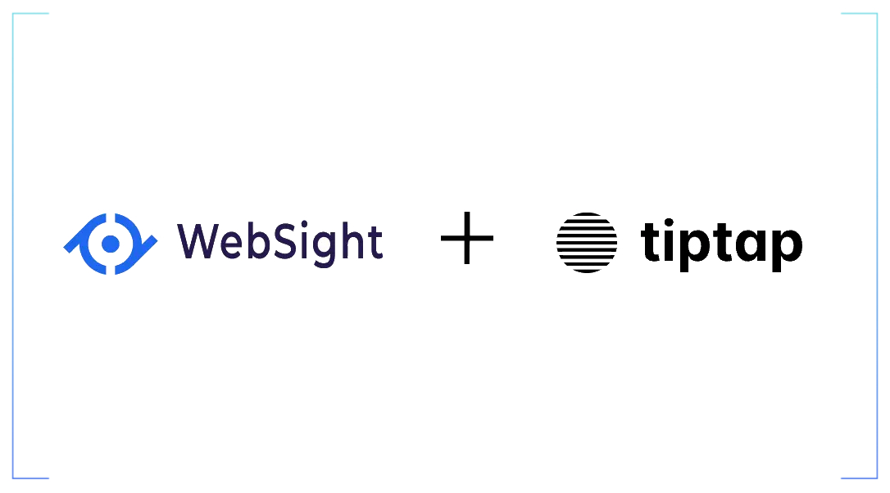
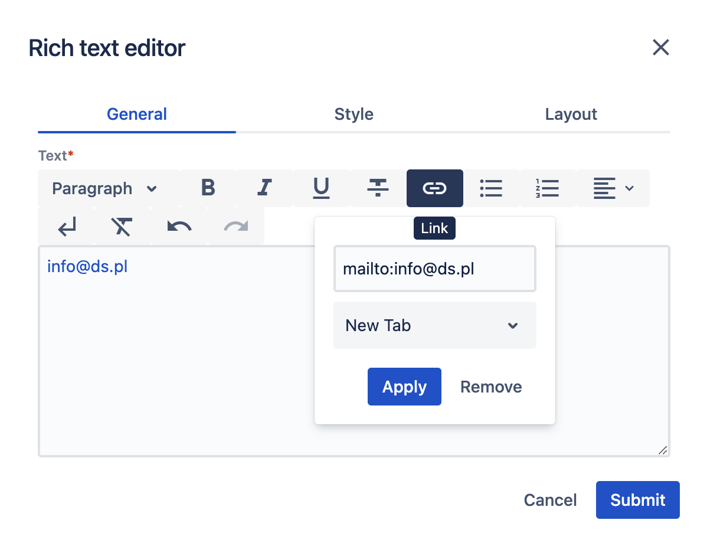
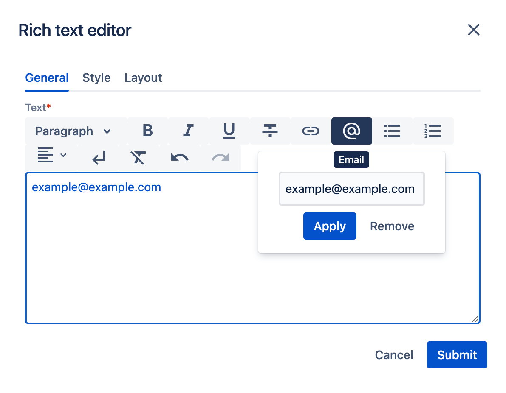

*Published at: 20.03.2023 by [Martyna Szeszko](https://github.com/martyna-ds)*

<p align="center" width="100%">
    
</p>

> There was a need to add a plugin for masking e-mail addresses inside Rich Text Editor to prevent spam messages. This new RTE plugin was
created as a custom, fully customizable component written from scratch for the [ds.pl](https://ds.pl) website. Let's follow the process of
creating such a component, with a little help from [TipTap library](https://tiptap.dev/introduction), which lies underneath the Rich Text Editor.

## New component requirements

The new component is supposed to add a masked email address to prevent spam messages. An anchor tag should not contain a plain, easy-to-read email address, but instead should use data attributes for storing email parts. An example of a protected email address could look like this:

```<a href="" data-part1="info" data-part2="ds" data-part3="pl" ... >Contact Us</a>```

After the page is loaded, the script should convert these data parts into the whole email address, like in a regular link with the `mailto:` prefix:

```<a href="mailto:info@ds.pl" ... >Contact Us</a>```

From the user's perspective, RTE should have a dedicated button which allows users to input an email address and the rest would be happening under the hood. The button could be placed next to the Link button. This is how the RTE component looks like now:

<p align="center" width="100%">
    
</p>

!!! warning "Email link obfuscation" 
    Please keep in mind that it is only a very basic method of email link obfuscation, chosen from among many other ways of encoding link contents. It will certainly not protect the data from all spambots or harvesters, but should be enough for our current needs.

## Technical overview

Due to component specifcity, the work can be split into two parts:

- CMS part - where adding/editing/deleting and encrypting email addresses is happening within the Rich Text Editor 
- page part - where RTE configuration and email decoding happens

Therefore, **the component must be used with the script provided within the page**, otherwise, email links won't be decoded.

As the decoding email script will be the last step, let's focus on the main issue here - extending the RTE editor. The editor component is
made up of two parts: the plugin element and the UI element. The plugin part is responsible for the plugin behavior and it is directly related
to the UI part, which is providing the UI for the plugin itself. In Websight CMS, the tiptap library is responsible for plugins and a
separate module that is a part of Websight CMS - for UI. As for the plugin, we can either extend or create a new extension. But what about
the UI element for this plugin? None of these (button, button dropdown, list dropdown, link) match the requirements, because we need a dropdown
with one input (link UI has input and select with `target` attribute selection). So we need a new UI as well.

!!! Hint
    See our other article about [Customizing Rich Text Editor in WebSight CMS](https://www.websight.io/blog/2022/customizing-rich-text-editor/), where you can read more about RTE configuration and learn how to create a plugin from predefined components.

## Page part - configuration
Let's start by preparing an extended configuration according to [the documentation](https://www.websight.io/docs/developers/development/dialogs/richtext-editor/configuration/#extending-and-overriding-configuration). The example path for an extended configuration could be `/apps/rte/extended/configuration/.content.json`. After that we can use this new configuration in our components, just like described [here](https://www.websight.io/docs/developers/development/dialogs/richtext-editor/configuration/#using-configuration).

```json title=".../application/backend/src/main/resources/apps/wcm/dialogs/components/richtext/configuration/.content.json"
{
  "sling:resourceSuperType": "/libs/wcm/dialogs/components/richtext/configuration",
  "link": {
    "sling:resourceType": "wcm/dialogs/components/richtext/ui/link",
    "title": "Link",
    "icon": "link",
    "plugin": {
      "sling:resourceType": "extensions/dialogs/components/richtext/plugin/link"
    }
  },
  "email": {
    "sling:resourceType": "extensions/dialogs/components/richtext/ui/email",
    "title": "Email",
    "icon": "alternate_email",
    "plugin": {
      "sling:resourceType": "extensions/dialogs/components/richtext/plugin/email"
    },
    "sling:orderBefore": "bulletlist"
  }
}
```
!!! note "Available icons" 
    Icons are provided by [Google font page](https://fonts.google.com/icons)

## CMS part - new plugin

To connect our JSON configuration above to actual scripts, create the following files with a path pointing to our script:

```json title="websight-rte-extensions/src/main/resources/libs/extensions/dialogs/components/richtext/plugin/email/email.json.html"
{
    "type": "/apps/websight-rte-extensions/web-resources/components/richtext/plugin/Email/Email.js"
}
```

Our new plugin will affect another plugin that is already in the default version in RTE - Link. **We need to exclude email handling from the Link plugin**, as we will cover that in the email plugin. That means we also need to modify the Link plugin by creating a custom link plugin.

So a similar file needs to be created for the link: 
```json title="websight-rte-extensions/src/main/resources/libs/extensions/dialogs/components/richtext/plugin/link/link.json.html"
{
    "type": "/apps/websight-rte-extensions/web-resources/components/richtext/plugin/Link/Link.js"
}
```

Then let's create the UI element for e-mail: 
```json title="websight-rte-extensions/src/main/resources/libs/extensions/dialogs/components/richtext/ui/email/email.json.html"
{
    "type": "/apps/websight-rte-extensions/web-resources/components/richtext/ui/EmailDialog.js",
    "configuration": {
        "title": "${properties.title}",
        "icon": "${properties.icon}"
    }
    <sly data-sly-list="${resource.children}">
        <sly data-sly-test="itemList.first">,
            "plugin": <sly data-sly-resource="${item}"></sly>
        </sly>
    </sly>
}
```
### TipTap

There is very supportive [tiptap documentation on how to build such custom extensions](https://tiptap.dev/guide/custom-extensions). In our case we can also just base our code on [Link docs](https://tiptap.dev/api/marks/link) and [Link code](https://github.com/ueberdosis/tiptap/blob/main/packages/extension-link/src/link.ts).

**Extend or write from scratch?**

Extending an existing component requires less code writing, as we can only replace particular methods. The obvious component, in this case, would be the Link component, as the behavior would be very similar. But the differences are significant, too. Fortunately, there is no need to decide now, as we can simply switch from extending to creating.

Some chosen methods from component: 
```typescript title="extension-email.ts"
...
const CustomEmail = Mark.create({
  name: 'email',
  priority: 1000,
  addOptions() {
    return {
      linkOnPaste: false,
      autolink: false,
      validate: undefined,
      HTMLAttributes: {
        rel: 'noopener noreferrer nofollow',
        class: null,
        'data-part1': null,
        'data-part2': null,
        'data-part3': null
      }
    };
  },
  onDestroy() {
    reset();
  },
  inclusive() {
    return this.options.autolink;
  },
  addAttributes() {
    return {
      class: {
        default: this.options.HTMLAttributes.class,
      },
      'data-part1': {
        default: null
      },
      'data-part2': {
        default: null
      },
      'data-part3': {
        default: null
      }
    };
  },

  parseHTML() {
    return [
      { tag: 'a[data-part1][data-part2][data-part3]' },
    ];
  },
  renderHTML({ HTMLAttributes }) {
    return [
      'a',
      mergeAttributes(this.options.HTMLAttributes, HTMLAttributes),
      0,
    ];
  },

    ...

  addProseMirrorPlugins() {
    const plugins: Plugin[] = [];

    if (this.options.autolink) {
      plugins.push(
        autolink({
          type: this.type,
          validate: this.options.validate,
        }),
      );
    }

    if (this.options.linkOnPaste) {
      plugins.push(
        pasteHandler({
          editor: this.editor,
          type: this.type,
        }),
      );
    }

    return plugins;
  },
});

export default CustomEmail;
```

TipTap library is built on top of the [ProseMirror](https://prosemirror.net/) package but almost every functionality can be done without any knowledge of it, as TipTap is handling it under the hood. However, for handling some events we need to add the `addProseMirrorPlugins()` method and inside it create prosemirror plugins to handle this special event-based behavior. Here is an [example usage of ProseMirror API](https://tiptap.dev/guide/custom-extensions/#access-the-prosemirror-api), so the helper file would look something like this:

```typescript title=" helpers/pasteHandler.ts"

export function pasteHandler(options: PasteHandlerOptions): Plugin {
  return new Plugin({
    key: new PluginKey('handlePasteEmail'),
    props: {
      handlePaste: (view, event, slice) => {
        ...
      },
    },
  });
}
```

Finally, we can create an `Email.ts` file with the component which loads the previously registered plugin:

```typescript title="/apps/websight-rte-extensions/web-resources/components/richtext/plugin/Email/Email.ts"
import CustomEmail from "./extension-email.js";
import { splitEmail } from "./helpers/splitEmail.js";
import { validateEmail } from "./helpers/validateEmail.js";

const Email = () => ({
    getTipTapExtensions: () => [CustomEmail.configure({autolink: true, linkOnPaste: true})],
    getAction: ({
      editor
    }) => ({
      execute: ({hrefDecoded}) => {
        if (validateEmail(hrefDecoded)) {
          editor.chain().focus().extendMarkRange('email').setEmail({
            hrefDecoded,
            ...splitEmail(hrefDecoded)
          }).run();
        } else {
          editor.chain().focus().extendMarkRange('email').unsetEmail().run();
        }
      }
    }),
    getState: ({
      editor
    }) => ({
      isActive: editor.isActive('email'),
      ...editor.getAttributes('email')
    })
});

export default Email;
```

- `getTipTapExtension` method is doing exactly what its name indicates, as well as making it possible to switch off/on some plugin features 
- `execute` runs when the user clicks the submit button 
- `getState` is passing the current editor state

## Page part once again - decoding script

Script for decoding is quite simple, as it is scanning the page and converting three data parts to a proper email address:

```js
window.addEventListener('load', () => {
    const links = document.querySelectorAll('[data-part1][data-part2][data-part3]');
    for (const link of links) {
      const attrs = link.dataset;
      link.setAttribute(
        'href',
        `mailto:${attrs.part1}@${attrs.part2}.${attrs.part3}`
      );
    }
});
```

## Result

The implemented extension for RTE is presented below.
<p align="center" width="100%">
    
</p>

## Summary

First of all, we created new entries in the richtext JSON configuration file, then we added proper JSON files with paths corresponding to actual scripts. After creating and extending the existing component we could add a simple script for decoding emails on our page.

As we can see, Rich Text Editor can be easily extended with any functionality we want, due to the flexible architecture model used in Websight CMS. Furthermore, creating an extension with the TipTap library offers broad possibilities, as well as creating a new UI component within CMS.
