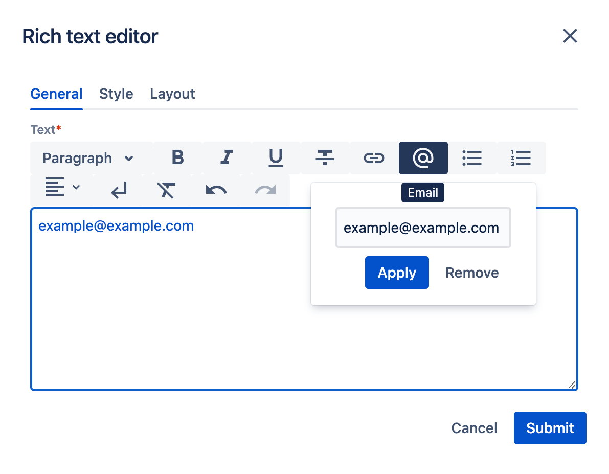

*Published at: 16.02.2023 by [Martyna Szeszko](https://github.com/martyna-ds)*

<p align="center" width="100%">
    
</p>

> As written in a related article [Customizing Rich Text Editor in WebSight CMS](https://www.websight.io/blog/2022/customizing-rich-text-editor/) RTE can be extended by additional fields, which provide new formatting options for users. However, the list of available plugins may not be sufficient for demanding clients. Let’s create a completely new component for the RTE toolbar, using [TipTap library](https://tiptap.dev/introduction) which lies underneath the Rich Text Editor component.

## New component requirements

The new component is supposed to add a masked email address in case it prevents spam messages. An anchor tag should not contain a plain, easy-to-read email address, instead can use data attributes for storing email parts. After a page is loaded, the script should convert these data parts to the whole email address, like in a regular link with `mailto:` prefix. 

From a user perspective, RTE should have a dedicated button where after clicking there is a possibility to input an email address, and the rest is happening under the hood.

!!! tip Available plugins
    Websight CMS already provides a list of useful RTE extensions. The guide [in the mentioned article](https://www.websight.io/blog/2022/customizing-rich-text-editor/) might be helpful to understand some steps covered throughout the article

## Technical overview

Component specifciity implies the work can be split into two parts:
- CMS part, where adding/editing/deleting and encrypting email addresses is happening within Rich Text Editor
- page part, where email decoding happens 

Therefore, **the component must be used with the script provided within page**, otherwise, email links won’t be decoded.

As the decoding email script will be the last step, let’s focus on the main issue here – extending the RTE editor. Such an editor component is made up of two parts: the plugin element and the UI element. The plugin part is responsible for the plugin behavior and it is directly related to the UI part, which is providing UI for the plugin itself. In Websight CMS, the @tiptap library is responsible for plugins, and for UI - a separate module that is a part of Websight CMS. As for the plugin, we can either extend Link or create a new extension. But what about the UI element for this plugin? Any of these (button, button dropdown, list dropdown, link) don't match the requirements, because we need a dropdown with one input (link UI has input and select with `target` attribute selection). So we need a new UI as well.

Our new plugin will affect another plugin that is already in the default version in RTE - Link. **We need to exclude email handling from the Link plugin**, as we will cover that in the email plugin. And that means we need also to modify the Link plugin by creating a custom link plugin.

## Page part - configuration

We can start by adding proper fields in the JSON file with richtext configuration. Under the `"configuration"` property we want to inherit all other components, so we can make use of the `"sling:resourceSuperType"` property and type our default path to richtext configuration `wcm/dialogs/components/richtext/configuration`. Afterward, we can add any plugin we want and in our case, `link` will be overwritten and `email` will be added as new. To not confuse and overcomplicate, let's keep simple titles and plugin/UI names. To keep both UI next to each other, let's use the `"sling:orderBefore"` property.

```json title=".../application/backend/src/main/resources/apps/wcm/dialogs/components/richtext/configuration/.content.json"
{
  "sling:resourceSuperType": "/libs/wcm/dialogs/components/richtext/configuration",
  "link": {
    "sling:resourceType": "wcm/dialogs/components/richtext/ui/link",
    "title": "Link",
    "icon": "link",
    "plugin": {
      "sling:resourceType": "extensions/dialogs/components/richtext/plugin/link"
    }
  },
  "email": {
    "sling:resourceType": "extensions/dialogs/components/richtext/ui/email",
    "title": "Email",
    "icon": "alternate_email",
    "plugin": {
      "sling:resourceType": "extensions/dialogs/components/richtext/plugin/email"
    },
    "sling:orderBefore": "bulletlist"
  }
}
```
!!! note Available icons
    Icons are provided from [Google font page](https://fonts.google.com/icons), but keep in mind, that not all icons listed on the google page can be available in CMS due to update time differences

## CMS part - new plugin

In case to connect our JSON configuration above to actual scripts, create the following files with a path pointing to our script:

```json websight-rte-extensions/src/main/resources/libs/extensions/dialogs/components/richtext/plugin/email/email.json.html
{
    "type": "/apps/websight-rte-extensions/web-resources/components/richtext/plugin/Email/Email.js"
}
```
A similar file needs to be created for the link.

And for UI element:
```json websight-rte-extensions/src/main/resources/libs/extensions/dialogs/components/richtext/ui/email/email.json.html
{
    "type": "/apps/websight-rte-extensions/web-resources/components/richtext/ui/EmailDialog.js",
    "configuration": {
        "title": "${properties.title}",
        "icon": "${properties.icon}"
    }
    <sly data-sly-list="${resource.children}">
        <sly data-sly-test="itemList.first">,
            "plugin": <sly data-sly-resource="${item}"></sly>
        </sly>
    </sly>
}
```
### TipTap

There is very supportive [tiptap documentation on how to build such custom extensions](https://tiptap.dev/guide/custom-extensions), also in our case we can just base our code on [Link docs](https://tiptap.dev/api/marks/link) and [Link code](https://github.com/ueberdosis/tiptap/blob/main/packages/extension-link/src/link.ts).

**Extend or write from scratch?**

Extending existing component result in less code writing, as we can only replace particular methods. The obvious component, in this case, would be the Link component, as the behavior would be very similar. But the differences are significant, too. Fortunately, it is no need to decide now, as we can simply switch from extending to creating.

I came out with the following result:

```ts extension-email.ts
...
const CustomEmail = Mark.create({
  name: 'email',
  priority: 1000,
  addOptions() {
    return {
      linkOnPaste: false,
      autolink: false,
      validate: undefined,
      HTMLAttributes: {
        rel: 'noopener noreferrer nofollow',
        class: null,
        'data-part1': null,
        'data-part2': null,
        'data-part3': null
      }
    };
  },
  onDestroy() {
    reset();
  },
  inclusive() {
    return this.options.autolink;
  },
  addAttributes() {
    return {
      class: {
        default: this.options.HTMLAttributes.class,
      },
      'data-part1': {
        default: null
      },
      'data-part2': {
        default: null
      },
      'data-part3': {
        default: null
      }
    };
  },

  parseHTML() {
    return [
      { tag: 'a[data-part1][data-part2][data-part3]' },
    ];
  },
  renderHTML({ HTMLAttributes }) {
    return [
      'a',
      mergeAttributes(this.options.HTMLAttributes, HTMLAttributes),
      0,
    ];
  },
  addCommands() {
    return {
      setEmail: attributes => ({ chain }) => {
        return chain()
          .setMark(this.name, attributes)
          .setMeta('preventAutolink', true)
          .run();
      },

      toggleEmail: attributes => ({ chain }) => {
        return chain()
          .toggleMark(this.name, attributes, { extendEmptyMarkRange: true })
          .setMeta('preventAutolink', true)
          .run();
      },

      unsetEmail: () => ({ chain }) => {
        return chain()
          .unsetMark(this.name, { extendEmptyMarkRange: true })
          .setMeta('preventAutolink', true)
          .run();
      },
    };
  },
  addPasteRules() {
    return [
      markPasteRule({
        find: text => find(text, 'email')
          .filter(email => {
            if (this.options.validate) {
              return this.options.validate(email.value);
            }

            return true;
          })
          .filter(email => email.isLink)
          .map(email => ({
            text: email.value,
            index: email.start,
            data: email,
          })),
        type: this.type,
        getAttributes: match => (splitEmail(match.data?.href)),
      }),
    ]
  },

  addProseMirrorPlugins() {
    const plugins: Plugin[] = [];

    if (this.options.autolink) {
      plugins.push(
        autolink({
          type: this.type,
          validate: this.options.validate,
        }),
      );
    }

    if (this.options.linkOnPaste) {
      plugins.push(
        pasteHandler({
          editor: this.editor,
          type: this.type,
        }),
      );
    }

    return plugins;
  },
});

export default CustomEmail;
```
TipTap library is built on the top of the [ProseMirror](https://prosemirror.net/) package but almost every functionality can be done without any knowledge of it, as tiptap is handling it under the hood. However, for handling some events we need to add the `addProseMirrorPlugins()` method and inside it create prosemirror plugins in case to handle these special event-based behavior. As the Link component has these neat features, I decided to make the email component no worse than that. Here is an [example usage of ProseMirror API](https://tiptap.dev/guide/custom-extensions/#access-the-prosemirror-api), and here is my paste event handling (for automatic email adding):

```ts helpers/pasteHandler.ts
import { Editor } from '@tiptap/core';
import { MarkType } from 'prosemirror-model';
import { Plugin, PluginKey } from 'prosemirror-state';
import { find } from 'linkifyjs';
import { splitEmail } from './splitEmail.js';

export function pasteHandler(options: PasteHandlerOptions): Plugin {
  return new Plugin({
    key: new PluginKey('handlePasteEmail'),
    props: {
      handlePaste: (view, event, slice) => {
        const { state } = view;
        const { selection } = state;
        const { empty } = selection;

        if (empty) {
          return false;
        }

        let textContent = '';

        slice.content.forEach(node => {
          textContent += node.textContent;
        });

        const email = find(textContent, 'email').find(item => 
            item.isLink && 
            item.value === textContent);

        if (!textContent || !email) {
          return false;
        }

        options.editor.commands.setMark(options.type, splitEmail(email.href));

        return true;
      },
    },
  });
}
```

Finally, we can create an `Email.ts` file with component which loads the previously registered plugin:
```ts /apps/websight-rte-extensions/web-resources/components/richtext/plugin/Email/Email.ts
import CustomEmail from "./extension-email.js";
import { splitEmail } from "./helpers/splitEmail.js";
import { validateEmail } from "./helpers/validateEmail.js";

const Email = () => ({
    getTipTapExtensions: () => [CustomEmail.configure({autolink: true, linkOnPaste: true})],
    getAction: ({
      editor
    }) => ({
      execute: ({hrefDecoded}) => {
        if (validateEmail(hrefDecoded)) {
          editor.chain().focus().extendMarkRange('email').setEmail({
            hrefDecoded,
            ...splitEmail(hrefDecoded)
          }).run();
        } else {
          editor.chain().focus().extendMarkRange('email').unsetEmail().run();
        }
      }
    }),
    getState: ({
      editor
    }) => ({
      isActive: editor.isActive('email'),
      ...editor.getAttributes('email')
    })
});

export default Email;
```
- `getTipTapExtension` method is doing exactly what its name indicates, as well as making it possible to switch off/on some plugin features
- `execute` runs when the user click submit button
- `getState` is passing the current editor state

<p align="center" width="100%">
    
    Result
</p>

## Page part once again - decoding script

Script for decoding is quite simple, as it is scanning the page and converting three data parts to proper email:

```js
window.addEventListener('load', () => {
    const links = document.querySelectorAll('[data-part1][data-part2][data-part3]');
    for (const link of links) {
      const attrs = link.dataset;
      link.setAttribute(
        'href',
        `mailto:${attrs.part1}@${attrs.part2}.${attrs.part3}`
      );
    }
});
```

## Summary

First of all, we created new entries in the richtext JSON configuration file, then we added proper json files with paths corresponding to actual scripts. After creating and extending the existing component we could add sa imple script for decoding emails on our page. 
As we can see, Rich Text Editor can be easily extended by any functionality we want, due to the flexible architecture model used in Websight CMS. Furthermore, creating an extension with the TipTap library offers broad possibilities, as well as creating a new UI component within CMS. 

