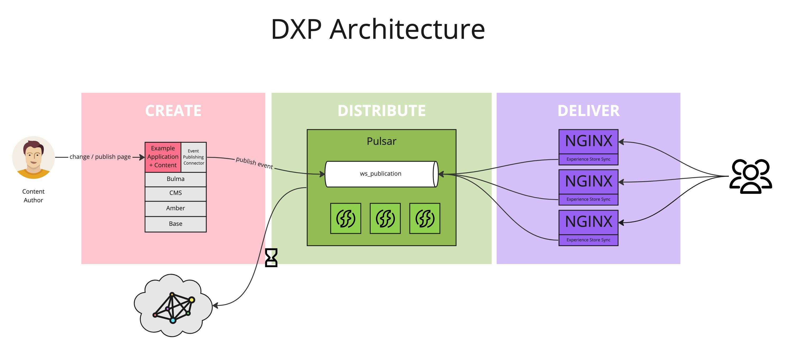
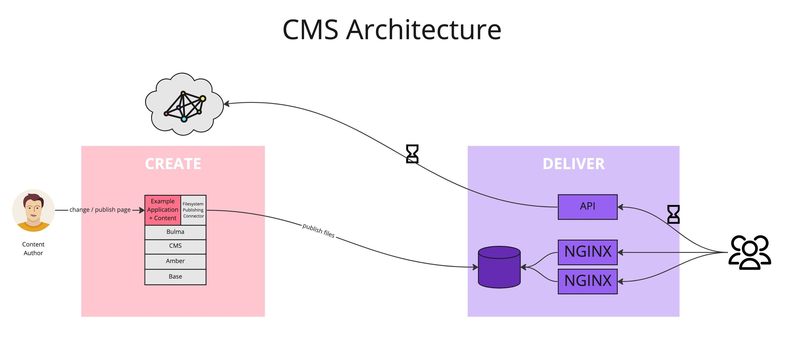
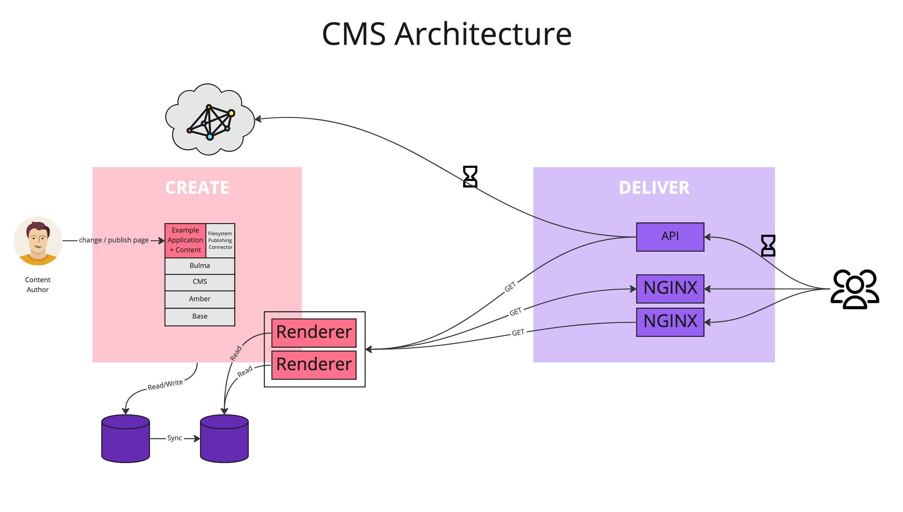

*Published at: 08.02.2023 by [Michał Cukierman](https://github.com/michalcukierman)*

    

> We are going to introduce a new publishing framework for WebSight CMS. In this post, I present why we need this change. The new approach requires a different CMS architecture. Thus, I describe the current and target architecture in the following sections. Finally, you can find a brief scope of the change and some design decisions we made. 

## Motivation

Firstly, let me explain our motivation. WebSight CMS and WebSight DXP are two different products, and we want to ensure each has its unique role. CMS design provides the best authoring experience, while DXP will concentrate on distributing experiences and delivering them efficiently. CMS should be usable on its own. To make this possible, we plan to include response-reply publishing and move the SSG module to DXP. With the new Publishing framework, we will:

- Make CMS more accessible to existing AEM, Drupal, Sitecore, and WordPress users,
- Be able to create a scalable publishing farm,
- Stop using NFS, which is expensive and causes performance issues,
- Eliminate point-to-point integrations (e.g. CMS-Nginx, CMS-Solr) and use the DXP messaging system for communication in complex systems,
- Move the responsibility for the event-driven content generation (pre-generation) to DXP.

Another reason is the need to determine the state of published experiences. Currently, we can only define the published version of a page, but to display the page, we require the entire context including assets, other pages, and configurations. For instance, to accurately render navigation links with correct titles, we usually need to know the state of the entire published tree.

To fulfill this requirement, we need to maintain published data in a separate location, either in a different database or sub-path.

## Current CMS architecture

Right now, CMS uses a push model where pages are rendered and stored on a shared disk that Nginx or Quarkus can access. This approach has advantages such as excellent performance and stability. However, this approach has limitations such as point-to-point integrations, limited throughput on the shared drive, and the incapacity to connect multiple CMS systems or add new destinations. That is why we have decided to move Static Site Generation (SSG) to DXP.

    
   Push model in WebSight CMS

## Target CMS architecture

Without the push model, the architecture of CMS becomes simplified to a standard request-reply setup. To boost performance and security, MongoDB can be set up with the master and read-only replicas. Renderers can be stripped of unnecessary modules, to guarantee faster startup times. Kubernetes autoscaling should be utilized to activate renderers only when needed.

    
   Request-reply model in WebSight CMS

## Required changes

The new approach requires a few changes. I described them briefly below.

### Apps activator decommission

Both unpublished and published front-end assets come from bundle resources. We need to ensure that:

- the document root is available for anonymous users,
- pulsar is notified about required FE libraries/assets to be published. It will be the scope of DXP.

### Simplifying publishing framework

There is no need for processors and custom handlers. There should be only one module that handles copying data from the `/content/` to `/published/` path. The module needs to:

- be customizable (to allow plugging custom handlers, for example, to paths rewriting or removing unnecessary properties),
- allow to add post-publish handlers to, for example, notify Pulsar about publish/unpublish events, or to send published data to S3.

### Publish status storage change

Currently, the publication status is saved in properties of Pages, Assets, and other objects. With the new approach, the status would be determined by evaluating tree data comparison. For instance, to determine if the home page has been published, we need to compare paths: `/content/spaceX/pages/homepage/` with `/published/spaceX/pages/homepage/`. Modification dates properties and information about author changes can be used to determine the exact status.

This way the status will be accurate after copying, moving or restoring the data from the backup.

We need to ensure that the new status check algorithm is efficient, as it will be used on every dashboard view.

### Publishing Algorithm

We consider the following ideas related to the new algorithm: 

- Space synchronization before publishing,
- It’s possible to publish a Page/Asset even if the parent elements are not published,  
- ACL needs to be set in the repository init configuration.

### _Ghost_ detection

After implementing the new publishing, we need to introduce the _ghost_ detection. The _ghost_ object is an object (Page, Asset) that has no authoring representation, but is published.

- It should be possible to unpublish such an object.
- _Ghost_ objects should be visible on the dashboard with a dedicated status.
- The dashboard filter should be extended to find _ghost_ objects easily.
- We should not unpublish the objects during actions that lead to their removal from `/content/`. For example, _delete page_, _move page_, _backup restore_. The same rule applies to objects other than pages (assets, tags).

## Design decisions

The new approach and architecture triggered a lot of discussion in our team. We have still a few open questions. However, we agreed so far on the following items.

- The publishing framework should be implemented using the JCR API, because spaces, pages, and assets are supported with JCR only. The API should be optimized for performance. 
- CMS doesn't implement static site generation (SSG). This feature will be supported by DXP.
- We are not going to invest in a complex cache control mechanism (although it’s possible). No cache flush handlers are considered now. Caching in Nginx should be based on the strong and weak HTTP cache.

## Summary 

What makes WebSight different is a true separation of concerns. The authoring environment, CMS, is detached from the runtime. Content authors need distributed collaboration platform focused on providing rich authoring features. We designed it specifically to create and manage the content between publications. 

Once ready, we generate static pages and distribute them with all dependencies to the runtime environment using the push model. However, this is DXP's responsibility. 

The new publication framework supports the separation and will lead to a better fit for the purpose. We are going to start its implementation soon. Stay tuned!