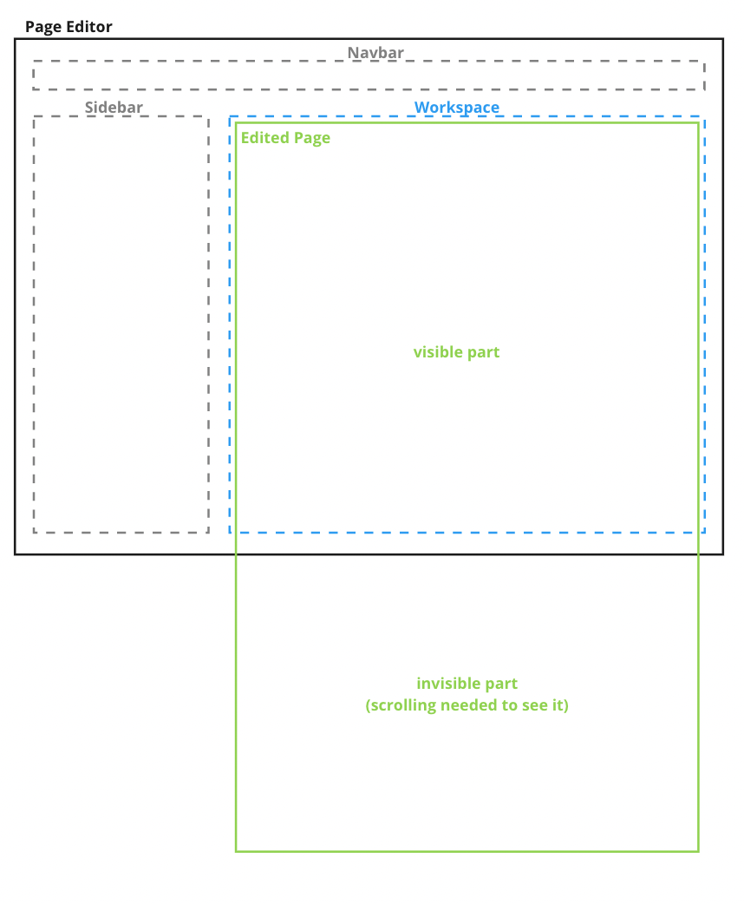
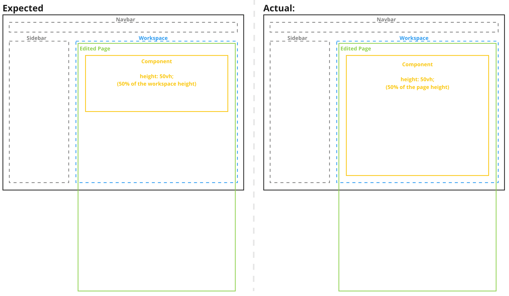
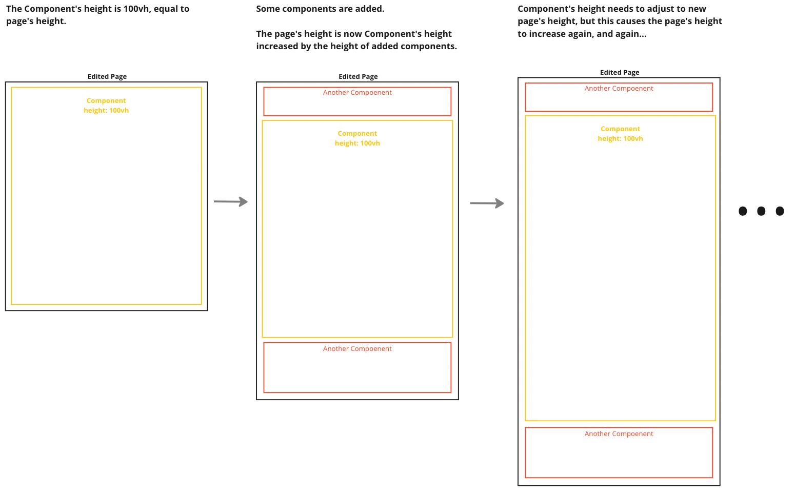
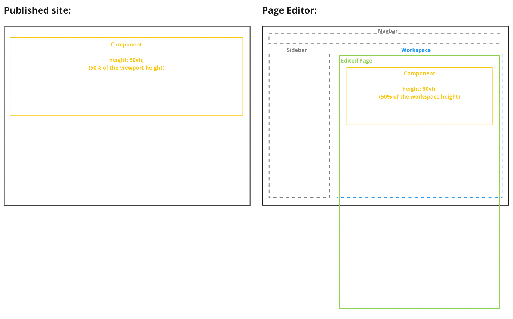

*Published at: 12.01.2023 by [Marcin Piniarski](https://github.com/mpiniarski)*

## Overview
Providing authors with simple and intuitive tools to create pages is not always a trivial task. One such tool is Page Editor, which should support the authoring process while remaining robust and consistent with the page seen by the end user. It’s a common issue that some parts of a page look or work differently in production than during authoring. In this blog post, I’ll explain how we solve it in WebSight CMS using viewport units as an example.

## Page Editor
Page Editor is a core part of WebSight CMS and one of the main tools authors use. It displays the edited page, allowing authors to intuitively build pages in a WYSIWYG way. They can interact with various overlays displayed on top of the canvas while seeing the edited page underneath.

To achieve it, the edited page is not displayed naturally, but it’s stretched like a canvas on an easel, taking the full height of its content. I presented it on a diagram below:

    
   Stretched page vs workspace

The page is stretched to its full height, even though the author only sees a fragment of it in the Workspace. It’s the Workspace that’s scrollable, not the page itself.

Such a solution provides great value for authors, but it comes with some limitations. One of the issues is that viewport units do not work properly in such cases because they are based on the edited page’s height instead of the workspace’s height. 

## Issue

If developers created a component using the `height: 50vh;` style it would lead to issues in the Page Editor because the component’s height would not be adequately calculated. It would have a height equal to 50% of the height of the edited page, not 50% of the workspace’s height. It happens, because the edited page is displayed inside of an iframe and the viewport units are relative to the iframe’s size. It’s visualized on a diagram below:

    
   The issue with viewport units - inconsistency in the Page Editor

Suppose the edited page consists of a component with `height: 100vh;` and some other elements. In that case, it could even lead to an infinite loop, where the height of the component would be increased to match the page’s height but then the page’s height would be increased to match the component and its siblings. Take a look at the diagram below:

    
   The issue with viewport units - infinite loop

Component developers could solve these issues by avoiding using the `vh` units. They could resign from them altogether or conditionally avoid them just in the _edit mode_ of the Page Editor. They would have to do that every time they wanted to use viewport units to style their components.

## Solution

To improve the development experience and make sure the components provided to authors always work well in the Page Editor, we’ve decided to automatically fix such issues.

We search for `vh` based styles in the edited page and substitute them in the _edit mode_ with `px` values calculated based on the workspace’s height. This way the components using viewport units are correctly displayed in the Page Editor and authors can see them, in the same way, they will appear on a published site:

    
  Page editor consistent with a published site 

## Summary

In WebSight, we value both the authoring and development experience. Thus, we not only take an extra effort to make creating components simple and robust but we also give a hand to developers to speed things up. Thanks to the solution we propose, the component’s developers don’t need to worry about using viewport units nor spend time on providing custom fixes for such cases. The authors are always getting robust, reliable components that work consistently both during authoring and after publication.

