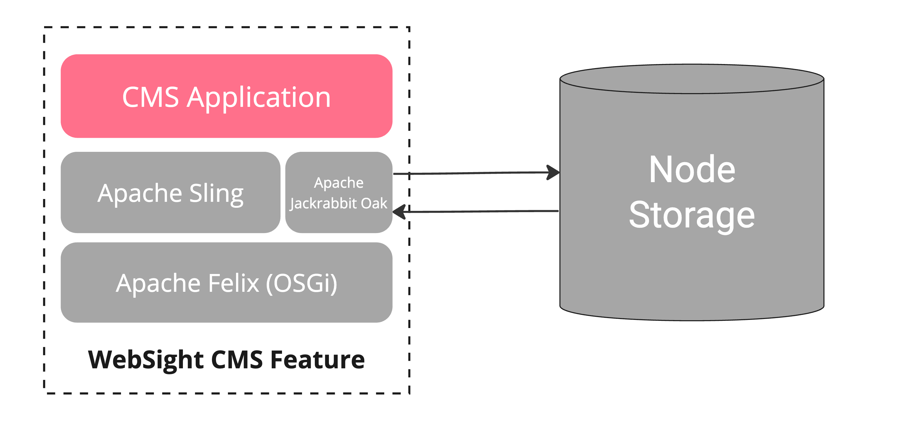
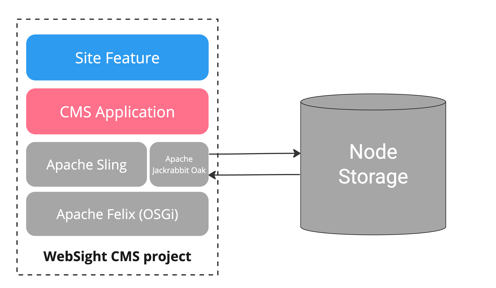
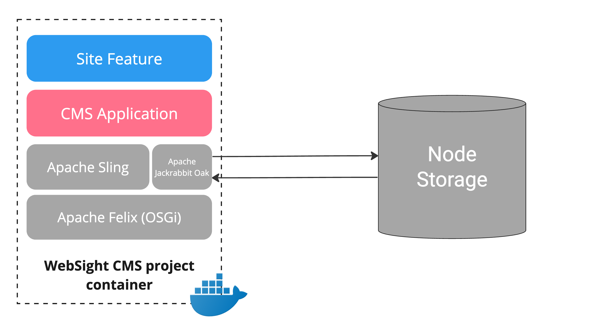
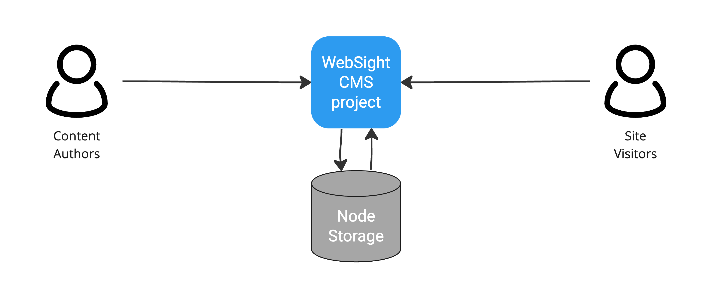

# Architecture
WebSight CMS is a `Java`-based [Apache Sling](https://sling.apache.org/) content-centric application built on top of a `Java Content Repository (JCR)`. It uses `Apache Jackrabbit Oak` as the JCR implementation supporting various Node Storages (e.g Segment Tar, Document Storage). The application runtime is based on the `Apache Felix (OSGi)` framework. WebSight CMS is delivered as a single [Sling Feature Model](https://sling.apache.org/documentation/development/feature-model.html) aggregating all its dependencies and configurations. It can be easily extended and packaged into a container image.

!!! note "Node Storage"
    Document Storage is designed for scalability and reliability. It is a good choice for clustered deployments. Segment Tar storage is designed for performance and is a good choice for standalone deployments. WebSight CMS supports both options. MongoDB is a recommended Document Storage implementation for production environments. Segment Tar is a recommended option for development and testing purposes.

## Project
Developers can easily extend the WebSight CMS with custom code. New functionalities can be added as a top-level Sling Feature (`Site Feature`), defining the dependencies and configurations. Combined with CMS Feature, it can be easily assembled into a single distributable unit:

!!! note "Sample project"
    Check the [WebSight Starter](https://github.com/websight-io/starter) sample project to see how the custom project can be structured and assembled.

## Containers
Once we have a distributable unit, it is easy to package it into a container image. Working with containers enables consistency and standardization. With Docker, we can use the same tooling to work locally as well as to deploy production environments to the cloud.

## Deployment
WebSight CMS is used both by content authors and site visitors. Authors use the CMS application to manage and publish content. Visitors browse the published pages rendered on request.

WebSight CMS uses Kubernetes as the target platform and comes with a [Helm chart](https://github.com/websight-io/charts) to simplify the deployment process. You can learn more about the available deployment options in the [Deployment](../deployment/) section.

## Next steps

As a next step, we encourage you to explore more details about WebSight modules:

- [Layers and Modules](./layers-and-modules/)

## Read More

- [Building OSGi applications with Sling Feature Model](https://www.websight.io/blog/2022/building-osgi-applications-with-sling-feature-model.html)
- [Why we decided to ship and develop the OSGi application in containers](https://www.websight.io/blog/2022/why-we-decided-to-ship-and-develop-the-osgi-application-in-containers.html)
