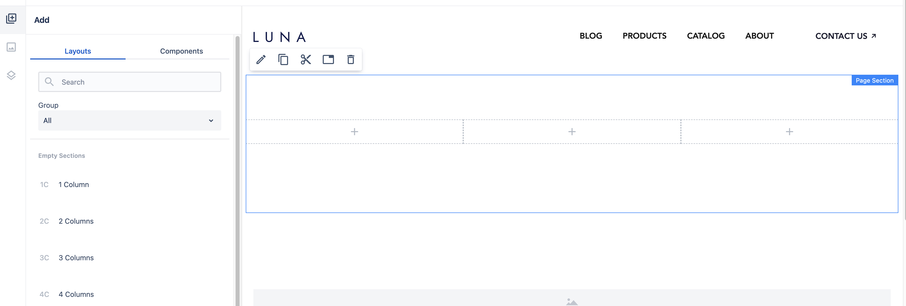
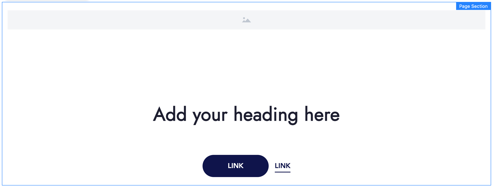
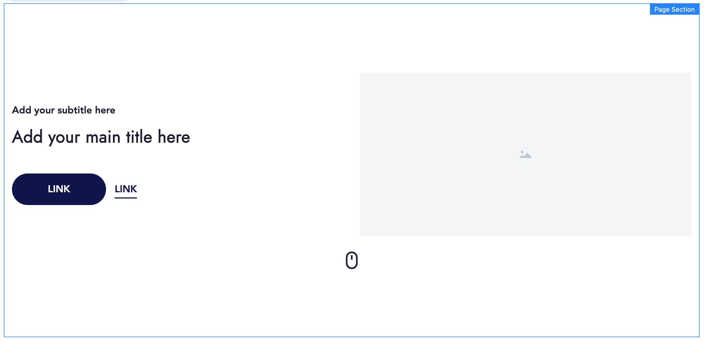
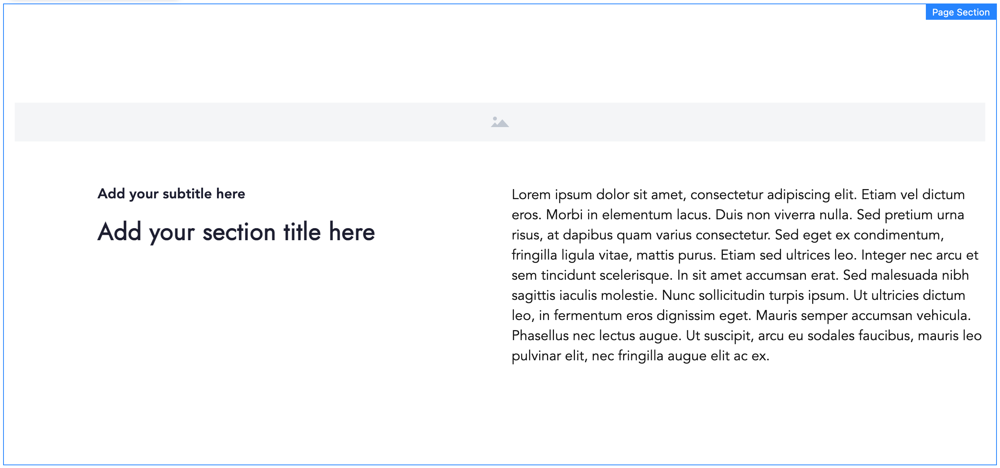
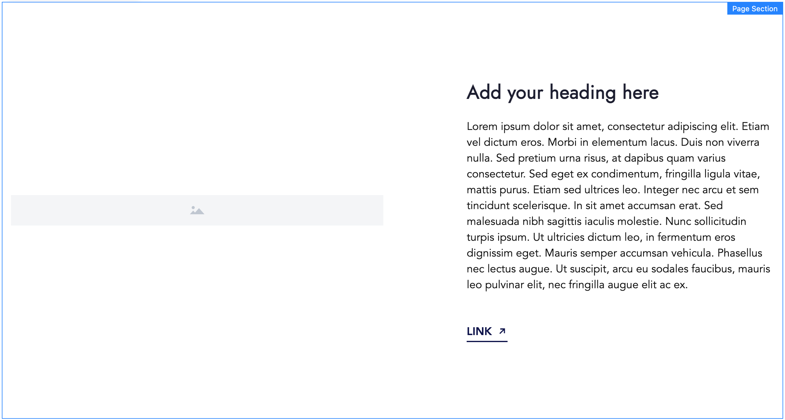
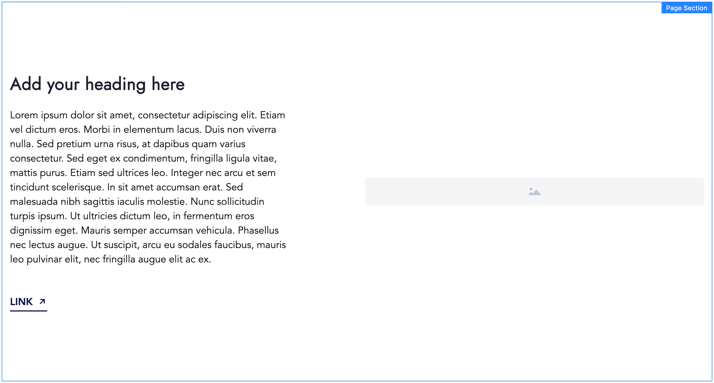

# Layouts

**Layouts** are group of components with predefined properties. They are used to define a specific page layout. They can be drag & dropped on a page instead of single components to speed up authoring process.

## Usage

To try it out open a blank page, select a Layouts tab in the left-side panel and drag and drop a 3 columns layout to the main page content. A page section with 3 resized containers will be added on a page.

    

All components that are added on a page with a given layout can be modified, moved or removed (same as regular components).

## Type of Layouts in Howlite

 There are two groups of layouts in Howlite:

- **Empty Sections** - used to define 1-4 empty columns (containers within a page section):
- **Filled Sections** - more complex page sections with some content inside, for example:
    - **Call To Action** (a page section with full-width image, title and CTAs)

     

        
    

    - **Hero** (a page section with a title, an image and a mouse icon at the bottom; used at the top of a page)

    

        
    

     - **Full Width Image** (a page section with a full-width image, a title on the left, and text on the right side)

     

        
    

    - **Image Left** (a page section with an image on the left, and text on the right side)

     

        
    

    - **Image Right** (a page section with an image on the right, and text on the left side)

     

        
    

