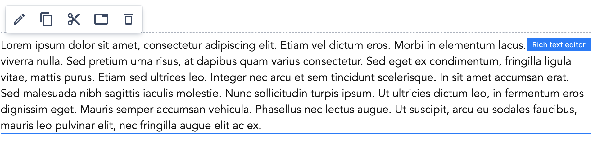
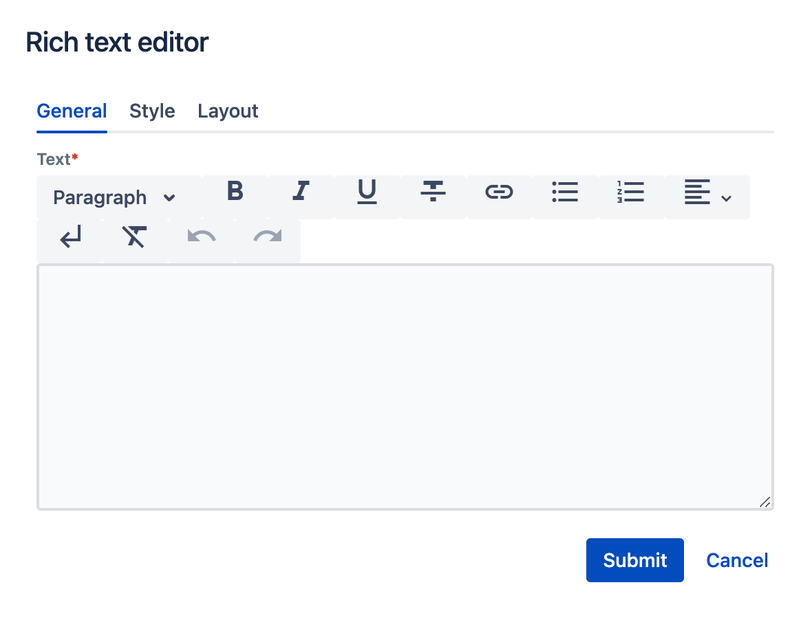
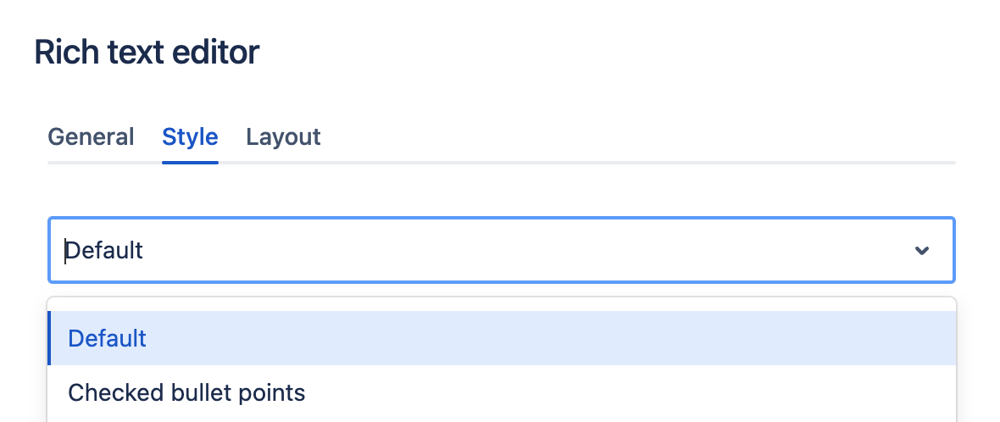
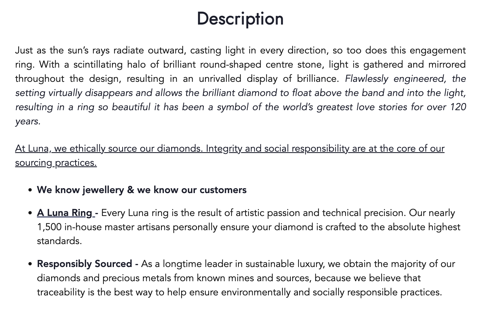
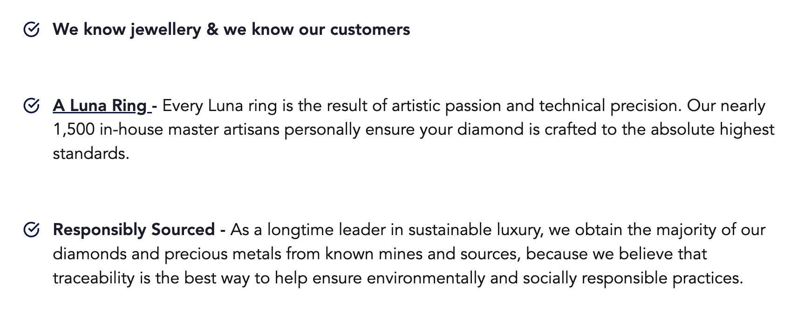

# RTE Component

A Rich Text Editor allows editors to create text content (paragraphs with headings, bullet lists, links and more) across pages.

## Usage

Drag & drop RTE component to a Page Section. A simple paragraph with _lorem ipsum_ content will be rendered on a page:

    

## Authorable properties
Click  (_Edit_ icon) on the **RTE** component to see its properties:

On the **General** tab, you can add:
  
  - **Text** -  with a wide range of functionalities. You can:
      - add a new Paragraph or Heading (with level 1 to 6)
      - select some words and make it bold / italic / underlined or crossed.
      - add a link
      - create bullet points or ordered list
      - align text to the left / center / right or with _justify_ option.
      - add a new line (__br__ html tag). Please note that pressing _Enter_ button in RTE results in a new paragraph. If you click _New Line_ icon - new line will be added inside the same paragraph.
      - clear formatting

    

- You can set the Style for the RTE using the **Style** tab:

    

- You can resize the RTE as any other component using the **Layout** tab. (See [grid](../grid) description for details.)

## Rendered component

RTE with **Default** style variant:

    

RTE with **Checked bullet points** style variant:

    

