# Author Info resolving example

This article is showcasing the possibilities of author info resolution. 
The mechanism behind it is used in any page or component that consumes information about authors.
We took Blog Article Author Bio component as an example.

## Preparations

[comment]: <> ( TODO Provide readymade content for this example instead?)

###  Have a blog list page

* login to Websight
* enter "Kyanite - personal template" space
* click "Create page" in the top right corner of the page
* choose a Blog Listing page and click "Next"

    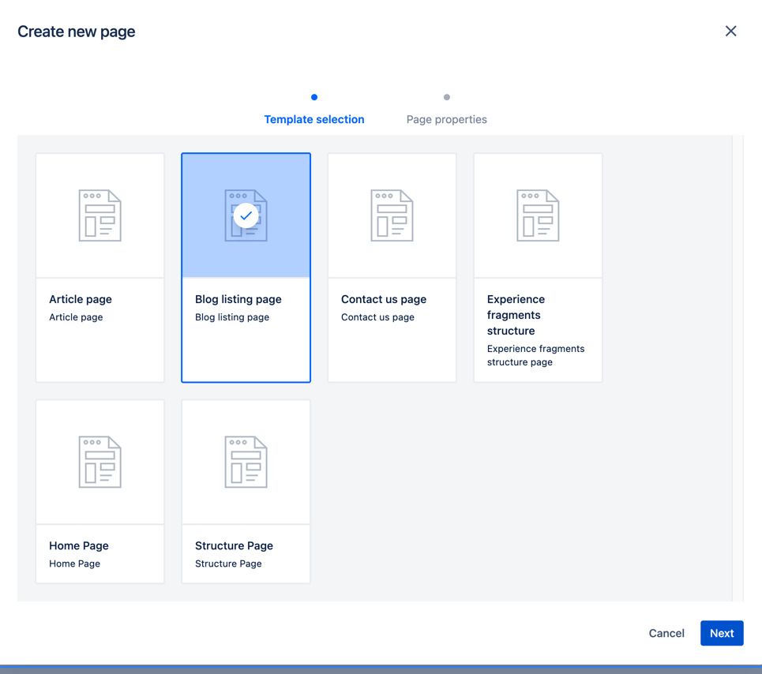

* name it "Blog list" and click "Submit"
* click the folder icon near the page's name to go underneath

    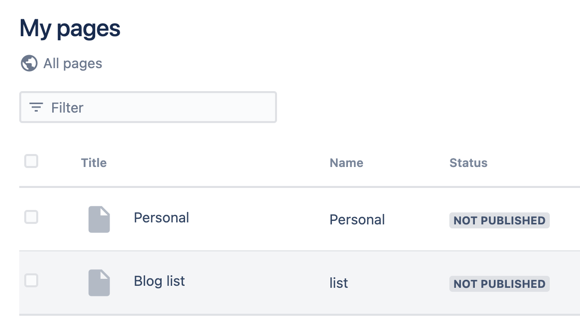

###  Have author bio pages for two authors

#### Author 1

* create an Author Bio page under "Blog list" page

    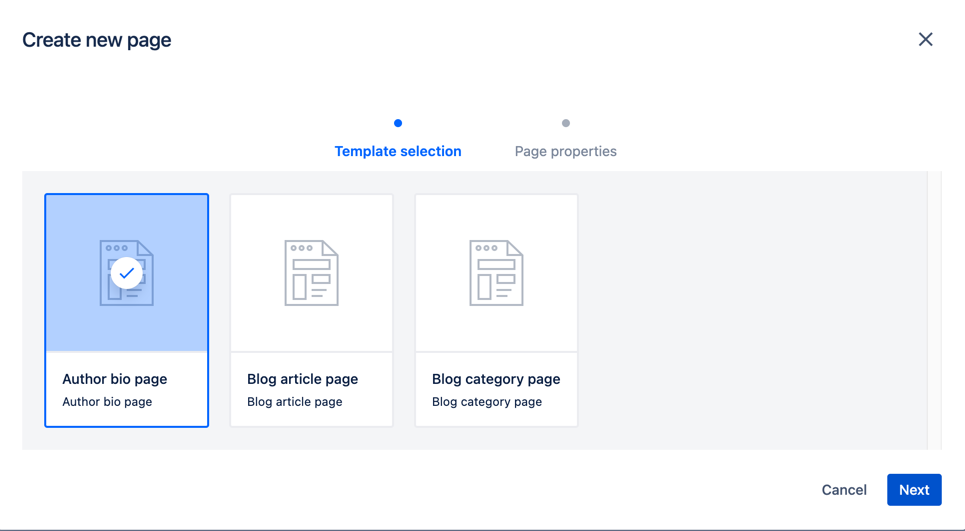

* name the page "Jack Brown"
* in Metadata tab, click "Own properties" below "Source of author info" label and fill author info. You can also do it in the page properties after creation
  

    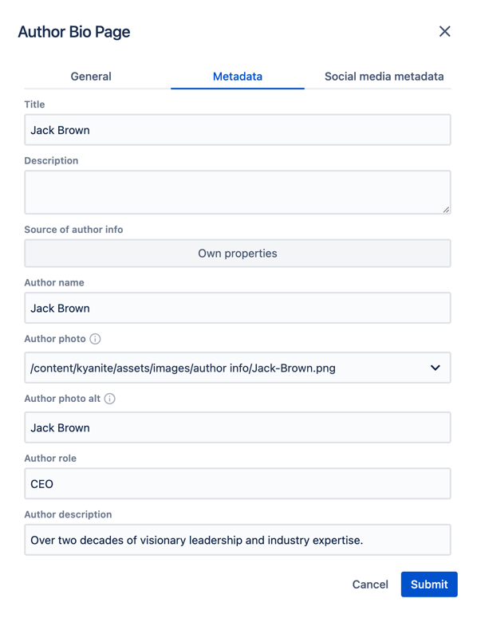

* click "Submit"

#### Author 2

* create another Author Bio page named "Lucy WIlliams" with the following properties:

    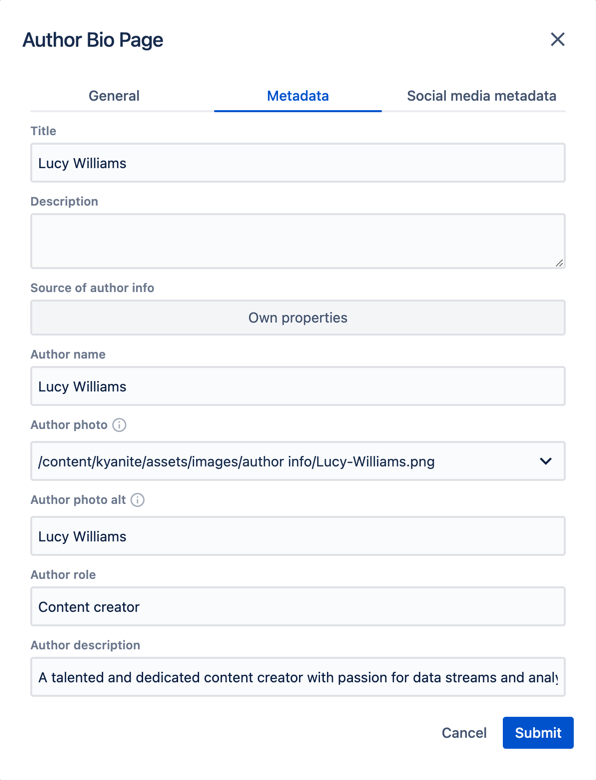

## Demonstration

###  Create a page with author info components

Create a Blog Article page

    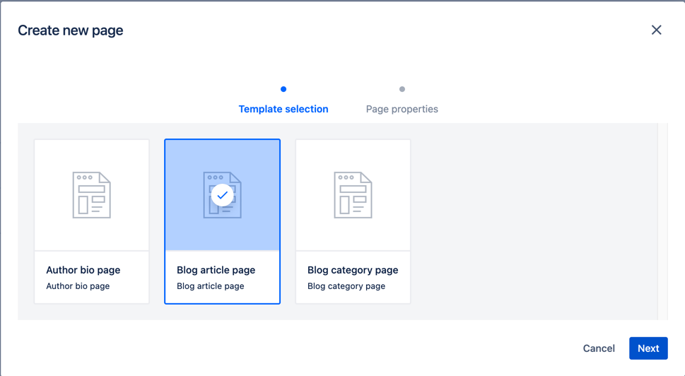

In Metadata tab, click "Author page" below "Source of author info" label and choose Author-1 page in the path picker.
The remaining values are up to your choice. You can also fill the properties the page after creation.

    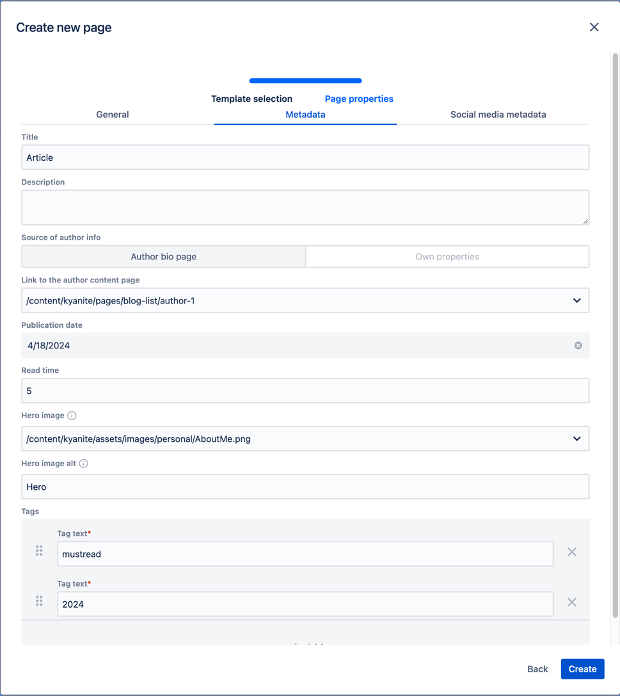

Open the created page. It initially has Blog Article Header and Blog Article Author Bio in it, and must look like this:

    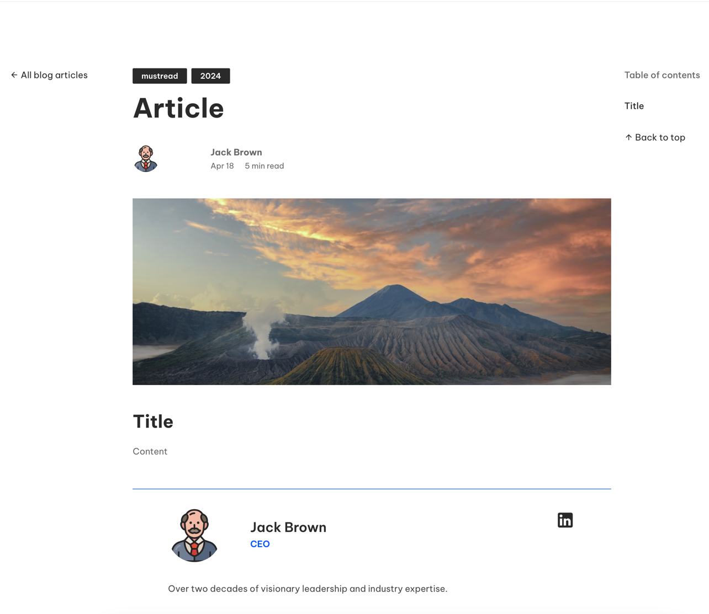

Components that use author info refer to the parent (containing) page by default.
The page is now referencing Jack Brown's bio page, so we see the respective information.

###  Play with component config

Click on Blog Article Author Bio component at the bottom and then click the gear icon to show component's dialog

    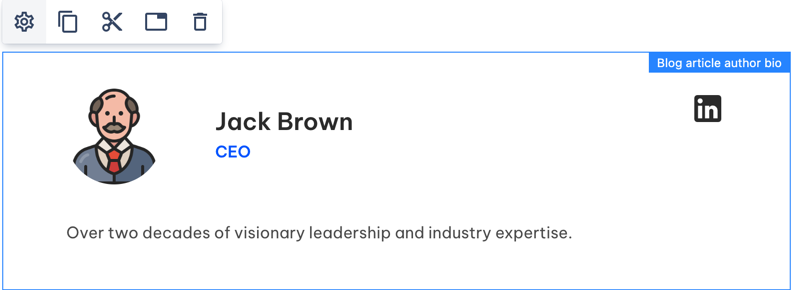

Change author info source to "Author page" and choose Lucy Williams page

    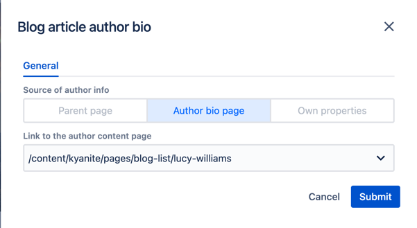

After submitting the dialog, you will see the changes. Notice that the header still shows Jack Brown info - we changed the source only for Author bio

    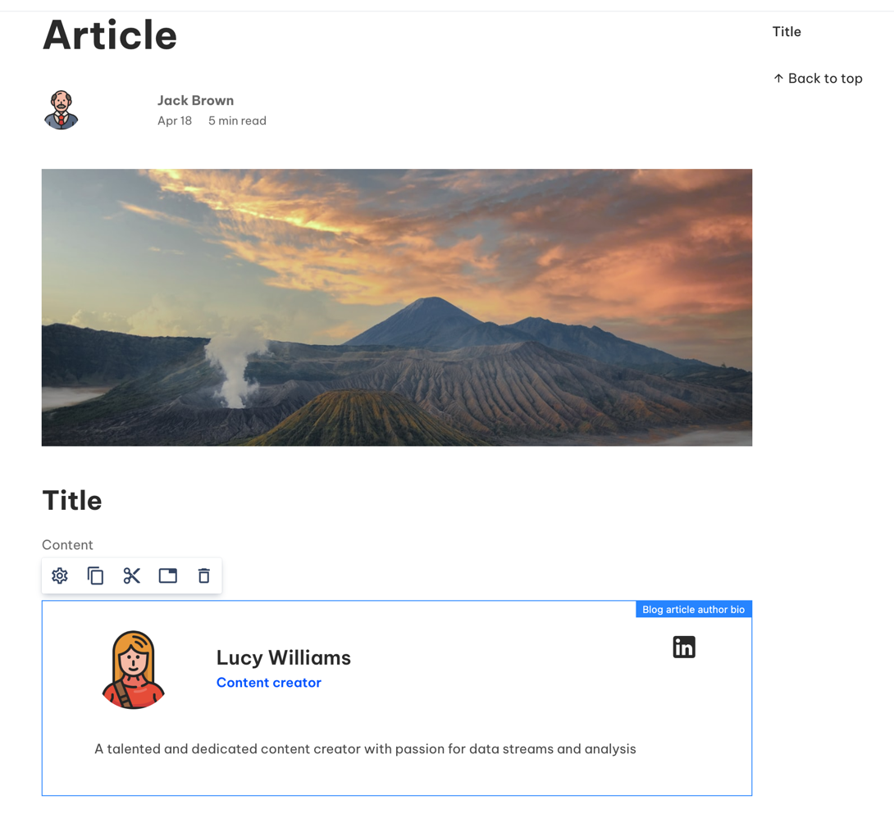

Call the dialog again and select "Own properties". Input information about the author we don't have a page for:

    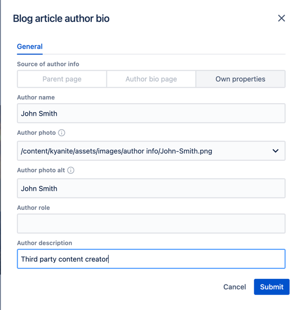

Now our component displays its own information.

    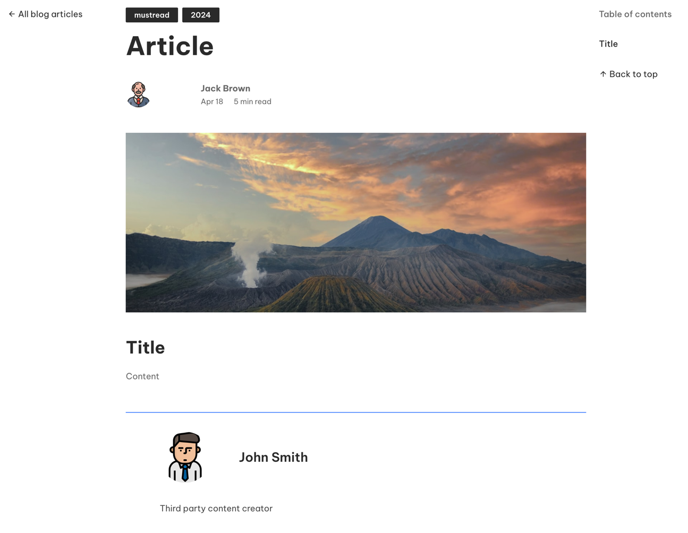

## Play with page config

Set author info source in Blog Article Author Bio dialog back to "Parent page".

Then, open page properties and in Metadata tab change author info source to "Own properties" and input info about the author:

    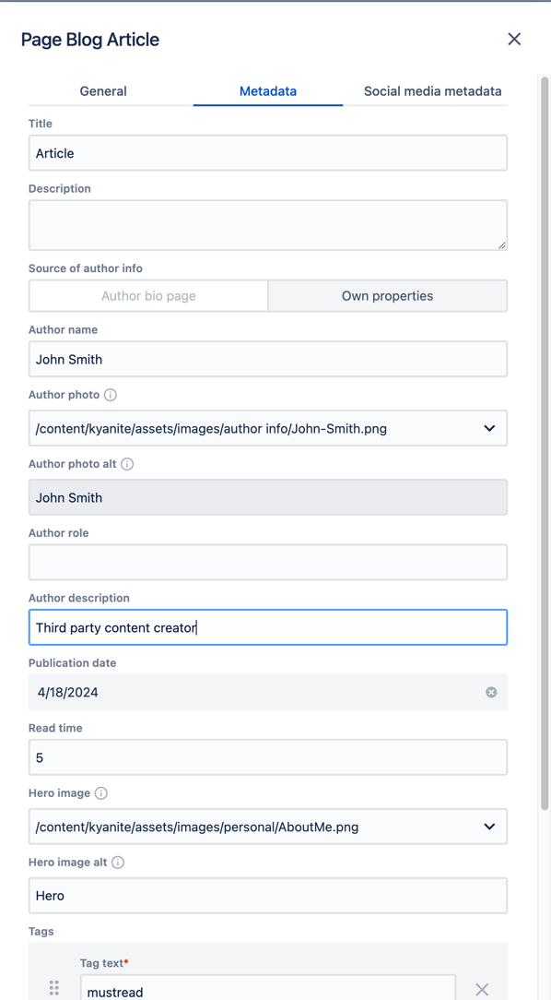

Both header and author bio has changed their contents respectively to the parent page changes.

    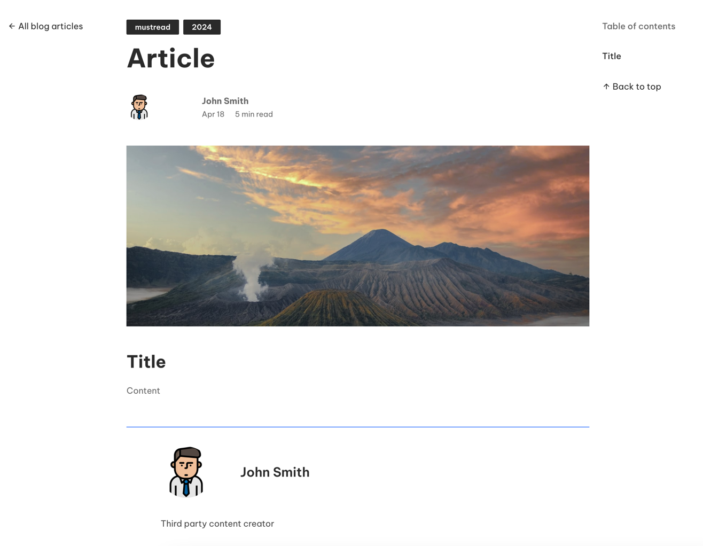

