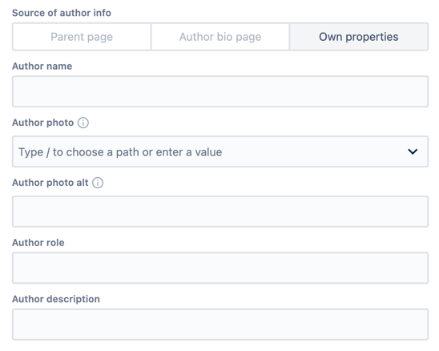

# Author Info

Every blog article has an author, and usually, you would want to give them credit by mentioning them before or after the article content.
But you wouldn't want to retype information about the same author under every article that belongs to them, would you?

To make things convenient, we keep information about the author in a single place - the Author Bio page - and refer to it whenever needed.

## Author info model

Author information contains:

* Author's name
* Link to the author's photo asset or an external image
* Alternative text for the photo
* Author's role in the company or on the project
* Short description
* <a href="../components/blogarticleauthorbio#socialmedia">Social media links</a>

Pages and components _may_ use any of these properties.

## <a name="config">Author info configuration</a>

Every page/component consuming author info uses the common dialog that has three options:

* Take author info from parent (containing) page - actual for components like Blog Article Header and Blog Article Author Info. Parent page itself may refer to another page - however many redirections there are, author info will be resolved.

    

* Refer to Author bio page of corresponding author. It is the initial choice for Blog Article pages.

    

* Input your own properties. Having own properties automatically makes page/component a valid source of author info for another pages/components. This is the only option for Author Bio page - it cannot refer to any other authors.

    

## Example

A small example demonstrating different author info setups is described <a href="./example">here</a>
