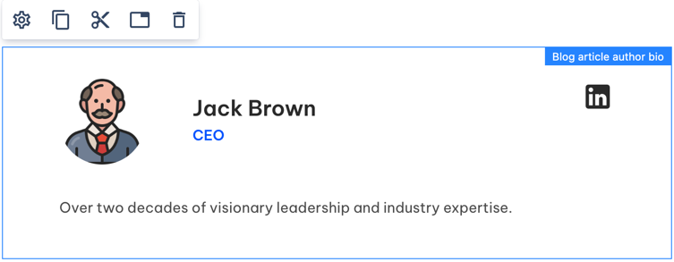
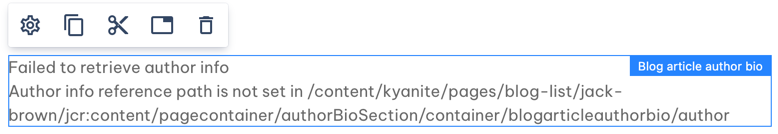
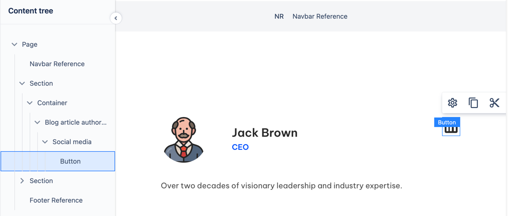
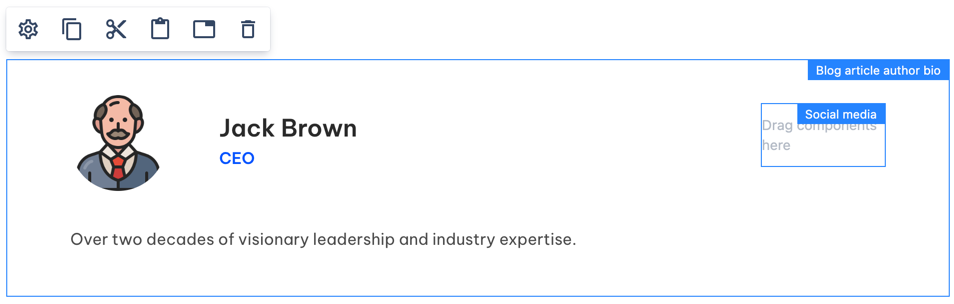
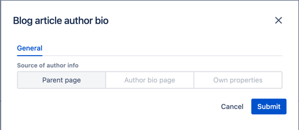

# Blog Article Author Bio

Blog Article Author Bio component allows you to display short info about the author.
While the most common usage is to place it at the top/bottom of an article or author's bio page, 
it is allowed on any blog-related page.

## Usage

Open/create a Blog Article page and drag & drop Blog Article Author Bio to the Page section.

By default it references the parent pages's author info. 
If the page references an existing author bio page or has its own author properties, the component will show info about respective author:

    

Otherwise, error message will be shown until you refer to a valid author info source or input your own properties, <a href="../../authorinfo/example">as explained here</a>

    

### <a name="socialmedia">Social media icons</a>

Author Bio has a 'Social media' section.
It is editable _only on Author Bio page_ and is read-only on all the other pages.

You can drag & drop Buttons into the Social Media section.
Initially you will see a Button with no label and linkedin icon there, with a link leading to WebSight account.

    

When there is nothing in the section, it will display a placeholder when in edit mode.

    

## Authorable properties

Blog Article Author Bio component uses <a href="../../authorinfo#config">common dialog for author info source configuration</a>.
It doesn't have any other properties. 

    

