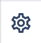

# Blog list

_Since:_ 0.0.4

[//]: # (TODO add component groups info)

Blog list allows you to display a grid of blog article previews.

## Usage

Drag & drop Blog list to a Page Section. It will automatically display all blog article previews it will find. 

The set of articles to be displayed depends on the type of the page Blog List belongs to:
- on pages that belong to a specific author, i.e. <a href="../../authorinfo#config">with author info configured</a>, it will filter articles by author:

    

- on all other pages it will display all the articles under the same space as the page

    

## Authorable properties

Click  ("Edit" icon).

- **Path to the blog article pages** - defines the root under which blog articles pages will be searched.
When the property is empty, space root will be used.
- **Source of author info** - allows you to filter articles by author. 
If no valid author is referenced directly or via parent page, it will have no effect.

    

## Rendered component

Blog list looks different on wide and narrow viewports.

On desktop, it's a grid with three articles per line:

    

On tablet/mobile every article takes all the component's width:

    

