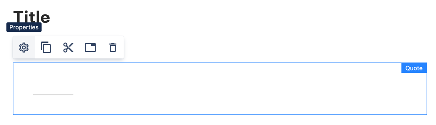
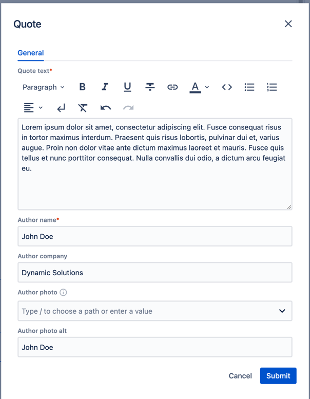
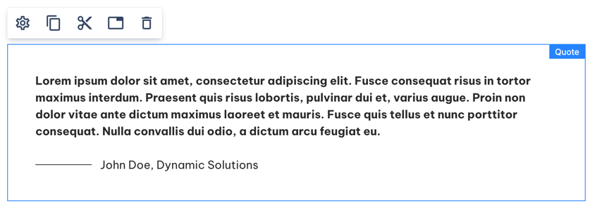

# Quote

_Since_: 0.5.1

[//]: # (TODO add component groups info)

Quote component allows you to add quotes to a Blog Article Page content.

## Usage

Drag & drop Quote to a Page Section.

    

Select the component and click  ("Edit" icon) to open the dialog.

Fill in some data. Quote text and author name are required, the rest is optional. 

    

Submit the changes and observe a rendered component.

If you don't provide an asset or link to an external image in 'Author photo' property,
it is replaced with a horizontal line.

    

