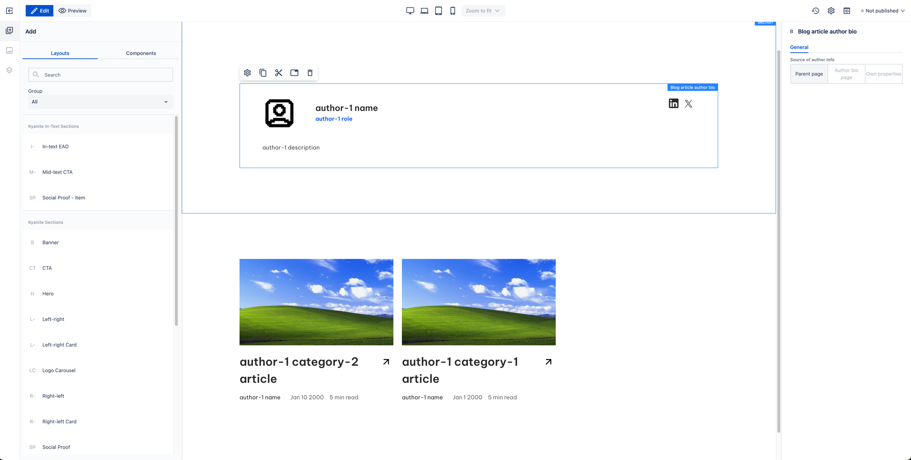
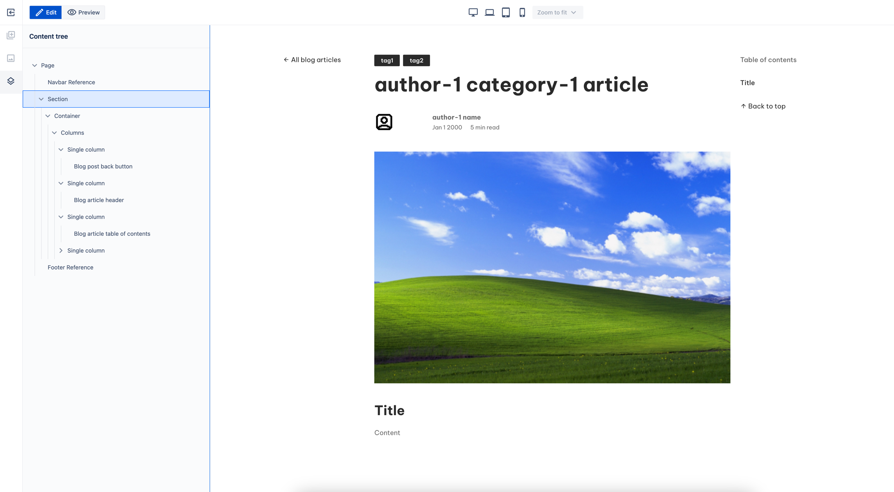
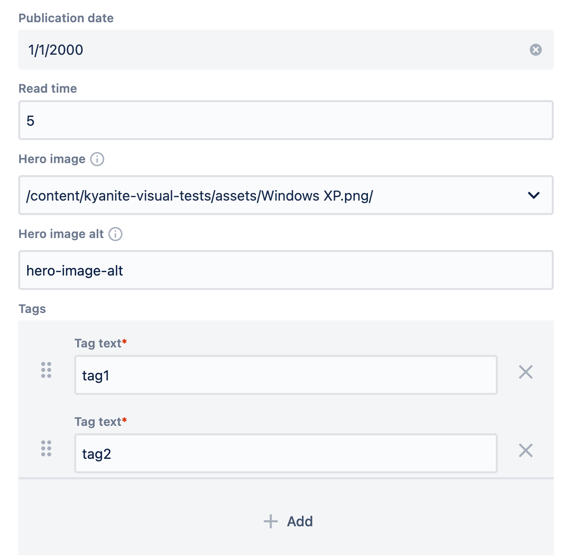
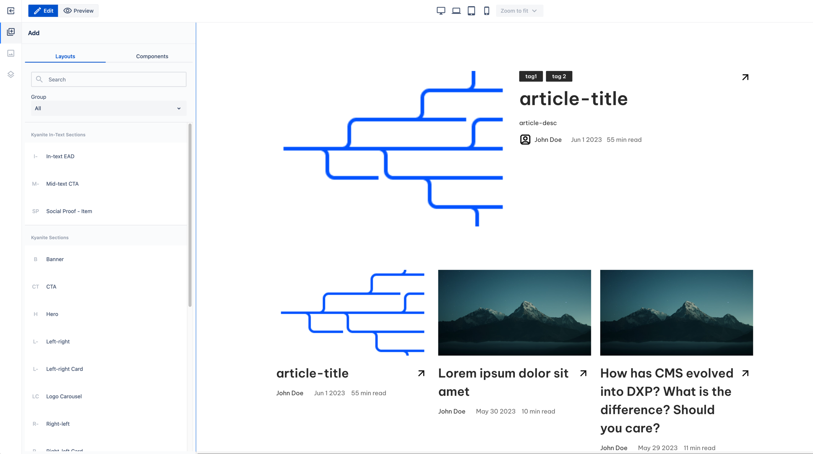

# Blog Page Templates

In Kyanite, we have a set of dedicated page templates for maintaining blog structure under your website:

* Templates for creating article pages:
    * Article page
    * Blog article page
* Aggregators templates
    * Blog category page
    * Blog listing page
* Author Bio page template designed to store information about blog authors to refer to from other pages and components

## Author Bio Page

Author bio page serves both as a storage and representation of information about blog articles author. When created, it initially has:

* Blog Article Author Bio
* Container for content, for example, author short biography
* Blog List

Author info configuration in the Metadata tab is the only configuration specific for this type of page.

## Blog Article Page

Blog article page is just that, an article by some author. It can be created under:

* Blog Listing page
* Blog Category page

It has predefined layout with article header, table of contents, and a container for actual content.

Besides author info configuration mentioned earlier, it has properties for article header:

## Blog Listing Page

Blog listing page serves as a root for you blog articles hierarchy.

Initially it has feature blog article and blog list added.

It has no unique properties.

## Blog Category Page

Blog Category Page serves as an auxiliary element to help you maintain a clear blog structure. 
One possible usage is to add a description of the category and place a blog list configured to display articles under the category page.

It can be created only under Blog Listing page as an intermediate level in your page hierarchy.

It has no initial content and unique properties.

## Article Page

Article page is a simple page with no initial content in it, except Navbar and Footer references.

Unlikely Blog article page, it can be created anywhere under the root, and it doesn't count as Blog article page in Blog List component.
When you want to create an article for a specific purpose and you don't want it to be displayed in blog list, Article page is what you need.
