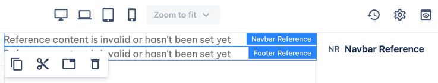
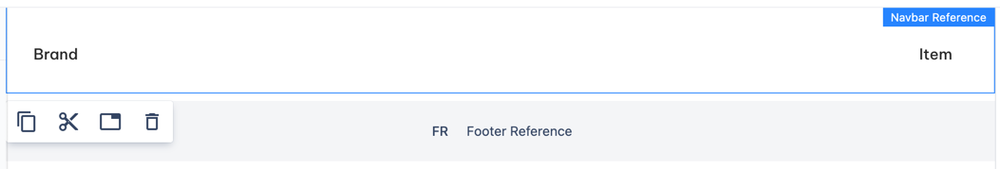
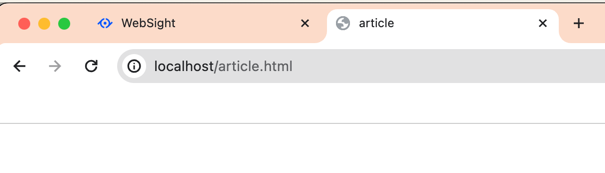
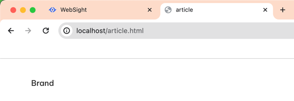
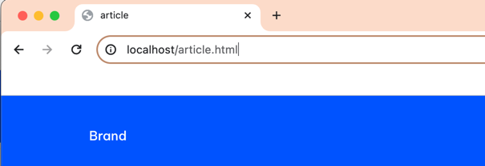

# Navbar reference

_Since_: 0.0.2

Navbar reference allows authors to use Navbar from Homepage at any page within the same space. 

<!--
It works as an <a href="../../fragment">Experience fragment</a>, with Homepage Navbar serving as a reference.
For usual fragment you would create an Experience Fragment page and publish it separately,
but Navbar reference content is published along with Homepage.
Since v.0.4.21 you don't need to republish the page after Navbar has changed. 
You publish the Homepage and Navbar reference is automatically updated on every published page.
The only limit is you must create Homepage first, otherwise there is nothing to refer to.
-->

## Usage

Login to Websight and open the 'Kyanite - personal template' space or any other space.

Create an Article page and open it for edition. 
It initially has Navbar reference on it, but there is no content.
It's because the Homepage doesn't exist yet and there is nothing to refer to.

<!--
It initially has Navbar reference on it, but the message says that there is no content referenced.
It's true, because the Homepage doesn't exist yet.

    

-->

Create a Homepage. Open it and observe the Navbar.

Now open article page, and you will see that Navbar is displayed in Navbar reference.

    

<!--
If you now publish the article page, you will not see Navbar there. **That's because we haven't published the Homepage yet**.

    

Publish the Homepage and refresh the published article page. You will see the Navbar in place.

    

Open the Homepage again. Add some content to Navbar, or just change its visual property. 
In this example we've changed 'variant' property from 'None' to 'Primary' - visual difference is obvious.
Republish the Homepage.
Refresh the published article page. You will see that Navbar has changed, although we didn't republish the article page.

    

-->

Publish the Article page. You will see the Navbar in place.

    

## Authorable properties

Navbar reference doesn't have authorable properties.
