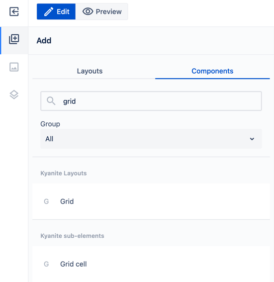

# Grid

_Since_: 0.4.21

Grid is a two-dimensional container similar to <a href="https://bulma.io/documentation/grid/fixed-grid/">Bulma Grid</a>

## Usage

Drag and drop Grid to a page section. It will initially have four Grid cells in it:

    

You can drag and drop Grid cells into Grid.

    

You can drag and drop any content into Grid cells.

## Authorable properties

### Grid

Grid has the following properties:

- Columns number for different viewports (desktop/tablet/mobile) - defines width of the Grid.
Try to input different values and switch between viewports to see the difference.

    

    

    

- Column gap and Row gap - space between columns/rows, in _rem_. 
Allowed bounds are from 0 to 8, with step of 0.5

    

### Grid cell

You can change width and height of a cell relatively to Grid:

    

Please notice that, if cell doesn't fit in place, it will be moved to the next row.
On the screenshot above, Cell 4 was pushed to a second row by cell 3, then to the third column by Cell 2. 
