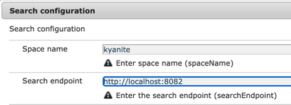
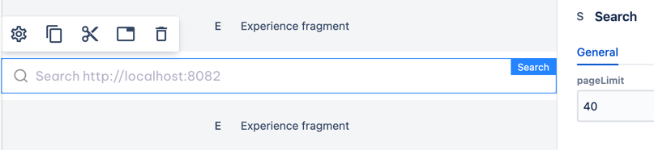
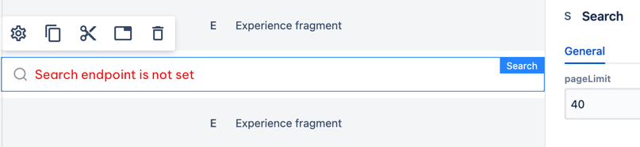
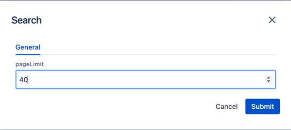
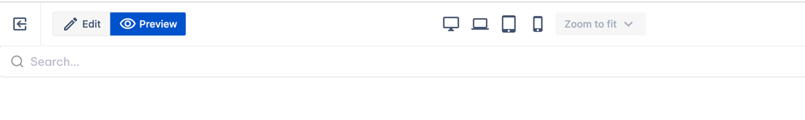
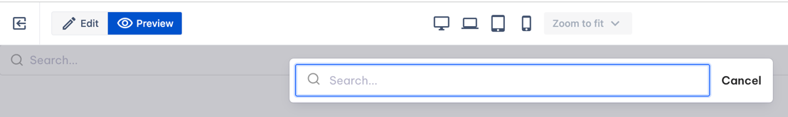
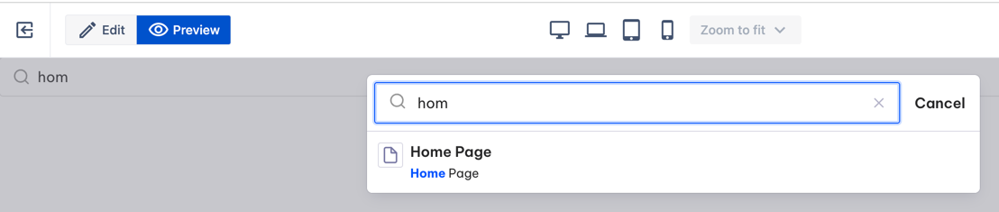

# Search

_Since_: 0.4.19

Search component is used for integration with StreamX search service.
It allows you to search for published pages by their names and content.

## Configuration

To use Search component in your space you need to provide a Search configuration.
  - go to OSGI configurations console (usually http://[host]:[port]/system/console/configMgr)
  - find "Search configuration" and add one for your space, like this:

    

## Usage

Drag & drop Search to a Page Section. 
If search endpoint has been set, it will look like this:

    

Otherwise you will see error message:

    

## Authorable properties

Click  ("Edit" icon).

  - you can limit the number of pages returned by search service

    

## Rendered component

[//]: # (TODO add component groups info)

If search endpoint is not set, component will not be rendered in preview/published mode.

If search endpoint is configured, you will see a single input.

    

Click the input and a modal window will appear:

    

Start to type symbols in the input. After there are at least three of them, 
request to search endpoint will be sent and you will see the result.

For this example, Homepage has been published so we see it in search output.

    

Every row of the result contains page name and a piece of content that matches your request.
