# Navbar components

[//]: # (TODO add component groups info)

There are several components that serve as building blocks for Navbar.

Available as Navbar direct children are:

- <a href="#navbar-menu">Navbar menu</a>
- <a href="#navbar-brand">Navbar brand</a>

## <a id="navbar-menu">Navbar menu</a>

Navbar menu represents a container for Navbar start and Navbar end components.

Aside from that, it is possible to add so named 'meta navigation' items that will show at the top ot Navbar menu:

    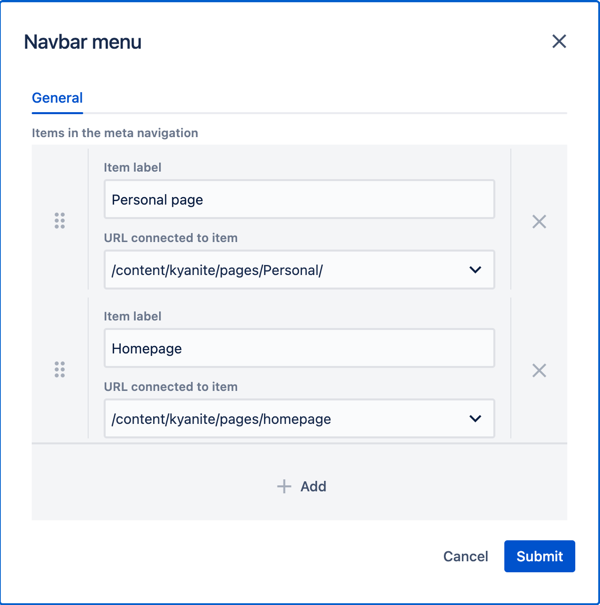

The result of the configuration above is the following. 
_Item_ here belongs to Navbar end component, while at the top we see two meta navigation items that we've just added.

    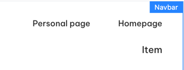

### <a id="navbar-start">Navbar start</a> and <a id="navbar-end">Navbar end</a>

Navbar start and Navbar end components are just containers for Navbar menu content. 
They don't have authorable properties.
The only difference is their alignment inside the Navbar menu:

    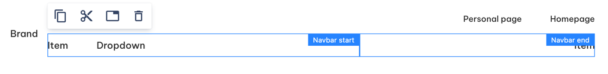

Navbar start and Navbar end can contain Navbar dropdowns or Navbar items.

## <a id="navbar-brand">Navbar brand</a>

Navbar brand component serves as a container for navbar content.

It has a property 'Create navbar burger' that folds Navbar menu on narrow viewports. 
Below is the example.

Wide viewport:

    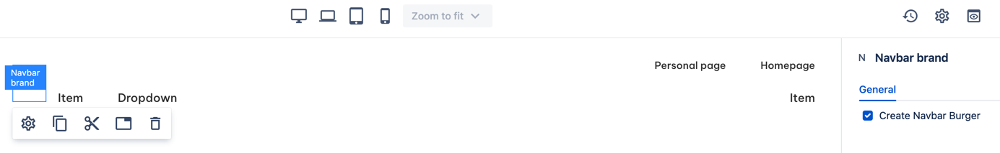

Narrow viewport: 

    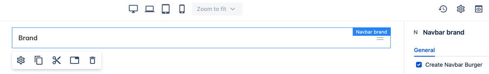

## <a id="navbar-dropdowns">Dropdowns</a>

### <a id="navbar-dropdown">Navbar dropdown</a>

Navbar dropdown displays a list of items on hover.

    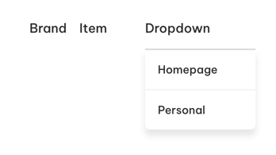

Dropdown has a number of authorable properties.

    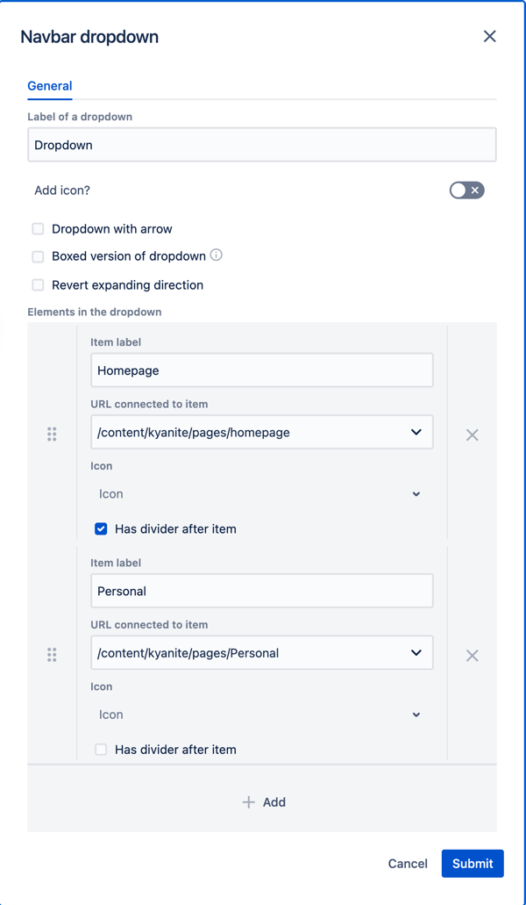

Author can add an <a href="../../icon">_**icon**_</a> to dropdown's label. It will be displayed _in front_ of all the dropdown items.

_**Dropdown with arrow**_ adds an arrow icon _after_ the label.

_**Boxed verion of dropdown**_ is actual for transparent navbars - it changes the style of dropdown.

_**Revert expanding direction**_ make dropdown list appear above the dropdown label.

With _**Elements in the dropdown**_ author can add elements to be displayed in the dropdown,
each element having its own label and link to a Websight page or external resource.

### <a id="navbar-mega-dropdown">Navbar mega dropdown</a>

Mega dropdown allows author to organize menu with up to 5 columns.
Each column can be either of 'text' or 'highlights' type.

On the example below we have:

  - first column with two sections containing two items each
  - _hidden_ second column.
  - third column containing a single section with a single item
  - fourth column containing two highlights
  - _empty_ fifth column

    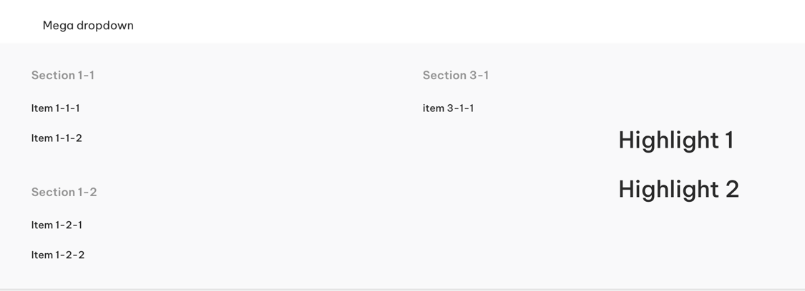

General properties are similar to a regular dropdown described above.

    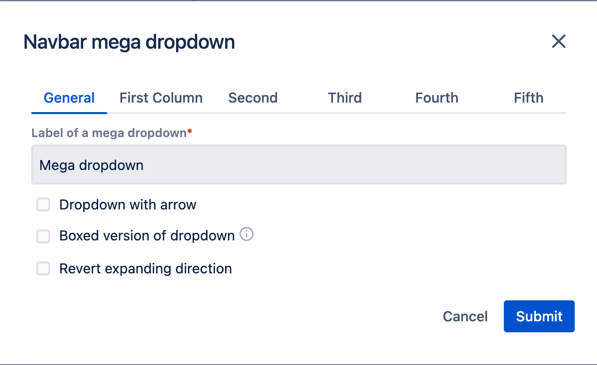

Text items are organized into sections.

    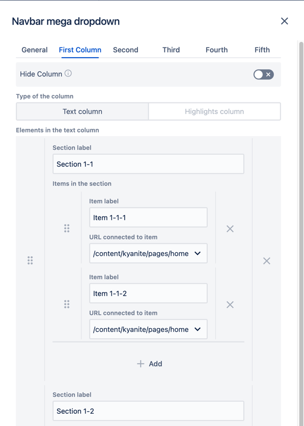

Highlights are not grouped into sections.

    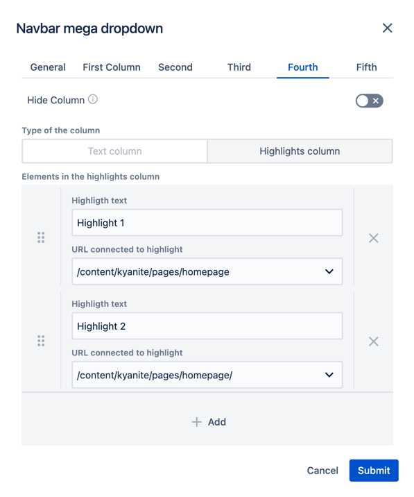

Hiding a column leaves empty space.

    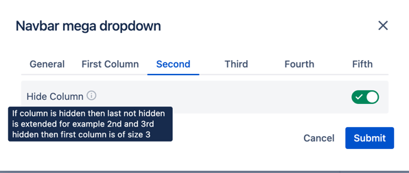

## <a id="navbar-item">Navbar item</a>

Navbar item is the most flexible Navbar component. 
Author may want to use it when just a label with URL is not enough, or in case they want to add some specific element/layout to Navbar.

Navbar item has three modes:

Link - default mode. Is just a link with a label and optionally an icon.

    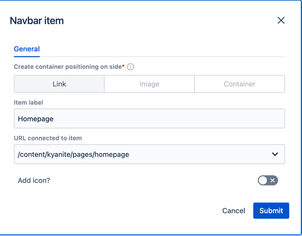

Image - author can use asset or external image as a navbar item. 

    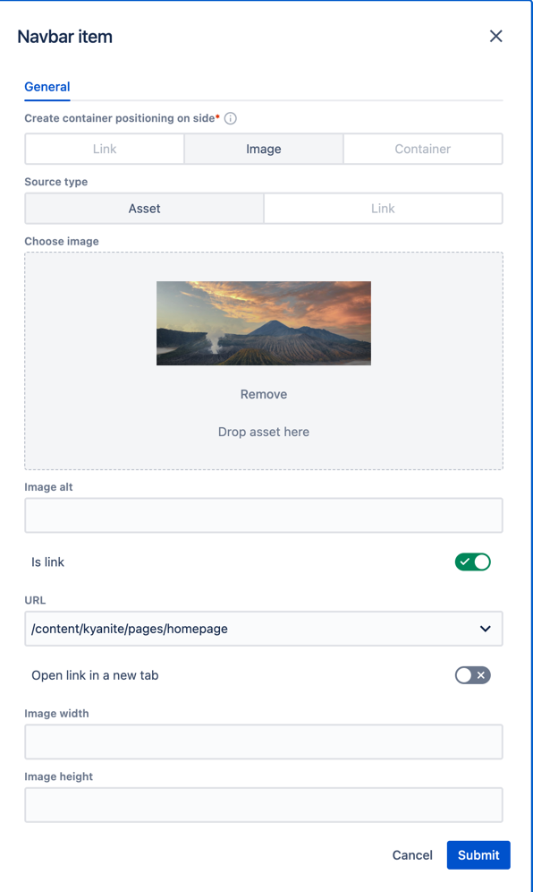

Container - allows author to use common Kyanite components to construct their own unique navbar item.

    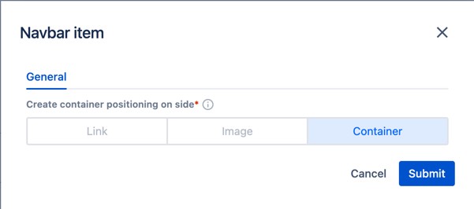

