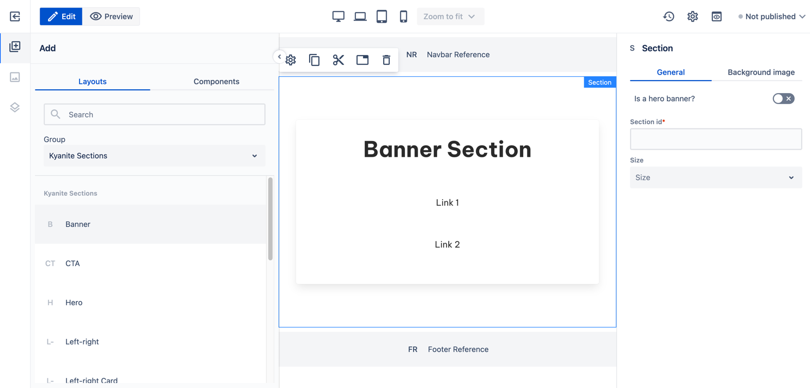

# Layouts

**Layouts** are group of components with predefined properties. They are used to define a specific page layout. They can be drag & dropped on a page instead of single components to speed up authoring process.

## Usage

To try it out open a blank page, select a Layouts tab in the left-side panel and drag and drop a Banner layout to the main page content. 
A page section with a card containing a title and two links will be added on the page.

    

All components that are added on a page with a given layout can be modified, moved or removed (same as regular components).
