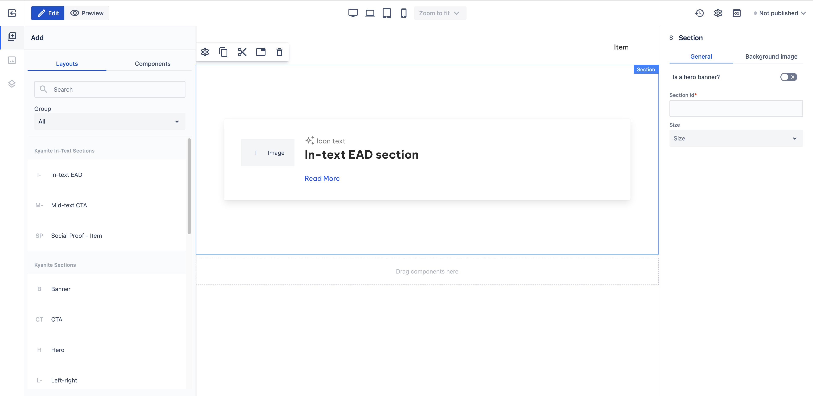

# In-text EAD

_Since_: 0.4.19

In-ext EAD section is a ready-to-use component that is designed to use between paragraphs. It is
basically a Card component with an image on the left and text on the right side, all used
to raise the attention of the user and possibly redirect them.

## Usage

Drag & drop In-text EAD component from Kyanite In-Text Sections to a Section or a Container.
After adding it to the page, it should look like this:

    

## Authorable properties

As the component is not a standalone component, and it wraps various other components, authoring
can be done through those basic components. Here is the structure of the authorable components:

- <a href="../../../components/card">Card</a>
    - <a href="../../../components/card/cardcontent">Card content</a>
        - <a href="../../../components/columns">Columns</a>
            - <a href="../../../components/columns/column">Single Column</a>
                - <a href="../../../components/image">Image</a>
            - <a href="../../../components/columns/column">Single Column</a>
                - <a href="../../../components/icon">Icon</a>
                - <a href="../../../components/title">Title</a>
                - <a href="../../../components/content">Content</a>