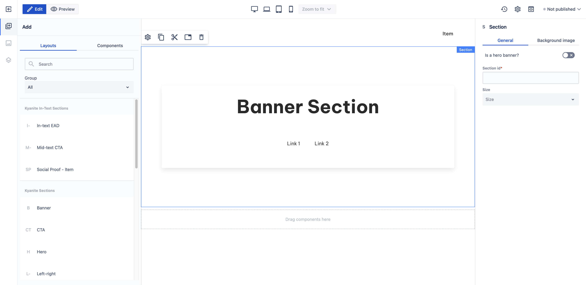

# Banner with Links

_Since_: 0.4.19

[//]: # (TODO add component groups info)

_Banner with Links_ section is a ready-to-use component to capture the attention of the users and provide
navigation options.

## Usage

Drag & drop _Banner with Links_ component from Kyanite Sections to the page directly, as the component already
contains a Section component.
After adding it to the page, it should look like this:

    

## Authorable properties

As the component is not a standalone component, and it wraps various other components, authoring
can be done through those basic components. Here is the structure of the authorable components:

- <a href="../../../components/section">Section</a>
    - <a href="../../../components/container">Container</a>
        - <a href="../../../components/card">Card</a>
            - <a href="../../../components/card/cardcontent">Card content</a>
                - <a href="../../../components/title">Title</a>
                - <a href="../../../components/container">Container</a>
                    - <a href="../../../components/level">Level</a>
                        - <a href="../../../components/level/levelitem">Level item</a>
                              - <a href="../../../components/link">Link</a>
                          - <a href="../../../components/level/levelitem">Level item</a>
                              - <a href="../../../components/link">Link</a>
