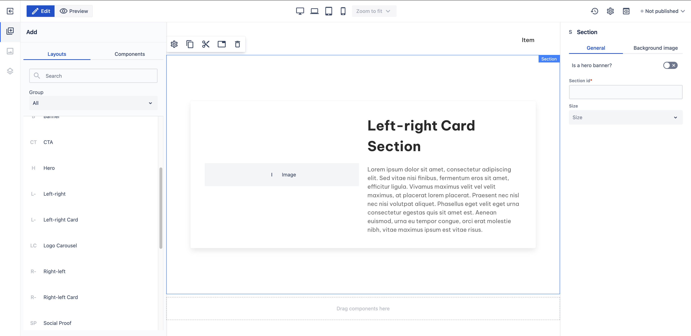

# Right-left card

_Since_: 0.4.19

[//]: # (TODO add component groups info)

Right-left card section is a ready-to-use component split into two parts, a title and a description
is shown on the left-hand side while an image can be found on the right-hand side. The difference
to the <a href="../leftright">Right-left</a> section is that in this layout all content is
wrapped inside a Card component.

## Usage

Drag & drop Right-left card component from Kyanite Sections to the page directly, as the
component already contains a Section component.
After adding it to the page, it should look like this:

    

## Authorable properties

As the component is not a standalone component, and it wraps various other components, authoring
can be done through those basic components. Here is the structure of the authorable components:

- <a href="../../../components/section">Section</a>
    - <a href="../../../components/container">Container</a>
        - <a href="../../../components/card">Card</a>
            - <a href="../../../components/card/cardcontent">Card content</a>
                - <a href="../../../components/columns">Columns</a>
                    - <a href="../../../components/columns/column">Single Column</a>
                        - <a href="../../../components/title">Title</a>
                        - <a href="../../../components/content">Content</a>
                    - <a href="../../../components/columns/column">Single Column</a>
                        - <a href="../../../components/image">Image</a>
