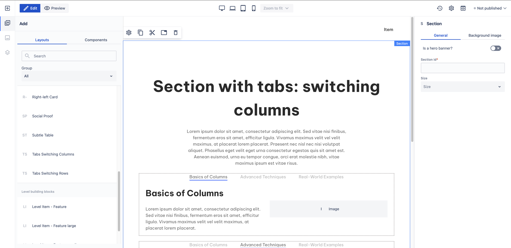

# Tabs Switching Columns

_Since_: 0.4.19

Tabs Switching Columns section is a ready-to-use component having a main title and description
and three pre-defined columns under as tabs. Each tab contains a title and a description 
on the left and an image on the right.

## Usage

Drag & drop Tabs Switching Columns component from Kyanite Sections to the page directly, as the
component already contains a Section component.
After adding it to the page, it should look like this:

    

## Authorable properties

As the component is not a standalone component, and it wraps various other components, authoring
can be done through those basic components. Here is the structure of the authorable components:

- <a href="../../../components/section">Section</a>
    - <a href="../../../components/container">Container</a>
        - <a href="../../../components/title">Title</a>
        - <a href="../../../components/columns">Columns</a>
            - <a href="../../../components/columns/column">Single Column</a>
                - <a href="../../../components/content">Content</a>
        - <a href="../../../components/tabs">Tabs</a>
            - <a href="../../../components/tabs/tab">Tab</a>
                - <a href="../../../components/tabs/tabcontent">Tab Content</a>
                    - <a href="../../../components/columns">Columns</a>
                        - <a href="../../../components/columns/column">Single Column</a>
                            - <a href="../../../components/title">Title</a>
                            - <a href="../../../components/content">Content</a>
                        - <a href="../../../components/columns/column">Single Column</a>
                            - <a href="../../../components/image">Image</a>
            - <a href="../../../components/tabs/tab">Tab</a>
                - <a href="../../../components/tabs/tabcontent">Tab Content</a>
                    - <a href="../../../components/columns">Columns</a>
                        - <a href="../../../components/columns/column">Single Column</a>
                            - <a href="../../../components/title">Title</a>
                            - <a href="../../../components/content">Content</a>
                        - <a href="../../../components/columns/column">Single Column</a>
                            - <a href="../../../components/image">Image</a>
            - <a href="../../../components/tabs/tab">Tab</a>
                - <a href="../../../components/tabs/tabcontent">Tab Content</a>
                    - <a href="../../../components/columns">Columns</a>
                        - <a href="../../../components/columns/column">Single Column</a>
                            - <a href="../../../components/title">Title</a>
                            - <a href="../../../components/content">Content</a>
                        - <a href="../../../components/columns/column">Single Column</a>
                            - <a href="../../../components/image">Image</a>