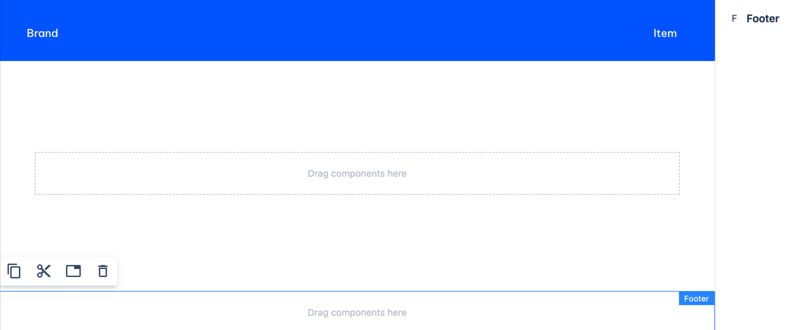

# Footer

_Since_: 0.0.1

Footer component is technically just a container for any content, but with additional feature:
once you have in on your Homepage, you can use it on any page via <a href="./footer-reference/">Footer reference</a>.

## Usage

Footer is automatically added to a page created from Homepage template.
You can freely remove and add it onto the page.

    

## Authorable properties

Footer doesn't have authorable properties.
