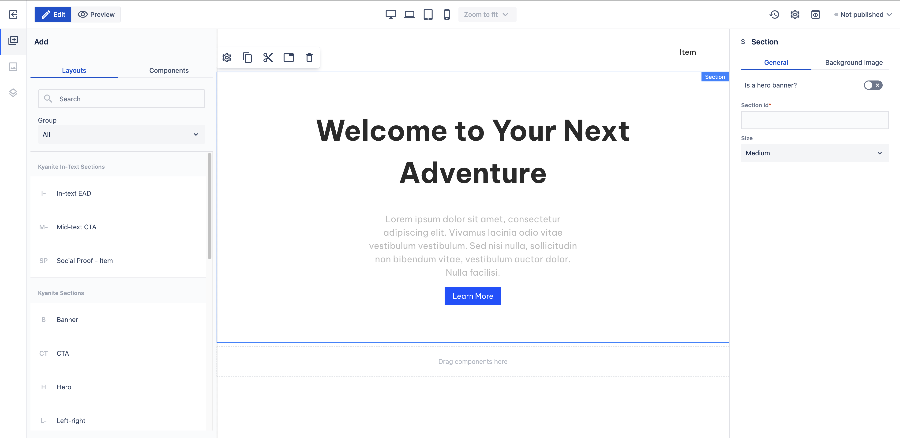

# Hero

_Since_: 0.4.19

Hero section is a ready-to-use component to appear as the first part of each page to make first
impressions. Also, there is a small description included with a button to take action.

## Usage

Drag & drop Hero component from Kyanite Sections to the page directly, as the component already
contains a Section component.
After adding it to the page, it should look like this:

    

## Authorable properties

As the component is not a standalone component, and it wraps various other components, authoring
can be done through those basic components. Here is the structure of the authorable components:
- <a href="../../section">Section</a>
  - <a href="../../container">Container</a>
    - <a href="../../title">Title</a>
    - <a href="../../columns">Columns</a>
      - <a href="../../columns/column">Single Column</a>
        - <a href="../../content">Content</a>
    - <a href="../../buttons">Buttons</a>
      - <a href="../../button">Button</a>