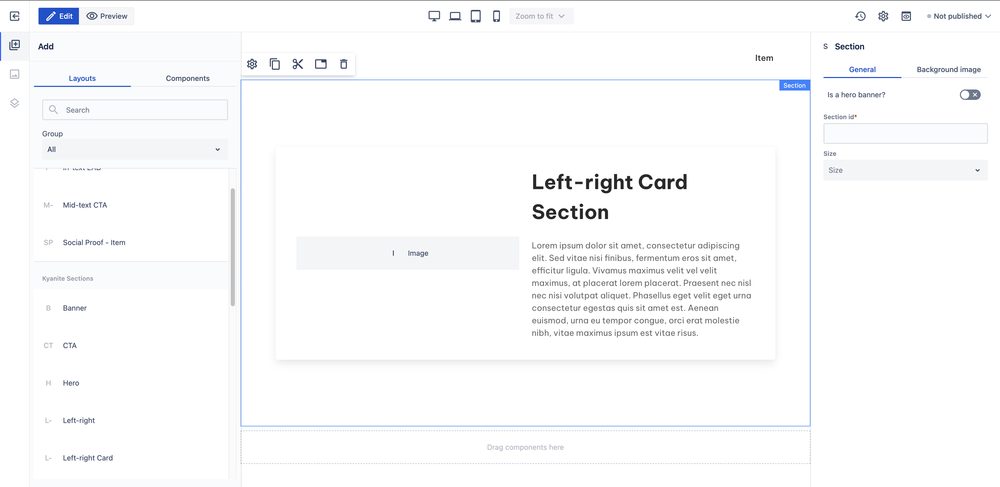

# Left-right card

_Since_: 0.4.19

Left-right card section is a ready-to-use component split into two parts, an image is shown on the
left-hand side while a title and a description can be found on the right-hand side. The difference 
to the <a href="../leftright">Left-right</a> section is that in this layout all content is
wrapped inside a Card component.

## Usage

Drag & drop Left-right card component from Kyanite Sections to the page directly, as the
component already contains a Section component.
After adding it to the page, it should look like this:

    

## Authorable properties

As the component is not a standalone component, and it wraps various other components, authoring
can be done through those basic components. Here is the structure of the authorable components:
- <a href="../../section">Section</a>
  - <a href="../../container">Container</a>
    - <a href="../../card">Card</a>
      - <a href="../../card/cardcontent">Card content</a>
        - <a href="../../columns">Columns</a>
          - <a href="../../columns/column">Single Column</a>
            - <a href="../../image">Image</a>
          - <a href="../../columns/column">Single Column</a>
            - <a href="../../title">Title</a>
            - <a href="../../content">Content</a>