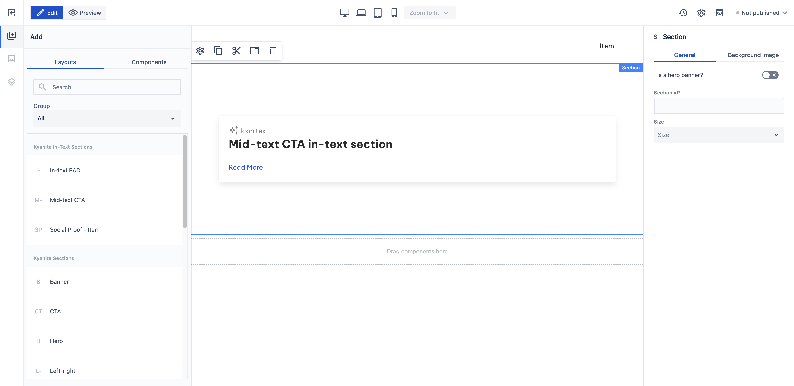

# Mid-text CTA

_Since_: 0.4.19

Mid-text CTA section is a ready-to-use component that is designed to use between paragraphs. It is
basically a Card component with some text used to raise the attention of the user and 
possibly redirect them.

## Usage

Drag & drop Mid-text CTA component from Kyanite In-Text Sections to a Section or a Container.
After adding it to the page, it should look like this:

    

## Authorable properties

As the component is not a standalone component, and it wraps various other components, authoring
can be done through those basic components. Here is the structure of the authorable components:
- <a href="../../card">Card</a>
  - <a href="../../card/cardcontent">Card content</a>
    - <a href="../../icon">Icon</a>
    - <a href="../../title">Title</a>
    - <a href="../../content">Content</a>