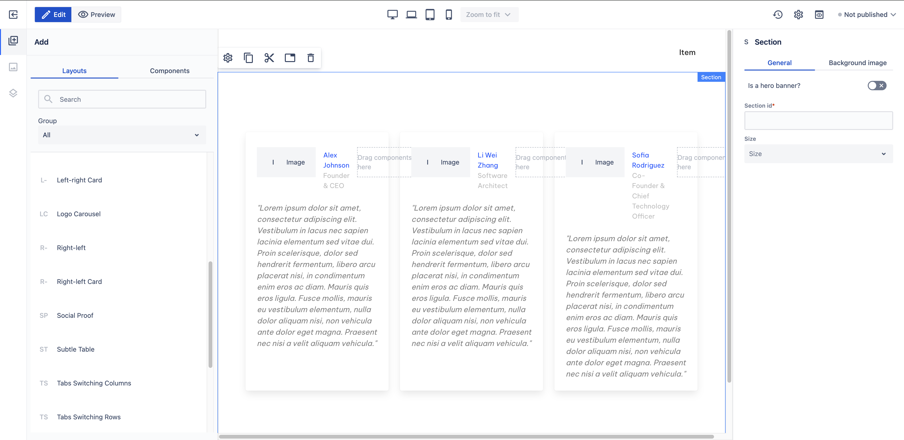

# Social Proof

_Since_: 0.4.19

Social Proof section is a ready-to-use component where authors can show user feedbacks using the
name, the profile picture, the job title and the actual feedback of the reviewer in a carousel.

## Usage

Drag & drop Social Proof component from Kyanite Sections to the page directly, as the
component already contains a Section component.
After adding it to the page, it should look like this:

    

The carousel can be extended with additional items. For this purpose there is a
<a href="./socialproofitem">Social Proof item</a> in-text layout created, so authors only need to 
drag & drop this item from the Kyanite In-Text Sections category from the left-hand side to
the carousel.

## Authorable properties

As the component is not a standalone component, and it wraps various other components, authoring
can be done through those basic components. Here is the structure of the authorable components:
- <a href="../../section">Section</a>
  - <a href="../../container">Container</a>
  - <a href="../../carousel">Carousel</a>
    - <a href="../../carousel/carouselitem">Carousel item</a>
      - <a href="../../card">Card</a>
        - <a href="../../card/cardcontent">Card Content</a>
          - <a href="../../mediaobject">Media Object</a>
            - <a href="../../mediaobject/medialeft">Media Left</a>
              - <a href="../../image">Image</a>
            - <a href="../../mediaobject/mediacontent">Media Content</a>
              - <a href="../../content">Content</a>
            - <a href="../../mediaobject/mediaright">Media Right</a>
          - <a href="../../content">Content</a>
    - <a href="../../carousel/carouselitem">Carousel item</a>
      - <a href="../../card">Card</a>
        - <a href="../../card/cardcontent">Card Content</a>
          - <a href="../../mediaobject">Media Object</a>
            - <a href="../../mediaobject/medialeft">Media Left</a>
              - <a href="../../image">Image</a>
            - <a href="../../mediaobject/mediacontent">Media Content</a>
              - <a href="../../content">Content</a>
            - <a href="../../mediaobject/mediaright">Media Right</a>
          - <a href="../../content">Content</a>
    - <a href="../../carousel/carouselitem">Carousel item</a>
      - <a href="../../card">Card</a>
        - <a href="../../card/cardcontent">Card Content</a>
          - <a href="../../mediaobject">Media Object</a>
            - <a href="../../mediaobject/medialeft">Media Left</a>
              - <a href="../../image">Image</a>
            - <a href="../../mediaobject/mediacontent">Media Content</a>
              - <a href="../../content">Content</a>
            - <a href="../../mediaobject/mediaright">Media Right</a>
          - <a href="../../content">Content</a>