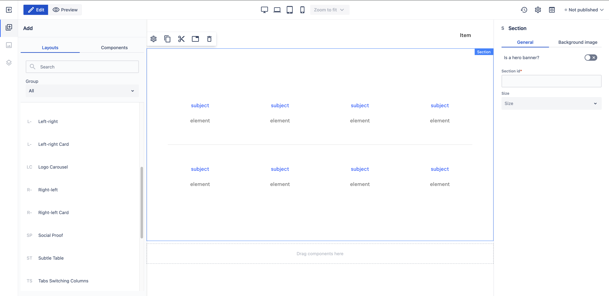

# Subtle Table

_Since_: 0.4.19

Subtle Table section is a ready-to-use component defining a 2x4 table where authors can showcase
keywords or catchphrases related to various topics.

## Usage

Drag & drop Subtle Table component from Kyanite Sections to the page directly, as the component already
contains a Section component.
After adding it to the page, it should look like this:

    

## Authorable properties

As the component is not a standalone component, and it wraps various other components, authoring
can be done through those basic components. Here is the structure of the authorable components:
- <a href="../../section">Section</a>
  - <a href="../../container">Container</a>
    - <a href="../../level">Level</a>
      - <a href="../../level/levelitem">Level Item</a>
        - <a href="../../container">Container</a>
          - <a href="../../content">Content</a>
          - <a href="../../content">Content</a>
      - <a href="../../level/levelitem">Level Item</a>
        - <a href="../../container">Container</a>
          - <a href="../../content">Content</a>
          - <a href="../../content">Content</a>
      - <a href="../../level/levelitem">Level Item</a>
        - <a href="../../container">Container</a>
          - <a href="../../content">Content</a>
          - <a href="../../content">Content</a>
      - <a href="../../level/levelitem">Level Item</a>
        - <a href="../../container">Container</a>
          - <a href="../../content">Content</a>
          - <a href="../../content">Content</a>
    - <a href="../../separator">Separator</a>
    - <a href="../../level">Level</a>
      - <a href="../../level/levelitem">Level Item</a>
        - <a href="../../container">Container</a>
          - <a href="../../content">Content</a>
          - <a href="../../content">Content</a>
      - <a href="../../level/levelitem">Level Item</a>
        - <a href="../../container">Container</a>
          - <a href="../../content">Content</a>
          - <a href="../../content">Content</a>
      - <a href="../../level/levelitem">Level Item</a>
        - <a href="../../container">Container</a>
          - <a href="../../content">Content</a>
          - <a href="../../content">Content</a>
      - <a href="../../level/levelitem">Level Item</a>
        - <a href="../../container">Container</a>
          - <a href="../../content">Content</a>
          - <a href="../../content">Content</a>