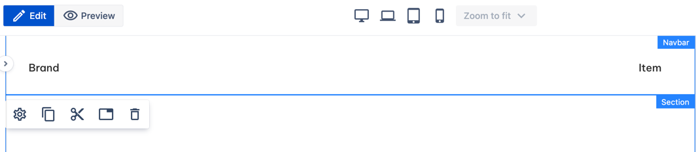
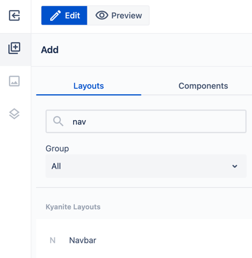
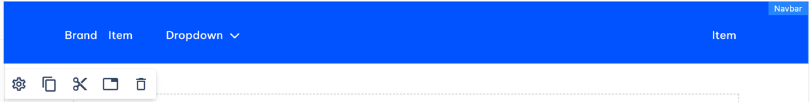
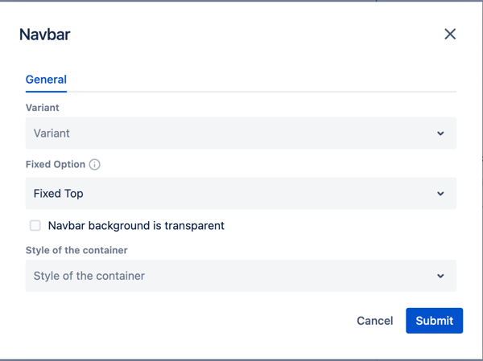

# Navbar

_Since_: 0.0.1

Navbar component serves as a navigation bar for your website. Once you have in on your Homepage, 
you can use it on any page via <a href="./navbar-reference/">Navbar reference</a>.

## Usage

Navbar is automatically added to a page created from Homepage template. 
When you open the newly created Homepage, at the top of the page you will see a navigation bar 
with Navbar Brand and Navbar Menu components inside.

    

You also can add Navbar to a page manually. Initial layout will slightly differ in this case. 

While editing a page, unfold left panel, click 'Add' icon and find Navbar in 'Layouts' tab, then drag and drop it to the page.

    

You will see the navigation bar with a couple of initial items in it.

    

## Navbar components

You can author Navbar content using specific components, dedicated explicitly for Navbar.

- root blocks
    - <a href="./navbar-components#navbar-menu">Navbar menu</a>
        - <a href="./navbar-components#navbar-start">Navbar start</a>
        - <a href="./navbar-components#navbar-end">Navbar end</a>
    - <a href="./navbar-components#navbar-brand">Navbar brand</a>
- content components
    - <a href="./navbar-components#dropdowns">dropdowns</a>
        - <a href="./navbar-components#navbar-dropdown">Navbar dropdown</a>
        - <a href="./navbar-components#navbar-mega-dropdown">Navbar mega dropdown</a>
    - <a href="./navbar-components#navbar-item">Navbar item</a> - container for actual content

## Authorable properties

Navbar properties allow author to customize its look and placement.

    

_**Variant**_ defines background color of the Navbar and is Primary by default.

_**Fixed Option**_ defines Navbar placement:
- _Fixed Top_ - wherever it is in page structure, Navbar will be placed at the top of the page without overlaying page content
- _Fixed Bottom_ - same, but Navbar will be placed in the very bottom of the page
- _Standard_ - Navbar position doesn't change, it will be rendered wherever you place it on your page

_**Style of the container**_ property defines paddings and margins of Navbar itself as well as its child blocks.
