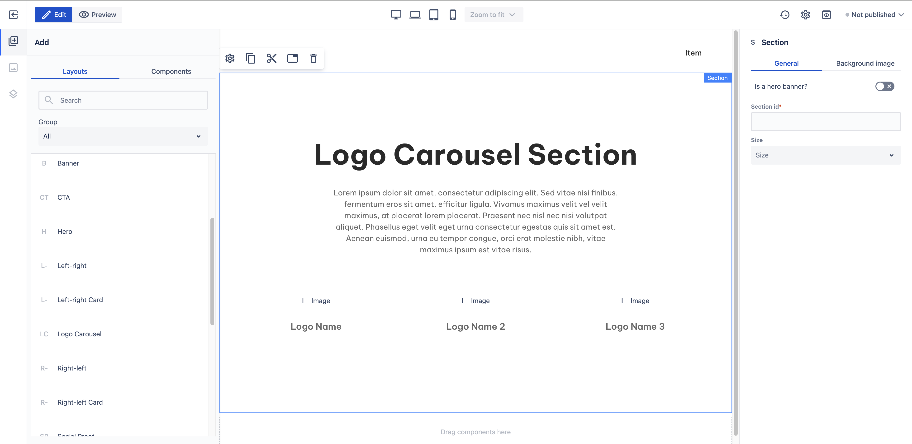

# Logo Carousel

_Since_: 0.4.19

Logo Carousel section is a ready-to-use component where following a title and a description,
authors can showcase a selection of logos with logo names.

## Usage

Drag & drop Logo Carousel component from Kyanite Sections to the page directly, as the
component already contains a Section component.
After adding it to the page, it should look like this:

    

## Authorable properties

As the component is not a standalone component, and it wraps various other components, authoring
can be done through those basic components. Here is the structure of the authorable components:

- <a href="../../../components/section">Section</a>
    - <a href="../../../components/container">Container</a>
        - <a href="../../../components/title">Title</a>
        - <a href="../../../components/columns">Columns</a>
            - <a href="../../../components/columns/column">Single Column</a>
                - <a href="../../../components/content">Content</a>
        - <a href="../../../components/level">Level</a>
            - <a href="../../../components/level/levelitem">Level item</a>
                - <a href="../../../components/container">Container</a>
                    - <a href="../../../components/image">Image</a>
                    - <a href="../../../components/content">Content</a>
            - <a href="../../../components/level/levelitem">Level item</a>
                - <a href="../../../components/container">Container</a>
                    - <a href="../../../components/image">Image</a>
                    - <a href="../../../components/content">Content</a>
            - <a href="../../../components/level/levelitem">Level item</a>
                - <a href="../../../components/container">Container</a>
                    - <a href="../../../components/image">Image</a>
                    - <a href="../../../components/content">Content</a>