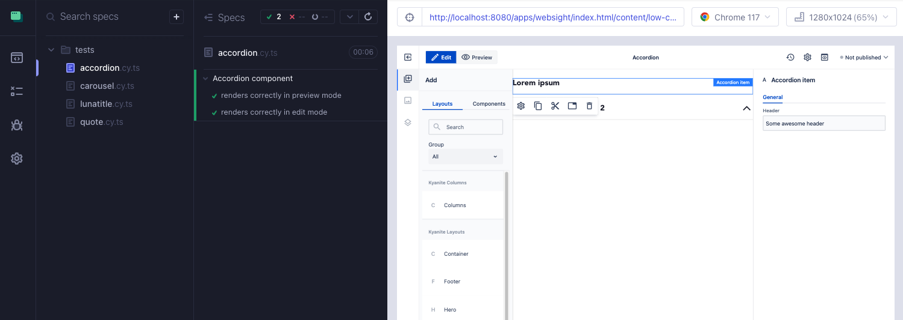
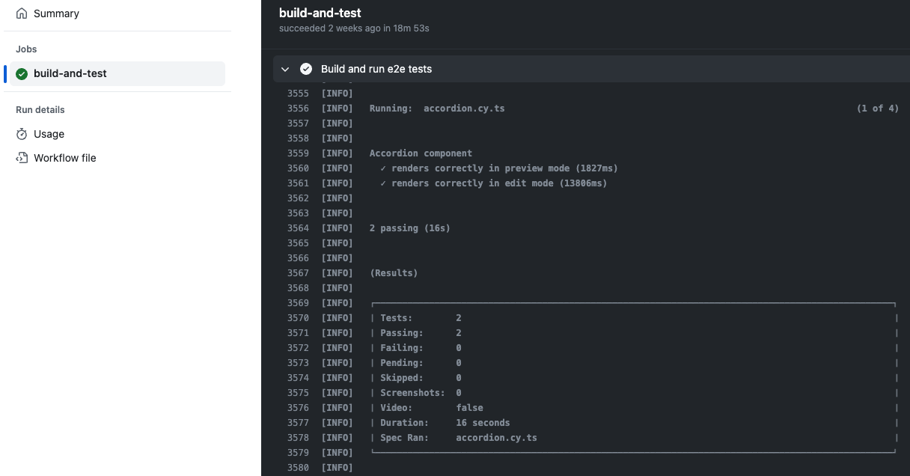

# Functional testing with Cypress


## Introduction

Cypress is a modern open-source end-to-end testing framework which provides good developer experience. You can check how we leverage Cypress in [starter](https://github.com/websight-io/starter) to perform **functional testing**. Its goal is to check if the end user can complete all the flows and actions available on the website.

!!! info "Important notice"

    For more information about [starter](https://github.com/websight-io/starter) project see [Quick start for developers](/cms/developers/quick-start).

## Documentation

Detailed information how to use Cypress can be found in the official docs:

[https://www.cypress.io](https://www.cypress.io)

We recommend also reading about best practices in Cypress:

[https://docs.cypress.io/guides/references/best-practices](https://docs.cypress.io/guides/references/best-practices)

## Using Cypress locally

Cypress tests are located in `tests/end-to-end/tests` folder.

To run them, you need to start your docker instance:

```shell
docker compose -f environment/local/docker-compose.yml up -d
```

Then add test content located in `/tests/content` folder by executing this script:

```shell
./mvnw -f tests/content/pom.xml clean install -P autoInstallPackage
```

Finally run the commands below:

```shell
cd tests/end-to-end
npm run dev
```

This will launch the Cypress interactive GUI. It is the most convenient way to write and debug your tests during development.



## Using Cypress on CI server

To run E2E tests on CI server, you need to launch Cypress in headless mode. It can be done by using this command from the root directory:

```bash
mvn clean verify -P e2e-functional
```

In `.github/workflows/ci.yml` you can check how we have configured running Cypress tests in Github Actions as a part of pull request validation.


