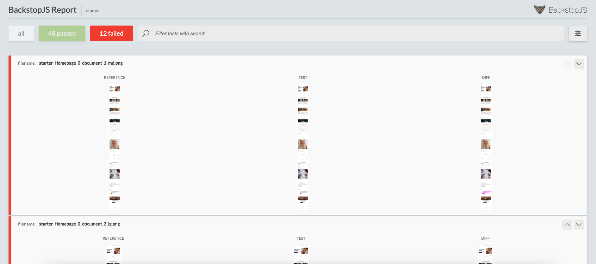
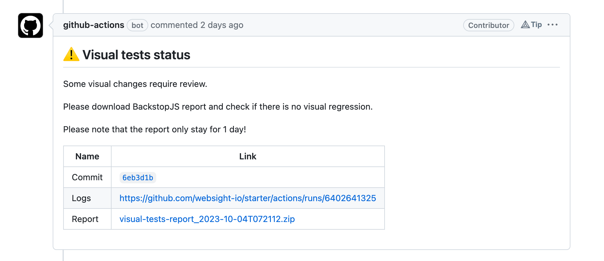
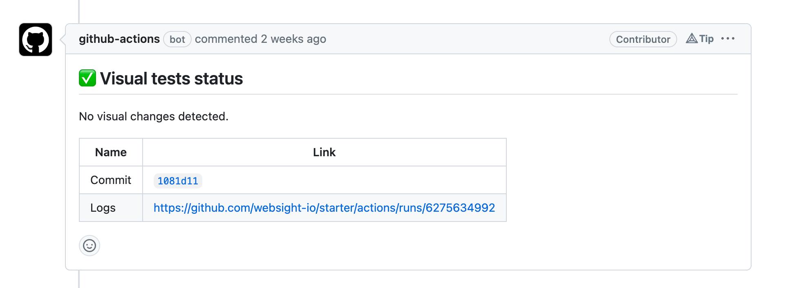

# Visual regression testing with BackstopJS


## Introduction

**Visual regression testing** is used to detect unintended visual changes in web application. It involves capturing screenshots of web pages or components at different points in time and comparing them to detect any differences. These differences needs to be reviewed if they are expected or not.

We use BackstopJS to perform visual regression testing. BackstopJS is a free and open-source tool that automates the process of capturing and comparing screenshots to identify any visual differences that may occur due to code changes, CSS updates, or other modifications.

BackstopJS official documentation can be found here:
[https://github.com/garris/BackstopJS](https://github.com/garris/BackstopJS)

## Configuration

BackstopJS configuration file is located there: `tests/end-to-end/backstop.js`.

In this file you need to provide the links for all pages to let BackstopJS know where to capture screenshots. You can also specify additional configuration options which can be found in the official docs. One option which is highly recommended is `viewports`. It lets you capture multiple screenshots with different dimensions for every page. This way you can verify if you pages looks good on different devices like mobile, tablet and desktop.

## Environment

To replicate the production environment as much as possible we run visual regression tests on a published content.

To achieve that in `tests/end-to-end/pom.xml` we perform `publish test content` step before actual testing.

```xml
<execution>
    <id>publish test content</id>
    <goals>
        <goal>npx</goal>
    </goals>
    <phase>integration-test</phase>
    <configuration>
        <skip>${e2e.skip}</skip>
        <arguments>ts-node ./utils/content.publish/content.publish.cli.ts</arguments>
        <environmentVariables>
        <baseUrlCms>http://localhost:${cms.port}</baseUrlCms>
        </environmentVariables>
    </configuration>
</execution>
```

## Using BackstopJS locally

You can use BackstopJS locally in the following way:

1. Run the command below to capture the screenshots of all pages defined in BackstopJS configuration file:

    ```shell
    mvn clean verify -P e2e-visual-seed
    ```

2. Make some changes in the code (i.e. via switching to a different branch in Git).
3. Run the command below to to capture again screenshots of all pages and compare them with reference screenshots:

    ```shell
    mvn clean verify -P e2e-visual-check
    ```

4. Open BackstopJS report which is located here:

    `tests/end-to-end/backstop_data/html_report/index.html`

    You can open it by double-click in Finder/File explorer.

    

5. Review visual changes in failed tests.

## Using BackstopJS on CI server

In `.github/workflows/ci.yml` file you can see how we have configured visual regression tests to run them in Github Actions during pull request validation.

The general idea how this works is as follows:

1. Switch to the base branch (most often `main` or `develop`) which is deducted as a common ancestor between the source branch and PR target branch.
2. Capture reference screenshots (`e2e-visual-seed` profile).
3. Switch back to the PR branch.
4. Capture the screenshots again and compare them with reference screenshots (`e2e-visual-check` profile).
5. Check if the report contains failed tests (visual changes).

    * If there are failed tests - upload report as an artifact and post the following comment on Github PR
    
    

    * If all tests passed - post the following comment on Github PR
    
    