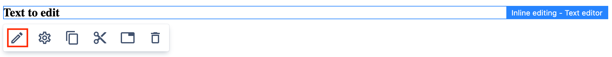
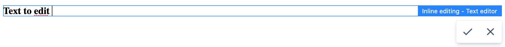
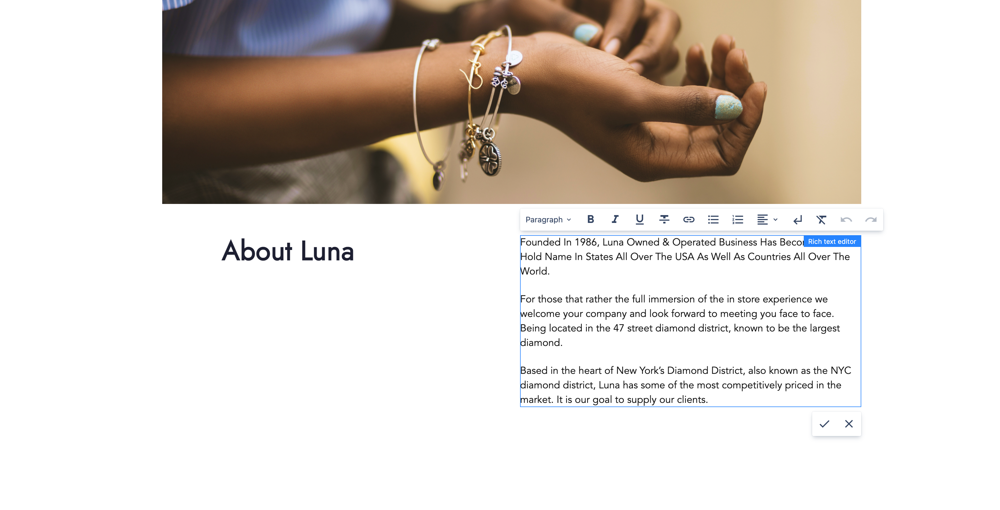
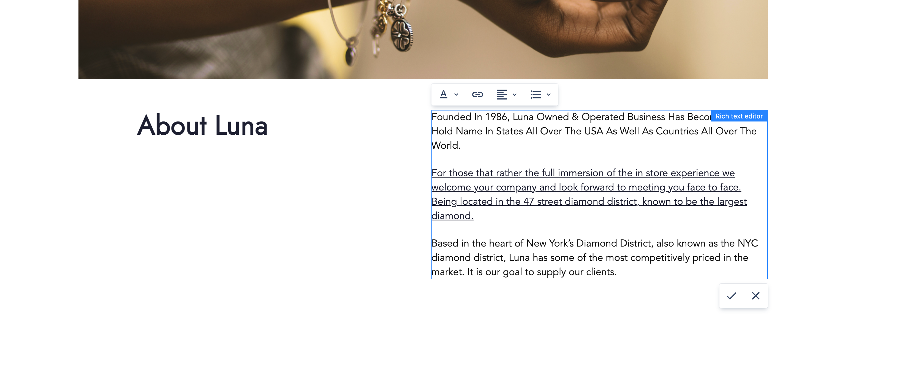

# Inline editing

## Overview

Inline editing makes it possible to update components directly within a page's content using the [Page Editor](../page-editor).

Currently, inline editing supports editing of single component properties. When inline editing is enabled 
for the component, the action triggering the editing is available.





## Enabling inline editing for component

Inline editing can be enabled for a component by updating the [Edit configuration](../components/#edit-configuration).

To enable the editing add the `inlineEditing` and `config` nodes to the component edit config.
The `config` node contains configuration related to editing of a single component property.

```json title="Example component edit config enabling inline editing"
{
  "inlineEditing": {
    "config": {
      "property": "title",
      "domSelectors": ["h1", "h2", "h3", "h4"],
      "editor": "text"
    }
  }
}
```

### Property

`property` contains the relative path of the component property where the edited value will be saved in the content.
The values can be a property name that will be saved on the component content node (for example: `"property": "title"`). It
may also contain sub-nodes on the component node (for example: `"property": "node1/node2/title"`).

The value of `property` must correspond to a field defined in the component dialog. If the field is
not needed in the dialog it can be disabled using dialogs _context_. See [component dialog documentation](/cms/developers/components/#dialog) for more information.

For the best content authoring experience, it is recommended to avoid inline editing of fields using [validation](/cms/developers/dialogs/#validation). Validation errors will be reported as notifications and the values will not be updated.

### DOM selectors

The `domSelectors` are used to find the DOM element for which the inline editing should take place.
Selectors will be evaluated one-by-one on all Component DOM nodes until the first result is found.
If a DOM selector value is not provided or is empty, then the first Component DOM node is used.

### Inline editor

The `editor` property contains the ID of the inline editor implementation, which will be used for editing.
See the provided editors below.

Depending on the editor implementation, an additional `editorConfiguration` object may be provided.

```json title="Example component edit config using inline editor configuration"
{
  "inlineEditing": {
    "config": {
      "property": "text",
      "editor": "some-editor-id",
      "editorConfiguration": {
        "someEditorRelatedProperty": "value"
      }
    }
  }
}
```

## Provided inline editors

WebSight CMS provides inline editors, which are available to use only by updating the edit configuration for the component as described below.

### Text editor

The WebSight text editor allows single-line plain text editing. The ID of the editor is `text`.

```json title="Example component edit config enabling text inline editing"
{
  "inlineEditing": {
    "config": {
      "property": "title",
      "editor": "text"
    }
  }
}
```


### Rich text editor

The WebSight rich text editor allows rich text editing in the same way as the [dialogs rich text](/cms/developers/dialogs/richtext-editor).
The ID of the editor is `rich-text`.

```json title="Example component edit config enabling rich text inline editing"
{
  "inlineEditing": {
    "config": {
      "property": "text",
      "editor": "rich-text"
    }
  }
}
```



To specify the [rich text configuration](/cms/developers/dialogs/richtext-editor/configuration), add
`editorConfiguration` and define the path to the configuration via `rteConfiguration`.

```json title="Example component edit config enabling rich text inline editing and specified configuration"
{
  "inlineEditing": {
    "config": {
      "property": "text",
      "editor": "rich-text",
      "editorConfiguration": {
        "rteConfiguration": "/libs/wcm/dialogs/components/richtext/configurations/compact"
      }
    }
  }
}
```


