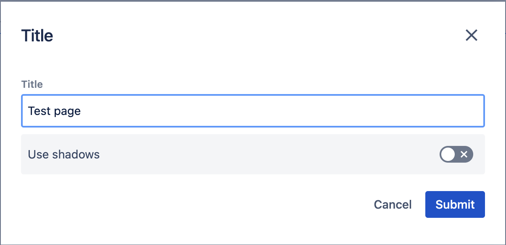
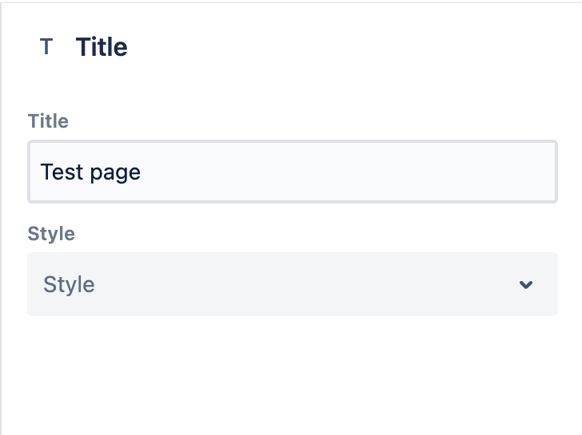
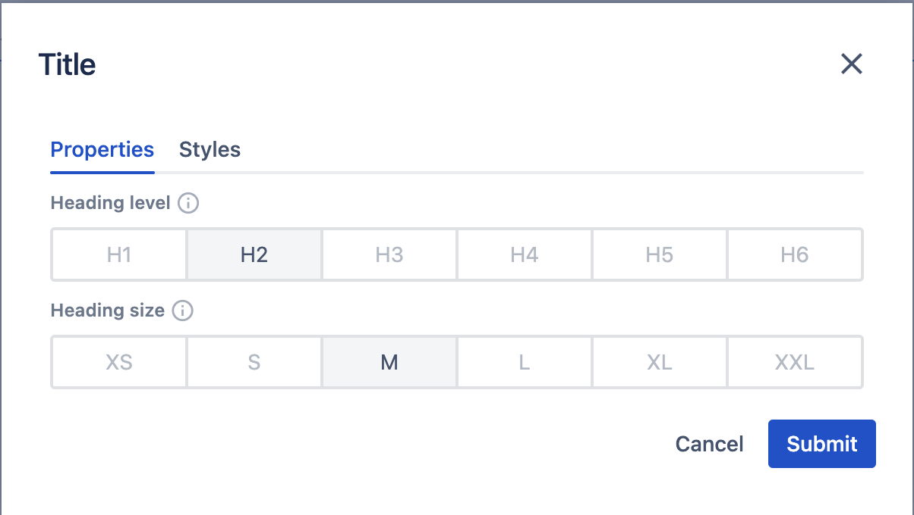

# Side Panel

## Overview

The _Side Panel_ is a part of the _Page editor_ that allows editing of the properties of the selected component.
It is displayed on the right side of the _Page editor_. Its purpose is slightly different from that of the full-blown _modal_.
The _Side Panel_ is more suitable for quick edits to the page content that you want to preview right away, such as changing
a font size, a button variant, or a card style. In contrast, with the _modal_, the focus is on editing the complete configuration
of the component at once.

## Configuration

By default, the component's dialog configuration will be used for both the side panel and the dialog.
This means that all components support the side panel right away. Since their purposes are different,
it is possible to differentiate between the fields and layout for the regular modal and the side panel.
This configuration allows developers to decide field-by-field if it should appear in both
of the two contexts, or only in one.

The mechanism used to achieve this is the `ws:disallowedContext` parameter (see more details about the mechanism [here](/cms/developers/dialogs#context)).
The two contexts that can be disabled are `edit:dialog` and `edit:panel`.

### Example 1
In this example, we're showcasing how to hide a `select` on the dialog and a `toggle` on the side panel.

```json
{
  "sling:resourceType": "wcm/dialogs/dialog",
  "title": {
    "sling:resourceType": "wcm/dialogs/components/textfield",
    "name": "title",
    "label": "Title"
  },
  "shadows": {
    "sling:resourceType": "wcm/dialogs/components/toggle",
    "name": "shadows",
    "label": "Use shadows",
    "ws:disallowedContext": ["edit:panel"]
  },
  "style": {
    "sling:resourceType": "wcm/dialogs/components/select",
    "label": "Style",
    "name": "style",
    "ws:disallowedContext": ["edit:dialog"],
    "primary": {
      "sling:resourceType": "wcm/dialogs/components/select/selectitem",
      "label": "Primary",
      "value": "primary"
    },
    "secondary": {
      "sling:resourceType": "wcm/dialogs/components/select/selectitem",
      "label": "Secondary",
      "selected": true,
      "value": "secondary"
    }
  }
}
```

#### Result



### Example 2
In this example, we're defining a completely separate layout and order for the two ways of editing to achieve an even better authoring experience. 

To accomplish this, we create a configuration of three tabs. The first two will only appear on the modal,
while the third one will only appear on the side panel. The third tab includes all three fields that are available
on the other two tabs. This allows the author to edit all the properties in the side panel in one tab
but defines separation for the fields on the modal.

```json
{
  "sling:resourceType": "wcm/dialogs/dialog",
  "tabs": {
    "sling:resourceType": "wcm/dialogs/components/tabs",
    "properties": {
      "sling:resourceType": "wcm/dialogs/components/tab",
      "label": "Properties",
      "ws:disallowedContext": ["edit:panel"],
      "headingLevel": {
        "sling:resourceType": "wcm/dialogs/components/include",
        "path": "/libs/howlite/components/common/headinglevel"
      },
      "headingSize": {
        "sling:resourceType": "wcm/dialogs/components/include",
        "path": "/libs/howlite/components/common/headingsize"
      }
    },
    "styles": {
      "sling:resourceType": "wcm/dialogs/components/tab",
      "label": "Styles",
      "ws:disallowedContext": ["edit:panel"],
      "styleVariant": {
        "sling:resourceType": "wcm/dialogs/components/include",
        "path": "/libs/howlite/components/common/stylevariant"
      }
    },
    "sidepanel": {
      "sling:resourceType": "wcm/dialogs/components/tab",
      "label": "Properties",
      "ws:disallowedContext": ["edit:dialog"],
      "headingLevel": {
        "sling:resourceType": "wcm/dialogs/components/include",
        "path": "/libs/howlite/components/common/headinglevel"
      },
      "headingSize": {
        "sling:resourceType": "wcm/dialogs/components/include",
        "path": "/libs/howlite/components/common/headingsize"
      },
      "styleVariant": {
        "sling:resourceType": "wcm/dialogs/components/include",
        "path": "/libs/howlite/components/common/stylevariant"
      }
    }
  }
}
```

#### Result



## Saving and error handling

The save function for the fields works automatically. There is no need to press a submit button. Some field values (for example, the toggle) are changed with a mouse click. The side panel saves them immediately, and the results are visible almost instantly. Other fields (for example,
the text field or the path picker) require typing a new value. It is stored when an author stops typing (based on a debounce method).
This approach reduces the number of content updates that could cause page flickering.

No matter whether errors happen during the regular editing experience (for example, during validations) or are caused by technical problems,
they need to be handled. In the event of any errors during the save process, the side panel resets the modified field to the
latest stable state (either the initial one or the last successfully saved one). This is to ensure that the author always sees valid and up-to-date information on the side panel.

## Validations

Since the purpose of the side panel is to provide a lightweight solution for simple editing, it has some limitations compared to the regular modal.
Fields that must be validated are not recommended to be displayed and edited on the side panel.
Editing such fields with a value that breaks a validation rule will result in an error message and the field will be reset (as described above).
