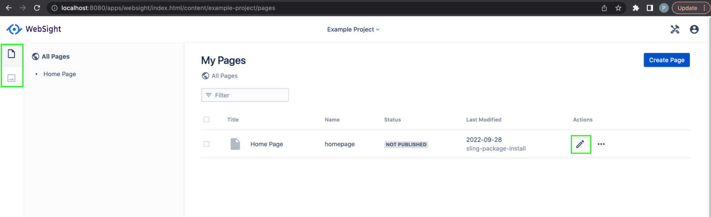
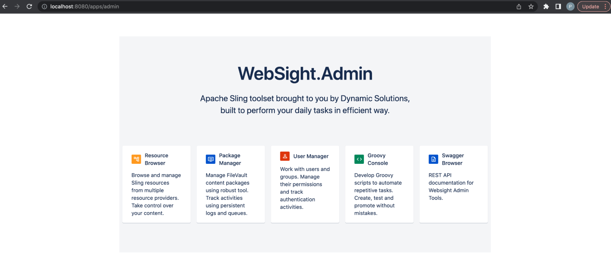

# Project setup

This document provides an introduction to working with WebSight projects. It explains how to configure, build and run a new project using Maven Archetype. It also describes the contents of the project build and runtime files.

Although the specific contents of your project may vary depending on your needs, the sample project described on this page is a useful starting-point for running Web applications using WebSight CMS.


## Prerequisites
To create and run a project, you will need [Java 17](https://adoptium.net/) or later, [Maven](https://maven.apache.org/) 3.8.5 or later.

You can check your Java version in most environments with:

```
java -version
openjdk 17.0.2 2022-01-18
OpenJDK Runtime Environment Temurin-17.0.2+8 (build 17.0.2+8)
OpenJDK 64-Bit Server VM Temurin-17.0.2+8 (build 17.0.2+8, mixed mode)
```

Check your Maven version with:

```
mvn --version
Apache Maven 3.8.5 (3599d3414f046de2324203b78ddcf9b5e4388aa0)
```

## Generate a project
To create a new project, first open a command prompt and cd to the directory where you want to store your project.

Next, use a Maven command to create your project, being sure to declare the desired parameters properly.

- Use the _groupId_, _artifactId_, and version parameters to declare Maven artifacts for your project. 
- Use _projectName_, _projectId_ and _package_ parameters to define technical requirements (such as application resources paths and Docker image names) and the root package for Java code.
- Use the _archetypeVersion_ parameter to set the archetype version you want to use. You can check the latest version [here](https://search.maven.org/search?q=g:pl.ds.websight%20a:websight-cms-ce-project-archetype).
- Use the _cmsVersion_ parameter to specify the WebSight CMS version that the project should use. Check the WebSight [Release Notes](/cms/release-notes/websight-cms/) to find the latest available version.

Example command:

```
mvn archetype:generate                                     \
  -DarchetypeGroupId=pl.ds.websight                        \
  -DarchetypeArtifactId=websight-cms-ce-project-archetype  \
  -DarchetypeVersion=3                                     \
  -DgroupId=my.groupId                                     \
  -DartifactId=my-artifactId                               \
  -Dversion=1.0.0-SNAPSHOT                                 \
  -DprojectName="Example Project"                          \
  -DprojectId=example-project                              \
  -Dpackage=com.example.project                            \
  -DcmsVersion=1.22.0
```

The above command creates a project with the following structure:

```
.
└── my-artifactId
    ├── README.md
    ├── application
    ├── content
    ├── distribution
    ├── pom.xml
    └── tests

```

## Project structure
The contents of the project structure we generated above are an example of what you'd typically include when creating a project for a Web application using WebSight CMS.

Note in particular the following modules:

* `application` - components code and scripts delivered as OSGi bundles
    * `backend` - CMS elements (pages, templates, components, etc.), Java models and services
    * `frontend` - frontend project bundled by webpack
* `content` - initial content as a JCR vault module (content_package)
* `distribution` - project distribution - Sling feature model and optionally Docker images
* `tests` - tests used to validate the distribution
    * `content` - content for end-to-end tests
    * `end-to-end` - end-to-end tests

It is important to note that the project contains built-in server definitions and configurations. The `distribution` module is responsible for bundling the application based on the configurations and WebSight CMS modules using [`Sling Feature Model`](https://sling.apache.org/documentation/development/feature-model.html). Optionally it also prepares the Docker images (however, Docker is out of scope of this guide).

## Build the application
To build the project, use the Maven command:


```bash
mvn clean package
```

Add e2e profile to execute end-to-end tests:

```bash
mvn clean verify -P e2e
```

You should see successful end-to-end test execution in the log:

<p align="center" width="100%">
    
</p>


Execution should end with a successful build message:

<p align="center" width="100%">
    
</p>

## Run the instance
Once your project build is complete, you can start a local instance by running the following command:

```bash
java --add-opens java.base/java.lang=ALL-UNNAMED \
  -jar distribution/target/dependency/org.apache.sling.feature.launcher.jar \
  -f distribution/target/slingfeature-tmp/feature-websight-cms-example-project-tar.json
```

The resulting instance runs WebSight CMS with your application at [localhost:8080](http://localhost:8080/). The default login is `wsadmin`/`wsadmin`. Published content is available locally at [localhost:8080/published](http://localhost:8080/published/).

See `README.md` for additional details about the runtime environment.
 
## Instance overview
After login, you will be redirected to the Spaces list. In WebSight CMS content is organized in Spaces. The Spaces list shows you the generated application and its associated content using the `content` module:

[http://localhost:8080/apps/websight/index.html/content::spaces](http://localhost:8080/apps/websight/index.html/content::spaces )


After clicking on the Space name, the Pages dashboard opens with one page delivered in the initial content. You can manage your pages here and navigate to the Assets dashboard (to manage Assets) or open the Page editor to edit page content from within the CMS:

[http://localhost:8080/apps/websight/index.html/content/example-project/pages](http://localhost:8080/apps/websight/index.html/content/example-project/pages)


In the Right top corner, you will find an Admin tools menu with links to administration tools. Or, the Admin dashboard can be accessed directly using the following link:

[http://localhost:8080/apps/admin](http://localhost:8080/apps/admin)

 
## Next steps
Now that you know how to set up a new project using WebSight CMS, consider learning more about the following topics:

- [Application development](../app-development/)
- [Components development](../components/)
- [Dialogs](../dialogs/)
- [Page editor](../page-editor/)
