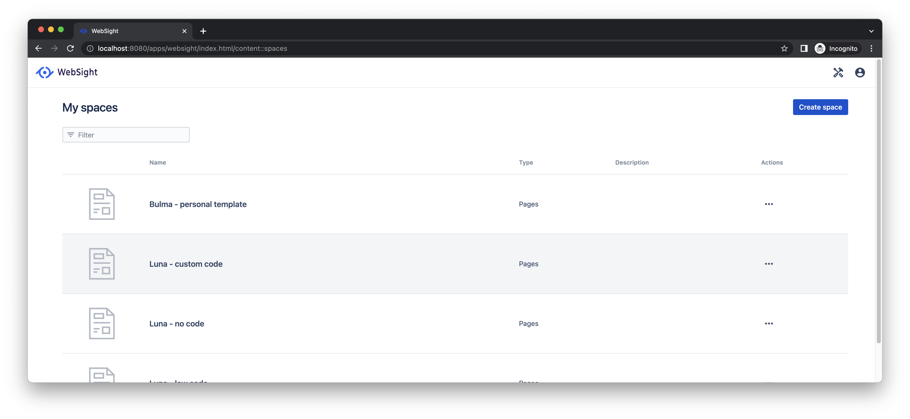
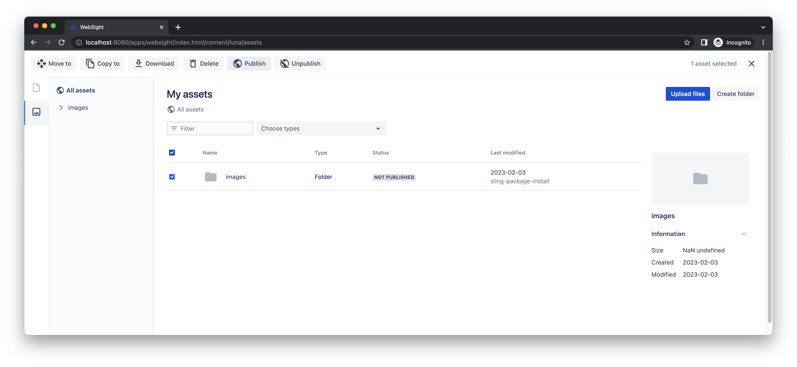
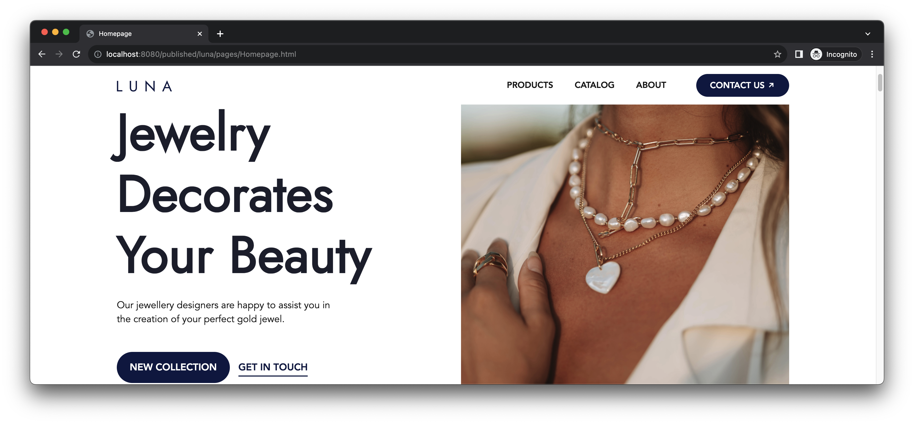
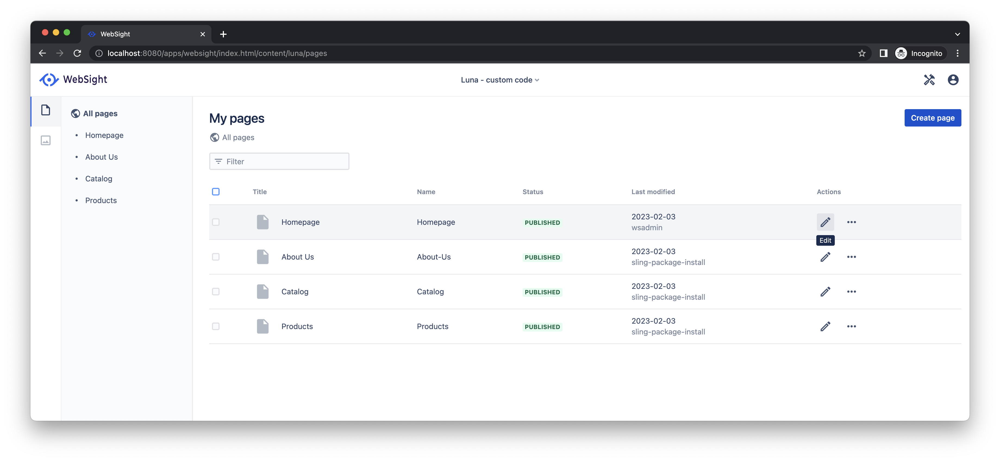
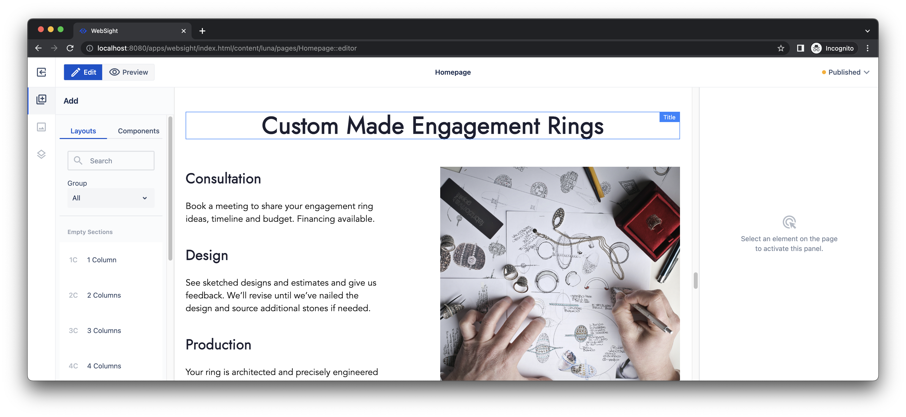
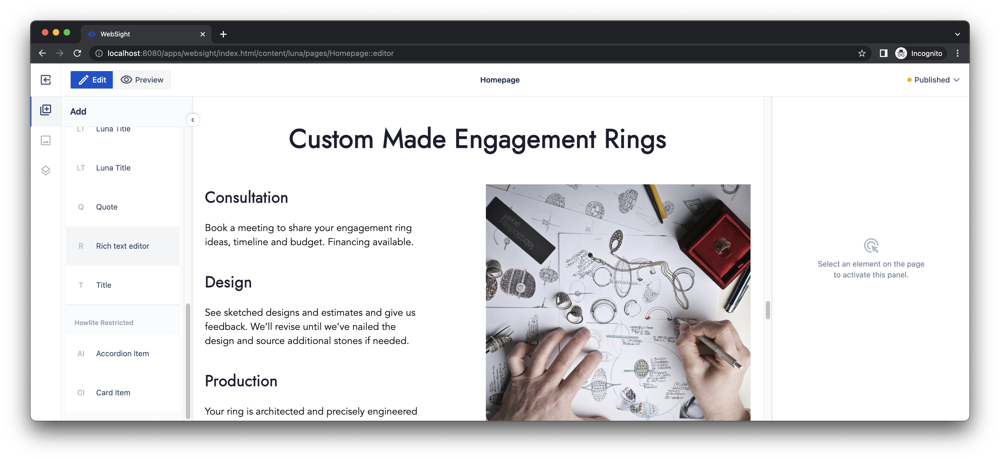
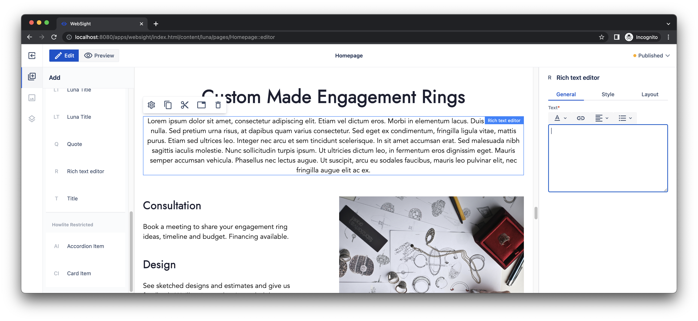
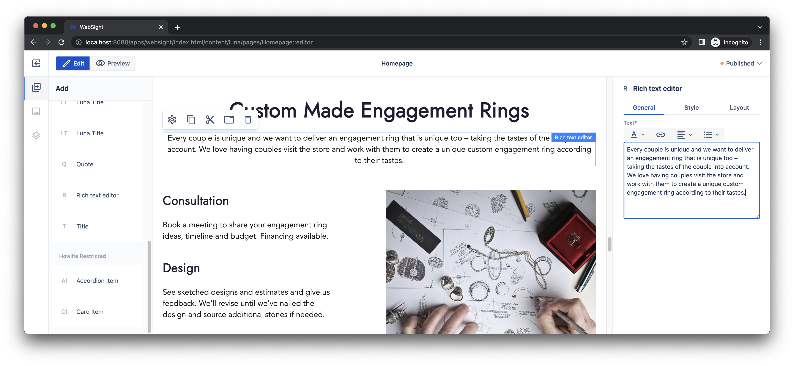
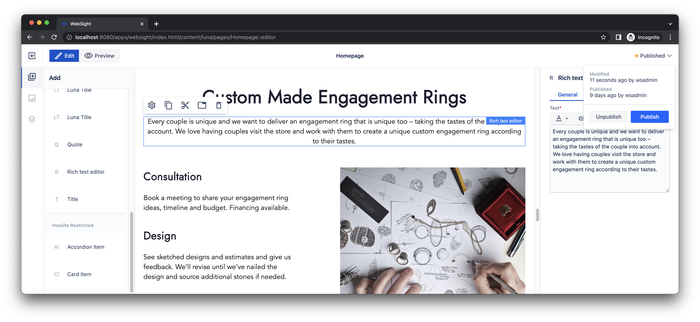
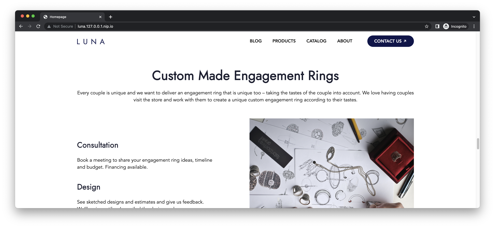

# Quick start guide

Follow this guide to run a local instance of WebSight CMS using Docker. The local instance serves as a testing instance where you can check out our demo site _Luna_. You can also use [Howlite](../authors/component-libs/howlite/index.md), our example components library, to create or update pages within the local instance. 

This guide is a starting-point for developing custom components for WebSight CMS. After you've mastered the concepts explained on this page, you can move onto our [quick start for developers](../developers/quick-start/index.md) for a deeper dive into components development for WebSight CMS.

!!! info "Prerequisites"

    Before going any further, please ensure you have [Docker Desktop](https://www.docker.com/products/docker-desktop/) installed and launched on your machine. Docker Desktop supports Windows, macOS, and Linux.

## Part A: Run a local instance using Docker

!!! hint "Quick setup with `curl`"
    If you have `curl` installed, you can set up the local environment using the following command. Then, you can go directly to Part B below.

    `curl https://docs.websight.io/scripts/get.sh | sh`

If this method doesn't work for you, follow the step (1) below to set up the WebSight CMS instance manually.

### 1. Create Docker container environment

Run the following command to start a Docker container with WebSight CMS:

```bash
docker run -p 8080:8080 --name websight-cms-ce --rm \
  --mount source=tar-repo,target=/websight/repository \
  europe-docker.pkg.dev/websight-io/public/websight-cms-starter:1.22.0 \
  websight-cms-starter-tar
```

A fresh WebSight instance will start within a couple of seconds. After it launches, you can open a Web browser to the URL [http://localhost:8080/](http://localhost:8080/) to view the WebSight admin panel.
Log in with `wsadmin` username and `wsadmin` as the password.

!!! hint "Tip"
    To turn off the local environment, use the `ctrl + c` key combination in the terminal that you used to launch your Docker instance. You can restart the instance by repeating the steps you used to launch it initially.


## Part B: Publish demo site

At this point, your local environment is running, but you still need to publish the demo site that is included in the distribution. Do this by following the steps below.

### 1. Open the Websight admin panel

In the local instance, the WebSight admin panel is accessible by navigating to [http://localhost:8080/](http://localhost:8080/) in a Web browser. Log in with `wsadmin` username and `wsadmin` as the password.

### 2. Select space for the demo site

We use _Spaces_ to organise content. In the WebSight admin panel, open the space for the demo site _Luna - custom code_.



### 3. Publish assets and the demo site

Open the list of _Assets_ using the left sidebar. Select the folder _images_ and then click _Publish_.



Open the list of _Pages_ using the left sidebar. Select all pages and click _Publish_.


### 4. View the demo site

Congratulations! The demo site is now available by navigating to [http://localhost:8080/published/luna/pages/Homepage.html](http://localhost:8080/published/luna/pages/Homepage.html) in a Web browser.

!!! info "Additional sample sites "

    The distribution contains other demo sites. After assets and pages publication, they are available at: 
    
    - [http://localhost:8080/published/kyanite/pages/Personal.html](http://localhost:8080/published/kyanite/pages/Personal.html)  Personal page created with the Kyanite components library
    - [http://localhost:8080/lowcodeluna/pages/Homepage.html](http://localhost:8080/lowcodeluna/pages/Homepage.html)  Luna - low code
    - [http://localhost:8080/published/nocodeluna/pages/Homepage.html](http://localhost:8080/published/nocodeluna/pages/Homepage.html) Luna - no code



## Part C: Update a page

Now that your local demo site is published, you can experiment with making basic changes to pages. As an example, the following steps show how to update the home page for the demo site that is built into WebSight.

### 1. Open the Websight admin panel

The WebSight admin panel runs at [http://localhost:8080/](http://localhost:8080/). Log in with `wsadmin` username and `wsadmin` as the password.

### 2. Select space for the demo site

We use _Spaces_ to organise content. Please open the space for the demo site _Luna - custom code_.


### 3. Edit the home page

Use the _Pencil_ icon to open the _Page editor_ for the home page. 



Scroll down the content to the section _Custom Made Engagement Rings_.



Find the _Rich text editor_ on the tab _Components_ and use the drag-and-drop feature to place it just below the section title. 



Click on the new component to check its properties on the side panel on the right.



Copy & paste the following text into the _Text_ field on the _General_ tab.

```
Every couple is unique and we want to deliver an engagement ring that is unique too – taking the tastes of the couple into account. We love having couples visit the store and work with them to create a unique custom engagement ring according to their tastes.
```



### 4. Publish changes

At this point, you've updated the page. However, unpublished changes are not visible on the site yet. To apply them, open the dropdown in the right corner of the admin interface and select action _Publish_.



### 5. View the updated page

Congratulations! Your changes should be visible now at [http://localhost:8080/published/luna/pages/Homepage.html](http://localhost:8080/published/luna/pages/Homepage.html). 



## Next steps

This page demonstrated the basics of editing pages with WebSight CMS. As a next step, we encourage you to explore more technical details about WebSight:

- [Howlite documentation](../authors/component-libs/howlite/) to browse components available in the library we used to create the _Luna_ site,
- [Kyanite components for the WebSight CMS](https://github.com/websight-io/kyanite/). It is a general set of components inspired by [Bulma](https://bulma.io/) framework. You can use the collection and build your site without any code development,
- [Quick start tutorial for developers](../developers/quick-start/) to check how to implement custom components.

The _Luna_ site (i.e., _Luna - custom code_) you looked through utilizes the [Howlite](../authors/component-libs/howlite/) components library. However, the distribution contains other demo sites, and we recommend exploring them too. Before you open the following links, visit the [admin panel](http://localhost:8080/), and publish pages and assets for a given space.

- [_Kyanite_ - personal template](http://localhost:8080/published/kyanite/pages/Personal.html). It is a sample inspired by the [Portfolio page](https://bulmatemplates.github.io/bulma-templates/templates/personal.html). We created it using the [Kyanite components](https://github.com/websight-io/kyanite/).
- [_Luna - no code_](http://localhost:8080/published/nocodeluna/pages/Homepage.html). We authored the _Luna_ site with the [Kyanite components](https://github.com/websight-io/kyanite/) without additional custom code or development.
- [_Luna - low code_](http://localhost:8080/lowcodeluna/pages/Homepage.html). We added some custom styling and implemented only components missing in the [Kyanite](https://github.com/websight-io/kyanite/) library.
