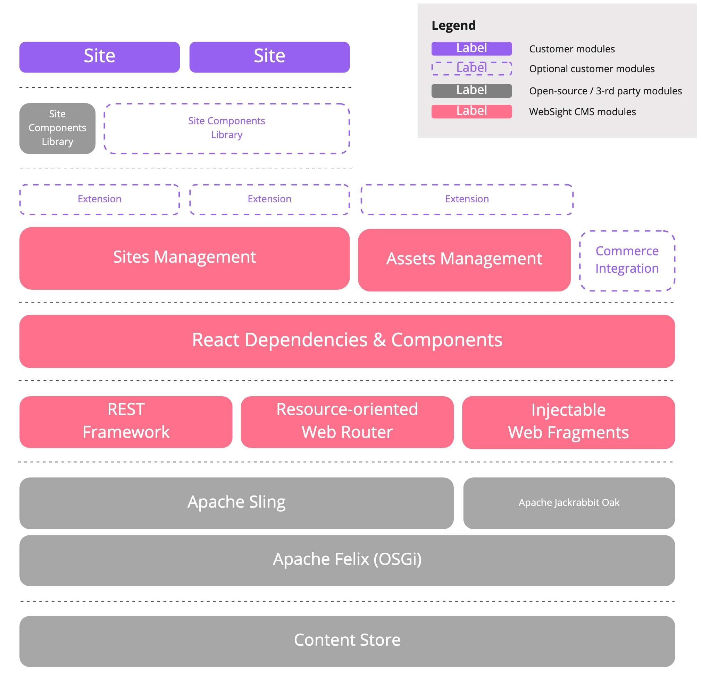
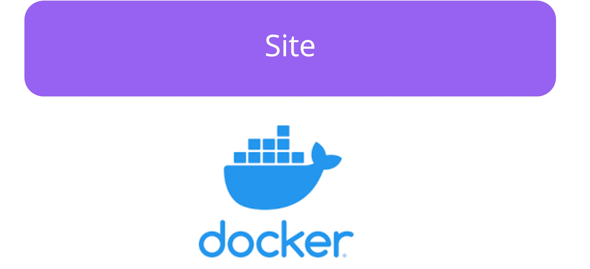
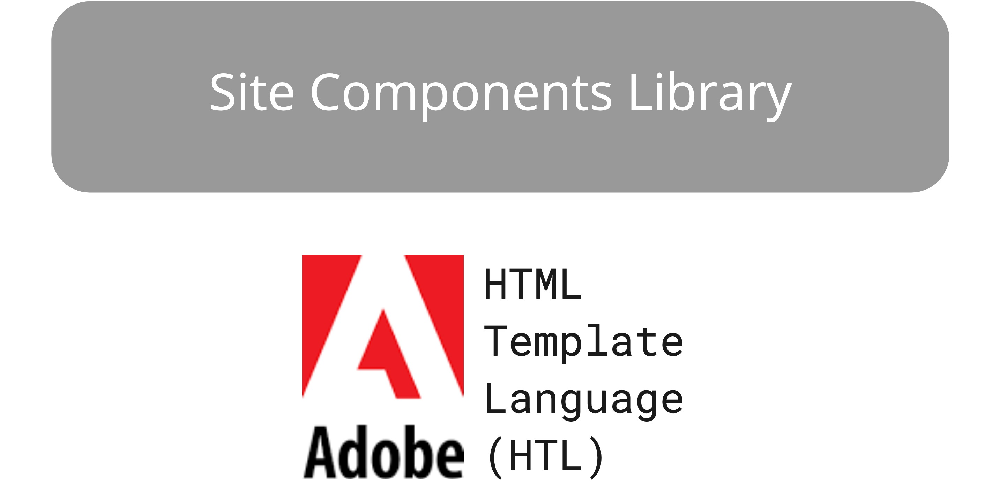
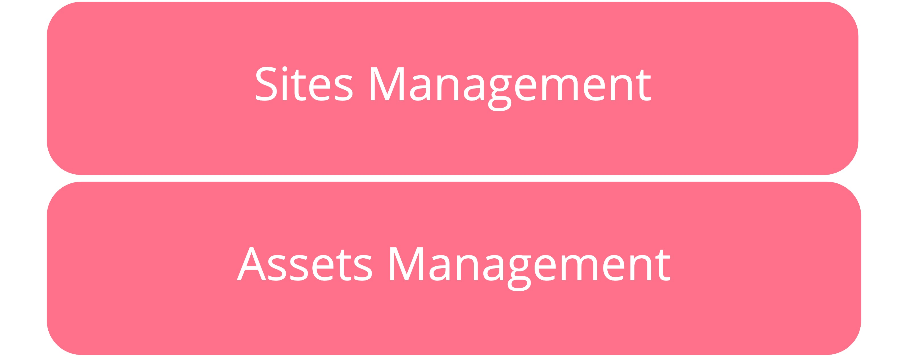
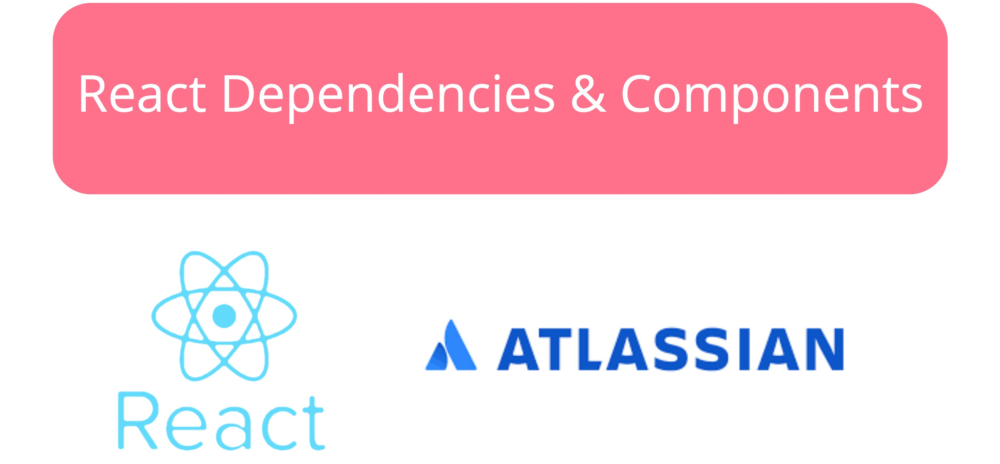
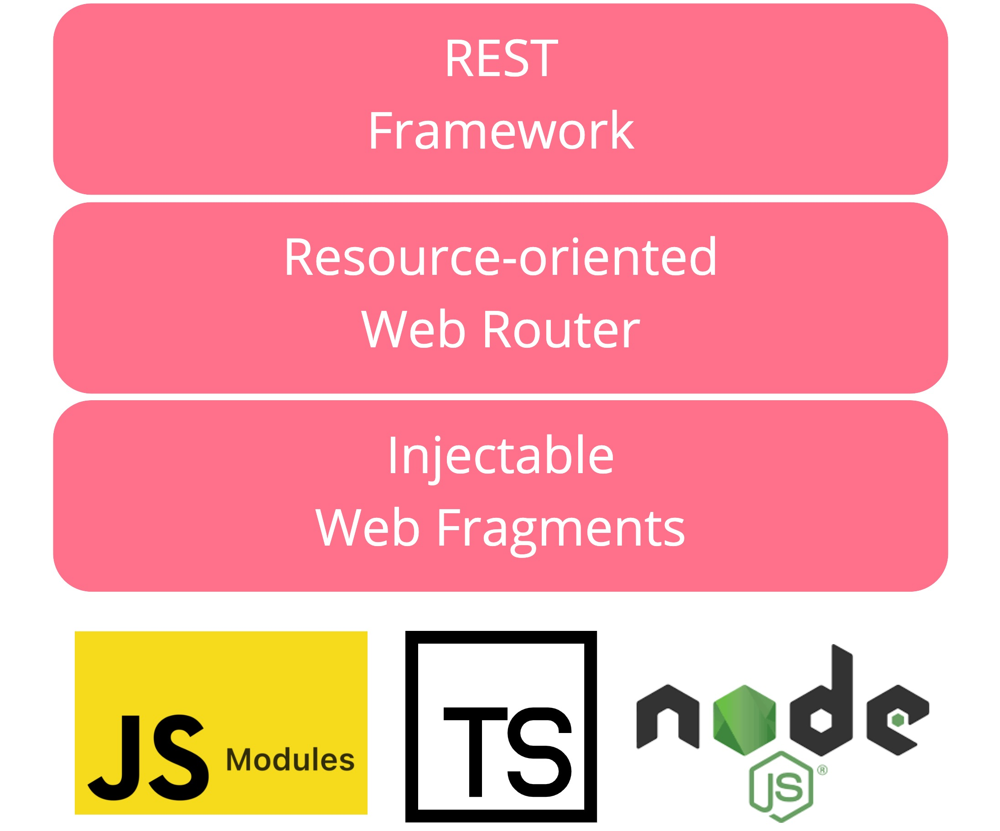
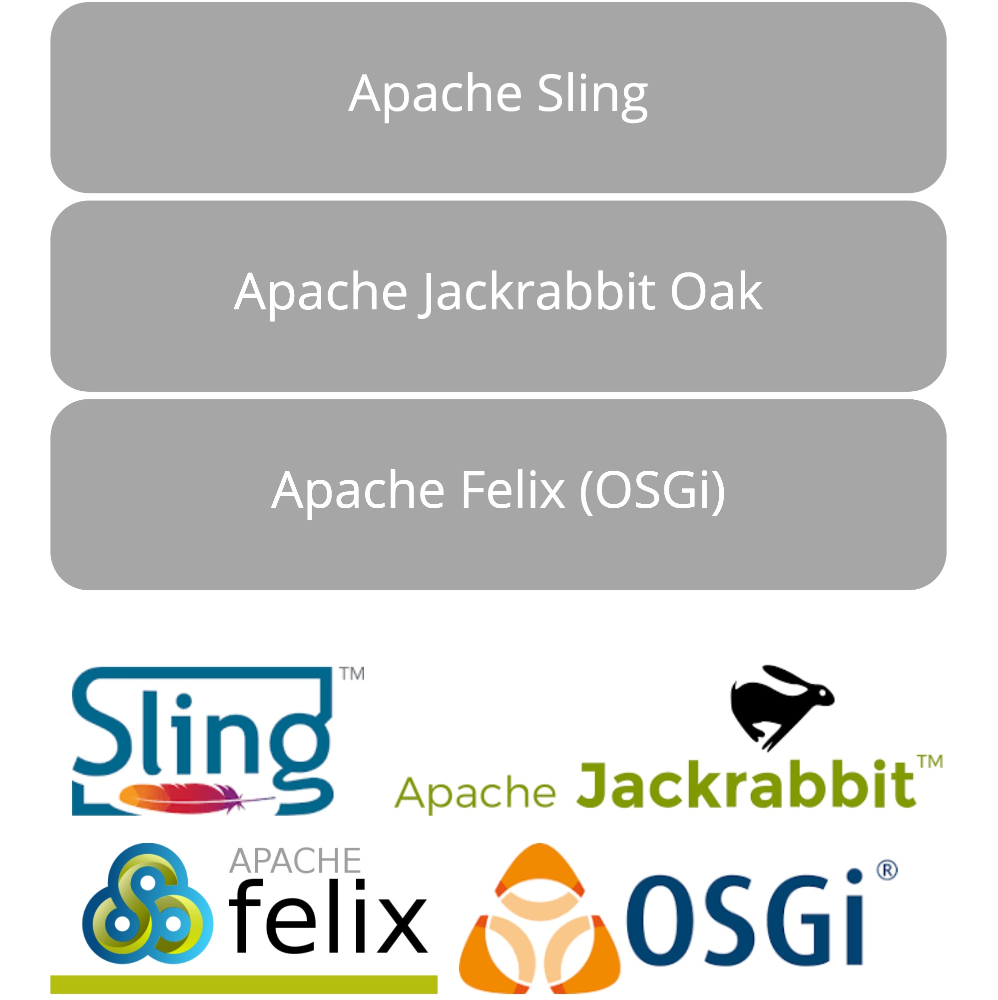
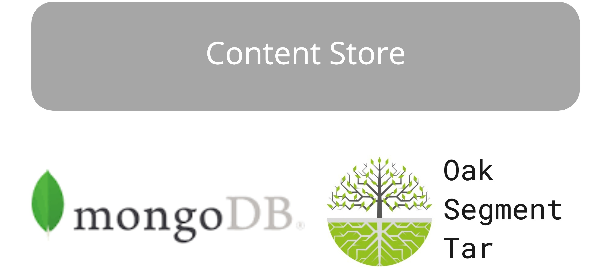

# WebSight CMS layers & modules

The diagram below represents the WebSight CMS layers and their responsibilities. 

Layers consist of features (see Sling Feature Model for more details), which are more high-level logical units (like site management or assets management).

## Layers details

This section describes each layer with its responsibilities:

Our platform supports multi-site management. Developers can configure site mappings (short URLs, vanity URLs) and restrictions for site components. Sites can have independent release lifecycles or be aggregated into a single container for cost savings.

With the sites management feature, authors can drag and drop site components to manage web pages and control their layouts. Clients can reuse our component libraries (Howlite, Bulma) to optimise the time needed to enable site creation or create custom ones.

With OSGi pluggability and Sling Feature configurability, our platform is composed of multiple low-level modules (OSGi bundles) organized into more general functionalities called features. While WebSight offers basic core features such as sites and assets management, our clients can also easily add custom features without making modifications to the platform codebase. Moreover, plugins allow clients to extend a user interface beyond the core features with custom actions, panels or even dashboards.

React is our first choice for building resource-oriented views. Each view is a single-page application with extension points for dynamically loaded React components. However, adding custom views with other JS Frameworks like Vue.js or Angular is as simple as adding libraries and bootstrapping the app.

It is a framework for building extendable web resource-oriented platforms. It separates presentation and business logic layers allowing developers to configure custom views and extend existing ones without modifying the codebase. Its core modules simplify building RESTful APIs, configuring resource-oriented web views and injecting HTML fragments into the existing ones.

Built on top of the open-source Apache Software Foundation stack:
<ul>
    <li>Apache Sling - a framework for RESTful web applications,</li>
    <li>Apache Felix - an implementation of the OSGi Framework and Service platform,</li>
    <li>Apache Jackrabbit Oak - an implementation of Java Content Repository (JCR).</li>
</ul>

We store the content and assets in MongoDB, a scalable and performant NoSQL database. Our clients can switch to other Oak store implementations based on TAR files to decrease costs.

