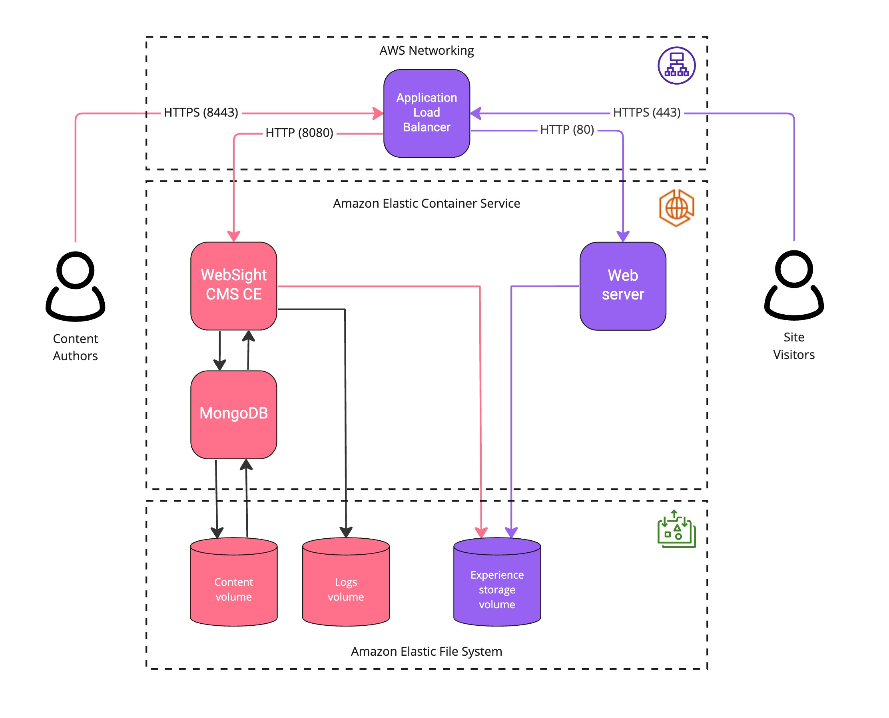

# Amazon ECS WebSight Architecture
AWS container services make it easy to manage WebSight CMS CE infrastructure & containers. For container orchestration, we can choose between **Amazon Elastic Container Service (ECS)** and **Amazon Elastic Kubernetes Service (EKS)**. For instrastructure provisioning, we can use **Amazon Elastic Compute Cloud (EC2)** with full control over the compute environment, or **Fargate**, serverless compute option, where the infrastructure provisioning is managed by AWS.

## Physical architecture with Elastic Container Service
This document describes WebSight deployment with **Amazon ECS** and **Fargate**. These are are key principles for this tooling:

- no additional charge for Amazon ECS cluster, we pay only for AWS resources we create to store and run the application
- ECS uses simple concepts (`services`, `tasks` and `containers`) similar to Docker Compose which lead to [Docker ECS integration](https://docs.docker.com/cloud/ecs-integration/)
- developer experience is almost the same localy and in the cloud
- ECS integrates natively with the AWS services like `CloudTrail`, `CloudWatch`, `Elastic Container Registry`, `Elastic File System`
- with Fargate, developers do not care about the underling infrastructure, making our clusters serveless (we pay only for vCPU and memory resources that the application requests)

The following diagram presents the physical architecture the WebSight CMS CE environment in AWS.

### Amazon Elastic Container Service
Amazon ECS is fully managed container orchestration service. It uses such abstractions as `services`, `tasks`, `task definitions`, `containers`. In brief: 

- task definition is a collection of one or more container configurations, 
- tasks are configured with the task definitions and launches containers
- services guarantee that the required number of tasks is runnning

Each service (`nginx`, `cms`, `mongo`) runs a single task launching a single container.

Read more about Amazon ECS [here](https://docs.aws.amazon.com/AmazonECS/latest/developerguide/Welcome.html).

### Amazon Elastic File System
Amazon Elastic File System (Amazon EFS) is fully managed, serverless file system with native AWS ECS integration. WebSight uses EFSs to store published experience, content and logs. Read more details about EFS [here](https://docs.aws.amazon.com/efs/latest/ug/whatisefs.html).

### Amazon Application Load Balancer
Application Load Balancer handles all request from both site visitors (HTTPS on port `443`) and authors (HTTPS on port `8443`), and forward to `nginx` or `cms` ECS services. ALB also terminates HTTPS - all routing between ALB and ECS use HTTP (`80` / `8080`) because the connection is private. Read more details [here](https://docs.aws.amazon.com/elasticloadbalancing/latest/application/introduction.html).

